# Chapter 1: ROS 2 Architecture

## Learning Objectives

By the end of this chapter, you will be able to:
- Explain the fundamental concepts of ROS 2 architecture
- Identify the key components: nodes, topics, services, and actions
- Understand the publish-subscribe communication model
- Describe the role of the ROS 2 middleware and DDS
- Recognize the differences between ROS 1 and ROS 2

## Introduction to ROS 2

Robot Operating System 2 (ROS 2) is the next-generation robotics framework designed for production robotics applications. Unlike its predecessor, ROS 2 is built from the ground up to address real-world robotics challenges including security, determinism, and multi-robot systems.

ROS 2 is not an operating system but rather a collection of libraries, tools, and conventions that facilitate robotics development. It provides hardware abstraction, device drivers, libraries, visualizers, message-passing, package management, and more.

## Key Components of ROS 2

### Nodes

A **node** is a process that performs computation. Nodes are the fundamental building blocks of a ROS 2 system. Each node typically performs a specific task and communicates with other nodes through messages.

In ROS 2, nodes are designed to be lightweight and modular. A complex robot system might have dozens of nodes running simultaneously, each handling different aspects of robot functionality such as sensor processing, control algorithms, and user interfaces.

### Topics

**Topics** enable the publish-subscribe communication pattern. Publishers send messages to topics, and subscribers receive messages from topics. This decouples the sender and receiver, allowing for flexible system design.

Topics are ideal for streaming data like sensor readings, camera feeds, or robot state information where the latest value is typically what matters most.

### Services

**Services** provide a request-response communication pattern. A client sends a request to a service, and the service returns a response. This is synchronous communication, making it suitable for operations that need a guaranteed response.

Services are perfect for operations that have a clear beginning and end, such as triggering a calibration procedure or requesting specific robot configuration data.

### Actions

**Actions** are for long-running tasks that require feedback and goal management. They combine the benefits of both topics and services, providing a way to send goals, receive feedback during execution, and get results when complete.

Actions are ideal for navigation tasks, manipulation sequences, or any operation that takes time to complete and needs to report progress.

## Middleware and DDS

ROS 2 uses a **middleware** layer that abstracts the underlying communication system. The default middleware implementation uses **DDS (Data Distribution Service)**, a well-established standard for real-time, high-performance communication.

DDS provides features like:
- Quality of Service (QoS) policies for different communication requirements
- Built-in discovery of nodes and topics
- Data-centric publish-subscribe model
- Security features for production environments

## Communication Patterns in Detail

### Publish-Subscribe Model

The publish-subscribe model is the backbone of ROS 2 communication. Here's how it works:

1. A **publisher** creates a topic and sends messages to it
2. A **subscriber** connects to the same topic to receive messages
3. The ROS 2 middleware handles the routing between publishers and subscribers
4. Publishers and subscribers can come and go without affecting each other

This model enables loose coupling between components, making systems more modular and maintainable.

```mermaid
graph LR
    A[Publisher Node] -->|Publishes| B("chatter" Topic)
    C[Subscriber Node 1] -->|Subscribes| B
    D[Subscriber Node 2] -->|Subscribes| B
    E[Subscriber Node 3] -->|Subscribes| B
    style A fill:#0f1729,stroke:#00d4ff,stroke-width:2px
    style B fill:#1a1f3a,stroke:#00d4ff,stroke-width:2px
    style C fill:#0f1729,stroke:#00d4ff,stroke-width:2px
    style D fill:#0f1729,stroke:#00d4ff,stroke-width:2px
    style E fill:#0f1729,stroke:#00d4ff,stroke-width:2px
```

### ROS 2 Architecture Overview

```mermaid
graph TB
    subgraph "Robot System"
        A[Node: Publisher]
        B[Node: Subscriber]
        C[Node: Service Server]
        D[Node: Service Client]
    end

    subgraph "ROS 2 Middleware (DDS)"
        E[DDS Implementation]
        F[Domain Participant]
        G[Publisher Interface]
        H[Subscriber Interface]
    end

    subgraph "Network Layer"
        I[Transport Layer]
        J[Discovery Protocol]
    end

    A --> G
    B --> H
    C --> E
    D --> E
    G --> E
    H --> E
    E --> I
    I --> J
    J --> I
    I --> E

    style A fill:#0f1729,stroke:#00d4ff,stroke-width:2px
    style B fill:#0f1729,stroke:#00d4ff,stroke-width:2px
    style C fill:#0f1729,stroke:#00d4ff,stroke-width:2px
    style D fill:#0f1729,stroke:#00d4ff,stroke-width:2px
    style E fill:#1a1f3a,stroke:#00d4ff,stroke-width:2px
    style F fill:#1a1f3a,stroke:#00d4ff,stroke-width:2px
    style G fill:#1a1f3a,stroke:#00d4ff,stroke-width:2px
    style H fill:#1a1f3a,stroke:#00d4ff,stroke-width:2px
    style I fill:#0f1729,stroke:#00d4ff,stroke-width:2px
    style J fill:#0f1729,stroke:#00d4ff,stroke-width:2px
```

### Quality of Service (QoS)

QoS settings allow you to specify communication requirements for topics and services:

- **Reliability**: Whether all messages must be delivered (RELIABLE) or best-effort delivery is acceptable (BEST_EFFORT)
- **Durability**: Whether late-joining subscribers should receive old messages (TRANSIENT_LOCAL) or only new messages (VOLATILE)
- **History**: How many messages to keep in the queue
- **Deadline**: Maximum time between consecutive messages

## ROS 2 vs ROS 1

| Feature | ROS 1 | ROS 2 |
|---------|-------|-------|
| Communication | Custom (roscpp/rosjava) | DDS-based middleware |
| Multi-machine | Requires ROS_MASTER_URI | Peer-to-peer discovery |
| Security | No built-in security | Built-in security features |
| Real-time | Limited | Better real-time support |
| Multi-robot | Complex setup | Native support |
| Platforms | Linux primarily | Linux, Windows, macOS, embedded |

## Assessment Questions

1. What are the four main communication patterns in ROS 2?
2. Explain the difference between a topic and a service in ROS 2.
3. What is the role of DDS in ROS 2 architecture?
4. Why is the publish-subscribe model beneficial for robotics systems?
5. Name three improvements ROS 2 has over ROS 1.

## Knowledge Check

Complete these knowledge check questions to verify your understanding:

1. **Multiple Choice**: Which middleware does ROS 2 primarily use?
   - A) TCP/IP
   - B) DDS (Data Distribution Service)
   - C) HTTP
   - D) MQTT

   *Answer: B) DDS (Data Distribution Service)*

2. **True/False**: In ROS 2, nodes must know about each other before they can communicate.
   - A) True
   - B) False

   *Answer: B) False - Nodes discover each other automatically through the middleware*

3. **Multiple Choice**: What does QoS stand for in ROS 2?
   - A) Quality of Service
   - B) Quick Operating System
   - C) Quantitative Observation System
   - D) Query Operating Service

   *Answer: A) Quality of Service*

4. **Short Answer**: Explain the difference between a publisher and a subscriber in the context of ROS 2 communication.

   *Answer: A publisher sends messages to a topic, while a subscriber receives messages from a topic. The publisher does not know which subscribers exist, and subscribers can join or leave at any time.*

5. **Scenario**: A robot needs to request the current battery level and receive a response. Which communication pattern should be used and why?

   *Answer: A service should be used because it provides a request-response pattern that is synchronous and guarantees a response, which is ideal for requesting specific information like battery level.*

## Next Steps

In the next chapter, we'll dive deeper into nodes, topics, and services with practical examples. You'll learn how to create your first ROS 2 nodes and implement basic communication patterns.

## References

- [ROS 2 Documentation](https://docs.ros.org/en/humble/)
- [ROS 2 Design Overview](https://design.ros2.org/)
- [DDS Specification](https://www.omg.org/spec/DDS/About-DDS/)