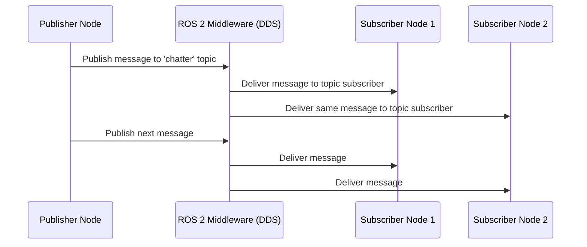
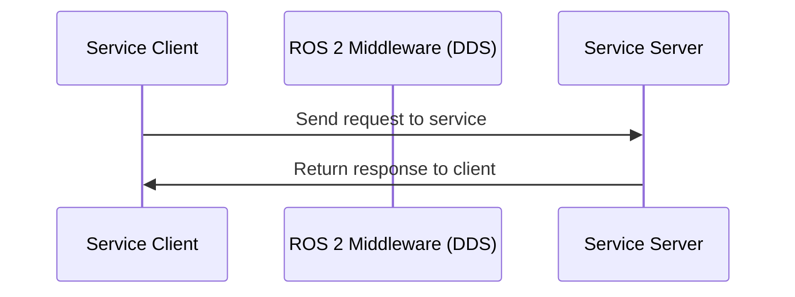

# Chapter 2: Nodes, Topics, Services

## Learning Objectives

By the end of this chapter, you will be able to:
- Create and run basic ROS 2 nodes in Python
- Implement publisher and subscriber nodes for topic communication
- Create service server and client nodes
- Understand message types and their definitions
- Use ROS 2 command-line tools for introspection

## Creating Your First ROS 2 Node

A ROS 2 node is essentially a program that uses the ROS 2 client library to communicate with other nodes. In Python, we use the `rclpy` library (ROS Client Library for Python).

### Basic Node Structure

Here's the minimal structure of a ROS 2 node in Python:

```python
import rclpy
from rclpy.node import Node

class MinimalNode(Node):

    def __init__(self):
        super().__init__('minimal_publisher')
        # Node initialization code goes here

def main(args=None):
    rclpy.init(args=args)
    minimal_node = MinimalNode()

    # Node execution code goes here

    minimal_node.destroy_node()
    rclpy.shutdown()

if __name__ == '__main__':
    main()
```

### Node Naming

Each node must have a unique name within the ROS 2 domain. The name is specified when creating the node instance:

```python
super().__init__('my_unique_node_name')
```

Node names should be descriptive and follow ROS naming conventions (lowercase with underscores).

## Topics and Publishers

Topics enable the publish-subscribe communication pattern. Publishers send messages to topics, and subscribers receive messages from topics.

### Creating a Publisher

Here's how to create a publisher in a ROS 2 node:

```python
import rclpy
from rclpy.node import Node
from std_msgs.msg import String

class MinimalPublisher(Node):

    def __init__(self):
        super().__init__('minimal_publisher')
        self.publisher_ = self.create_publisher(String, 'topic', 10)
        timer_period = 0.5  # seconds
        self.timer = self.create_timer(timer_period, self.timer_callback)
        self.i = 0

    def timer_callback(self):
        msg = String()
        msg.data = 'Hello World: %d' % self.i
        self.publisher_.publish(msg)
        self.get_logger().info('Publishing: "%s"' % msg.data)
        self.i += 1

def main(args=None):
    rclpy.init(args=args)
    minimal_publisher = MinimalPublisher()
    rclpy.spin(minimal_publisher)
    minimal_publisher.destroy_node()
    rclpy.shutdown()

if __name__ == '__main__':
    main()
```

### Creating a Subscriber

Here's how to create a subscriber to receive messages from a topic:

```python
import rclpy
from rclpy.node import Node
from std_msgs.msg import String

class MinimalSubscriber(Node):

    def __init__(self):
        super().__init__('minimal_subscriber')
        self.subscription = self.create_subscription(
            String,
            'topic',
            self.listener_callback,
            10)
        self.subscription  # prevent unused variable warning

    def listener_callback(self, msg):
        self.get_logger().info('I heard: "%s"' % msg.data)

def main(args=None):
    rclpy.init(args=args)
    minimal_subscriber = MinimalSubscriber()
    rclpy.spin(minimal_subscriber)
    minimal_subscriber.destroy_node()
    rclpy.shutdown()

if __name__ == '__main__':
    main()
```

## Services

Services provide request-response communication. A service client sends a request to a service server, which processes the request and returns a response.

### Creating a Service Server

Here's how to create a service server:

```python
import rclpy
from rclpy.node import Node
from example_interfaces.srv import AddTwoInts

class MinimalService(Node):

    def __init__(self):
        super().__init__('minimal_service')
        self.srv = self.create_service(AddTwoInts, 'add_two_ints', self.add_two_ints_callback)

    def add_two_ints_callback(self, request, response):
        response.sum = request.a + request.b
        self.get_logger().info('Incoming request\na: %d b: %d' % (request.a, request.b))
        return response

def main(args=None):
    rclpy.init(args=args)
    minimal_service = MinimalService()
    rclpy.spin(minimal_service)
    rclpy.shutdown()

if __name__ == '__main__':
    main()
```

### Creating a Service Client

Here's how to create a service client:

```python
import rclpy
from rclpy.node import Node
from example_interfaces.srv import AddTwoInts

class MinimalClient(Node):

    def __init__(self):
        super().__init__('minimal_client')
        self.cli = self.create_client(AddTwoInts, 'add_two_ints')
        while not self.cli.wait_for_service(timeout_sec=1.0):
            self.get_logger().info('service not available, waiting again...')
        self.req = AddTwoInts.Request()

    def send_request(self, a, b):
        self.req.a = a
        self.req.b = b
        self.future = self.cli.call_async(self.req)
        rclpy.spin_until_future_complete(self, self.future)
        return self.future.result()

def main(args=None):
    rclpy.init(args=args)
    minimal_client = MinimalClient()
    response = minimal_client.send_request(1, 2)
    minimal_client.get_logger().info(
        'Result of add_two_ints: %d' % response.sum)
    minimal_client.destroy_node()
    rclpy.shutdown()

if __name__ == '__main__':
    main()
```

## Message Types

ROS 2 comes with predefined message types in standard packages like `std_msgs`, `geometry_msgs`, and `sensor_msgs`. You can also define custom message types.

### Common Message Types

- `std_msgs.msg.String`: Simple string message
- `std_msgs.msg.Int32`: 32-bit integer
- `std_msgs.msg.Float64`: 64-bit floating point
- `geometry_msgs.msg.Twist`: Velocity commands for mobile robots
- `sensor_msgs.msg.JointState`: Robot joint positions, velocities, efforts
- `sensor_msgs.msg.Image`: Camera image data

### Custom Message Types

To create custom messages, define them in `.msg` files in your package's `msg/` directory:

```
# CustomMessage.msg
string name
int32 id
float64 value
bool active
```

## Communication Flow Diagrams

Understanding the flow of communication in ROS 2 is crucial for effective system design. Here are visual representations of the main communication patterns:

### Publish-Subscribe Flow



### Service Request-Response Flow



## ROS 2 Command-Line Tools

ROS 2 provides several command-line tools for introspection and debugging:

### Node Commands

- `ros2 node list`: List all active nodes
- `ros2 node info <node_name>`: Get information about a specific node

### Topic Commands

- `ros2 topic list`: List all active topics
- `ros2 topic echo <topic_name>`: Print messages from a topic
- `ros2 topic pub <topic_name> <msg_type> <args>`: Publish a message to a topic

### Service Commands

- `ros2 service list`: List all active services
- `ros2 service call <service_name> <srv_type> <args>`: Call a service

## Quality of Service (QoS) Settings

When creating publishers and subscribers, you can specify QoS settings:

```python
from rclpy.qos import QoSProfile

qos_profile = QoSProfile(depth=10)
publisher = self.create_publisher(String, 'topic', qos_profile)
```

Common QoS settings include:
- `depth`: History size for the message queue
- `reliability`: RELIABLE or BEST_EFFORT
- `durability`: VOLATILE or TRANSIENT_LOCAL

## Assessment Questions

1. What is the difference between a publisher and a subscriber in ROS 2?
2. Explain the purpose of the `rclpy.init()` and `rclpy.shutdown()` functions.
3. How do you create a service client that waits for a service to become available?
4. What are Quality of Service (QoS) settings and why are they important?
5. Name three common message types in ROS 2 and their purposes.

## Knowledge Check

Complete these knowledge check questions to verify your understanding:

1. **Multiple Choice**: What is the purpose of `rclpy.spin()` in a ROS 2 node?
   - A) To initialize the node
   - B) To keep the node running and process callbacks
   - C) To shut down the node
   - D) To create publishers

   *Answer: B) To keep the node running and process callbacks*

2. **True/False**: In ROS 2, a publisher must know about all subscribers before sending messages.
   - A) True
   - B) False

   *Answer: B) False - Publishers and subscribers are decoupled through the middleware*

3. **Multiple Choice**: Which message type would be most appropriate for sending robot joint positions?
   - A) std_msgs.msg.String
   - B) geometry_msgs.msg.Twist
   - C) sensor_msgs.msg.JointState
   - D) std_msgs.msg.Int32

   *Answer: C) sensor_msgs.msg.JointState*

4. **Short Answer**: Explain the difference between `create_publisher()` and `create_subscription()` in terms of their parameters.

   *Answer: Both functions take a message type and topic name, but create_publisher takes a queue size (history depth) as the third parameter, while create_subscription takes a callback function as the third parameter.*

5. **Scenario**: You need to send a command to move a robot and receive confirmation when the movement is complete. Which communication pattern would be most appropriate and why?

   *Answer: An action would be most appropriate because it provides feedback during execution and a result when complete, which is ideal for long-running tasks like robot movement.*

## Hands-On Practice

Try creating a simple publisher and subscriber pair:
1. Create a publisher that sends the current time every second
2. Create a subscriber that receives and logs the time messages
3. Use `ros2 topic echo` to verify messages are being published

## References

- [ROS 2 Python Client Library API](https://docs.ros.org/en/humble/p/rclpy/)
- [ROS 2 Tutorials](https://docs.ros.org/en/humble/Tutorials.html)
- [ROS 2 Message Types](https://docs.ros.org/en/humble/Concepts/About-ROS-Interfaces/)