# Chapter 2: Gazebo Setup & Configuration

## Learning Objectives

By the end of this chapter, you will be able to:
- Install and configure Gazebo for ROS 2
- Understand Gazebo architecture and components
- Create and modify world files
- Use Gazebo plugins for sensor and actuator simulation
- Navigate the Gazebo GUI effectively

## Introduction to Gazebo

Gazebo is an open-source 3D robotics simulator that integrates with ROS 2. It provides physics simulation, sensor simulation, and visualization capabilities essential for robotics development.

### Why Gazebo?

**Advantages**:
- **Open Source**: Free and community-supported
- **ROS 2 Integration**: Native support through gazebo_ros2_control
- **Realistic Physics**: Uses ODE, Bullet, Simbody, or DART physics engines
- **Sensor Suite**: Cameras, LiDAR, IMU, force-torque, contact sensors
- **Plugin System**: Extensible with custom sensors and behaviors

**Use Cases**:
- Algorithm testing before hardware deployment
- Multi-robot system simulation
- Sensor fusion development
- Machine learning training environments

## Gazebo Architecture

```mermaid
graph TB
    subgraph "Gazebo System"
        A[Gazebo Server<br/>gzserver]
        B[Gazebo Client<br/>gzclient]
        C[Physics Engine<br/>ODE/Bullet/DART]
        D[Sensor Manager]
        E[Plugin System]
    end

    subgraph "ROS 2 Integration"
        F[gazebo_ros]
        G[gazebo_ros2_control]
        H[ROS 2 Topics/Services]
    end

    subgraph "External Systems"
        I[World Files<br/>.sdf/.world]
        J[Model Files<br/>.sdf]
        K[Plugin Libraries<br/>.so]
    end

    A --> C
    A --> D
    A --> E
    B --> A
    F --> A
    G --> A
    F --> H
    G --> H
    I --> A
    J --> A
    K --> E

    style A fill:#0f1729,stroke:#00d4ff,stroke-width:2px
    style B fill:#0f1729,stroke:#00d4ff,stroke-width:2px
    style C fill:#1a1f3a,stroke:#00d4ff,stroke-width:2px
    style D fill:#1a1f3a,stroke:#00d4ff,stroke-width:2px
    style E fill:#1a1f3a,stroke:#00d4ff,stroke-width:2px
    style F fill:#0f1729,stroke:#00d4ff,stroke-width:2px
    style G fill:#0f1729,stroke:#00d4ff,stroke-width:2px
```



### Components

1. **Gazebo Server (gzserver)**: Runs physics simulation and sensor generation
2. **Gazebo Client (gzclient)**: Provides 3D visualization and user interface
3. **Physics Engine**: Computes rigid body dynamics and collisions
4. **Sensor Manager**: Simulates cameras, LiDAR, IMU, etc.
5. **Plugin System**: Custom functionality through shared libraries

## Installation

### Ubuntu 22.04 with ROS 2 Humble

```bash
# Install Gazebo Garden (recommended for ROS 2 Humble)
sudo apt update
sudo apt install ros-humble-gazebo-ros-pkgs

# Verify installation
gazebo --version
```

### Alternative: Gazebo Fortress

```bash
# Add OSRF repository
sudo sh -c 'echo "deb http://packages.osrfoundation.org/gazebo/ubuntu-stable `lsb_release -cs` main" > /etc/apt/sources.list.d/gazebo-stable.list'
wget https://packages.osrfoundation.org/gazebo.key -O - | sudo apt-key add -

# Install Gazebo Fortress
sudo apt update
sudo apt install gz-fortress

# Install ROS 2 integration
sudo apt install ros-humble-ros-gz
```

### Verification

```bash
# Launch Gazebo with ROS 2 integration
ros2 launch gazebo_ros gazebo.launch.py

# In another terminal, check topics
ros2 topic list

# Expected topics:
# /clock
# /parameter_events
# /rosout
```

## World Files

World files define the simulation environment using SDF (Simulation Description Format).

### Basic World File Structure

```xml
<?xml version="1.0"?>
<sdf version="1.8">
  <world name="my_world">
    <!-- Physics settings -->
    <physics type="ode">
      <max_step_size>0.001</max_step_size>
      <real_time_factor>1</real_time_factor>
      <real_time_update_rate>1000</real_time_update_rate>
    </physics>

    <!-- Lighting -->
    <light type="directional" name="sun">
      <cast_shadows>true</cast_shadows>
      <pose>0 0 10 0 0 0</pose>
      <diffuse>0.8 0.8 0.8 1</diffuse>
      <specular>0.2 0.2 0.2 1</specular>
      <attenuation>
        <range>1000</range>
        <constant>0.9</constant>
        <linear>0.01</linear>
        <quadratic>0.001</quadratic>
      </attenuation>
      <direction>-0.5 0.1 -0.9</direction>
    </light>

    <!-- Ground plane -->
    <model name="ground_plane">
      <static>true</static>
      <link name="link">
        <collision name="collision">
          <geometry>
            <plane>
              <normal>0 0 1</normal>
              <size>100 100</size>
            </plane>
          </geometry>
          <surface>
            <friction>
              <ode>
                <mu>100</mu>
                <mu2>50</mu2>
              </ode>
            </friction>
          </surface>
        </collision>
        <visual name="visual">
          <geometry>
            <plane>
              <normal>0 0 1</normal>
              <size>100 100</size>
            </plane>
          </geometry>
          <material>
            <ambient>0.8 0.8 0.8 1</ambient>
            <diffuse>0.8 0.8 0.8 1</diffuse>
          </material>
        </visual>
      </link>
    </model>

    <!-- Include models from Gazebo model database -->
    <include>
      <uri>model://sun</uri>
    </include>

  </world>
</sdf>
```

### Physics Configuration

```xml
<physics type="ode">
  <max_step_size>0.001</max_step_size>  <!-- 1ms timestep -->
  <real_time_factor>1</real_time_factor>  <!-- 1x real-time -->
  <real_time_update_rate>1000</real_time_update_rate>  <!-- 1000 Hz -->

  <!-- Solver settings -->
  <ode>
    <solver>
      <type>quick</type>  <!-- quick, world -->
      <iters>50</iters>  <!-- Constraint solver iterations -->
      <sor>1.3</sor>  <!-- Successive over-relaxation -->
    </solver>

    <constraints>
      <cfm>0.0</cfm>  <!-- Constraint force mixing -->
      <erp>0.2</erp>  <!-- Error reduction parameter -->
      <contact_max_correcting_vel>100</contact_max_correcting_vel>
      <contact_surface_layer>0.001</contact_surface_layer>
    </constraints>
  </ode>
</physics>
```

### Creating Custom Models

```xml
<model name="simple_box">
  <pose>0 0 0.5 0 0 0</pose>  <!-- x y z roll pitch yaw -->
  <static>false</static>

  <link name="box_link">
    <inertial>
      <mass>1.0</mass>
      <inertia>
        <ixx>0.166667</ixx>
        <ixy>0.0</ixy>
        <ixz>0.0</ixz>
        <iyy>0.166667</iyy>
        <iyz>0.0</iyz>
        <izz>0.166667</izz>
      </inertia>
    </inertial>

    <collision name="collision">
      <geometry>
        <box>
          <size>1 1 1</size>
        </box>
      </geometry>
    </collision>

    <visual name="visual">
      <geometry>
        <box>
          <size>1 1 1</size>
        </box>
      </geometry>
      <material>
        <ambient>1 0 0 1</ambient>  <!-- Red box -->
        <diffuse>1 0 0 1</diffuse>
      </material>
    </visual>
  </link>
</model>
```

## Gazebo Plugins

Plugins extend Gazebo's functionality by adding custom sensors, actuators, and behaviors.

### Common Plugin Types

1. **World Plugins**: Modify world behavior
2. **Model Plugins**: Add functionality to models
3. **Sensor Plugins**: Custom sensor types
4. **System Plugins**: Low-level Gazebo modifications
5. **Visual Plugins**: Custom rendering
6. **GUI Plugins**: User interface extensions

### ROS 2 Integration Plugins

#### gazebo_ros_diff_drive

Simulates differential drive robot:

```xml
<plugin name="differential_drive_controller" filename="libgazebo_ros_diff_drive.so">
  <ros>
    <namespace>/demo</namespace>
    <remapping>cmd_vel:=cmd_vel</remapping>
    <remapping>odom:=odom</remapping>
  </ros>

  <update_rate>50</update_rate>

  <!-- Wheels -->
  <left_joint>left_wheel_joint</left_joint>
  <right_joint>right_wheel_joint</right_joint>

  <!-- Kinematics -->
  <wheel_separation>0.5</wheel_separation>
  <wheel_diameter>0.2</wheel_diameter>

  <!-- Limits -->
  <max_wheel_torque>20</max_wheel_torque>
  <max_wheel_acceleration>1.0</max_wheel_acceleration>

  <!-- Output -->
  <publish_odom>true</publish_odom>
  <publish_odom_tf>true</publish_odom_tf>
  <publish_wheel_tf>false</publish_wheel_tf>

  <odometry_frame>odom</odometry_frame>
  <robot_base_frame>base_footprint</robot_base_frame>
</plugin>
```

#### gazebo_ros_camera

Simulates RGB camera:

```xml
<sensor name="camera" type="camera">
  <update_rate>30</update_rate>
  <camera>
    <horizontal_fov>1.047</horizontal_fov>  <!-- 60 degrees -->
    <image>
      <width>640</width>
      <height>480</height>
      <format>R8G8B8</format>
    </image>
    <clip>
      <near>0.1</near>
      <far>100</far>
    </clip>
    <noise>
      <type>gaussian</type>
      <mean>0.0</mean>
      <stddev>0.007</stddev>
    </noise>
  </camera>

  <plugin name="camera_controller" filename="libgazebo_ros_camera.so">
    <ros>
      <namespace>/robot</namespace>
      <remapping>image_raw:=camera/image_raw</remapping>
      <remapping>camera_info:=camera/camera_info</remapping>
    </ros>
    <camera_name>camera</camera_name>
    <frame_name>camera_link</frame_name>
    <hack_baseline>0.07</hack_baseline>
  </plugin>
</sensor>
```

#### gazebo_ros_ray_sensor (LiDAR)

```xml
<sensor name="lidar" type="ray">
  <update_rate>10</update_rate>
  <ray>
    <scan>
      <horizontal>
        <samples>360</samples>
        <resolution>1</resolution>
        <min_angle>-3.14159</min_angle>
        <max_angle>3.14159</max_angle>
      </horizontal>
    </scan>
    <range>
      <min>0.12</min>
      <max>30.0</max>
      <resolution>0.01</resolution>
    </range>
    <noise>
      <type>gaussian</type>
      <mean>0.0</mean>
      <stddev>0.01</stddev>
    </noise>
  </ray>

  <plugin name="lidar_controller" filename="libgazebo_ros_ray_sensor.so">
    <ros>
      <namespace>/robot</namespace>
      <remapping>~/out:=scan</remapping>
    </ros>
    <output_type>sensor_msgs/LaserScan</output_type>
    <frame_name>lidar_link</frame_name>
  </plugin>
</sensor>
```

#### gazebo_ros_imu_sensor

```xml
<sensor name="imu_sensor" type="imu">
  <update_rate>100</update_rate>
  <imu>
    <angular_velocity>
      <x>
        <noise type="gaussian">
          <mean>0.0</mean>
          <stddev>2e-4</stddev>
        </noise>
      </x>
      <y>
        <noise type="gaussian">
          <mean>0.0</mean>
          <stddev>2e-4</stddev>
        </noise>
      </y>
      <z>
        <noise type="gaussian">
          <mean>0.0</mean>
          <stddev>2e-4</stddev>
        </noise>
      </z>
    </angular_velocity>
    <linear_acceleration>
      <x>
        <noise type="gaussian">
          <mean>0.0</mean>
          <stddev>1.7e-2</stddev>
        </noise>
      </x>
      <y>
        <noise type="gaussian">
          <mean>0.0</mean>
          <stddev>1.7e-2</stddev>
        </noise>
      </y>
      <z>
        <noise type="gaussian">
          <mean>0.0</mean>
          <stddev>1.7e-2</stddev>
        </noise>
      </z>
    </linear_acceleration>
  </imu>

  <plugin name="imu_plugin" filename="libgazebo_ros_imu_sensor.so">
    <ros>
      <namespace>/robot</namespace>
      <remapping>~/out:=imu</remapping>
    </ros>
    <initial_orientation_as_reference>false</initial_orientation_as_reference>
  </plugin>
</sensor>
```

## Gazebo GUI Overview

### Main Interface Components

1. **Scene View**: 3D visualization of the simulated world
2. **Timeline**: Play, pause, step simulation
3. **Insert Tab**: Add models from model database
4. **World Tab**: Configure world properties
5. **Model Editor**: Create and modify models
6. **Building Editor**: Design indoor environments

### Camera Controls

- **Orbit**: Left-click + drag
- **Pan**: Shift + left-click + drag
- **Zoom**: Scroll wheel
- **Look**: Ctrl + left-click + drag

### Useful Shortcuts

- **Ctrl + R**: Reset simulation
- **Spacebar**: Play/pause
- **Ctrl + T**: Show/hide timeline
- **T**: Toggle transparency mode
- **G**: Show/hide grid
- **V**: View wireframe mode

### Inspecting Models

1. Right-click model → **View → Joints**: Visualize joint axes
2. Right-click model → **View → Inertia**: Show inertia visualizations
3. Right-click model → **View → Center of Mass**: Display COM
4. Right-click model → **View → Collisions**: Show collision geometry

## Spawning Models Programmatically

### Using ROS 2 Service

```python
import rclpy
from rclpy.node import Node
from gazebo_msgs.srv import SpawnEntity

class ModelSpawner(Node):
    def __init__(self):
        super().__init__('model_spawner')
        self.client = self.create_client(SpawnEntity, '/spawn_entity')

        while not self.client.wait_for_service(timeout_sec=1.0):
            self.get_logger().info('Waiting for spawn_entity service...')

    def spawn_model(self, model_name, model_xml, pose):
        request = SpawnEntity.Request()
        request.name = model_name
        request.xml = model_xml
        request.initial_pose = pose

        future = self.client.call_async(request)
        rclpy.spin_until_future_complete(self, future)

        if future.result() is not None:
            self.get_logger().info(f'Successfully spawned {model_name}')
            return True
        else:
            self.get_logger().error('Failed to spawn model')
            return False

def main():
    rclpy.init()
    spawner = ModelSpawner()

    # Define pose
    from geometry_msgs.msg import Pose
    pose = Pose()
    pose.position.x = 0.0
    pose.position.y = 0.0
    pose.position.z = 0.5

    # Load model from file
    with open('path/to/model.sdf', 'r') as f:
        model_xml = f.read()

    spawner.spawn_model('my_robot', model_xml, pose)

    spawner.destroy_node()
    rclpy.shutdown()
```

## Best Practices

### Performance Optimization

1. **Use simplified collision meshes**: Replace complex meshes with primitive shapes
2. **Limit sensor update rates**: 30 Hz cameras, 10 Hz LiDAR often sufficient
3. **Run headless**: Use gzserver only (no gzclient) for faster simulation
4. **Adjust physics parameters**: Reduce solver iterations if real-time performance needed

### Debugging

1. **Enable verbose output**:
   ```bash
   gazebo --verbose
   ```

2. **Check ROS 2 topics**:
   ```bash
   ros2 topic list
   ros2 topic echo /topic_name
   ```

3. **Monitor performance**:
   ```bash
   gz stats
   ```

4. **Validate SDF files**:
   ```bash
   gz sdf -k model.sdf
   ```

## Assessment Questions

1. What are the two main components of Gazebo and their roles?
2. Explain the difference between collision and visual geometry in a model.
3. What is the purpose of the `gazebo_ros_diff_drive` plugin?
4. How do you spawn a model programmatically using ROS 2?
5. Name three methods to improve Gazebo simulation performance.

## Knowledge Check

1. **Multiple Choice**: Which physics engine does Gazebo use by default?
   - A) Bullet
   - B) ODE
   - C) DART
   - D) PhysX

   *Answer: B) ODE (Open Dynamics Engine)*

2. **True/False**: The Gazebo client (gzclient) is required to run physics simulation.
   - A) True
   - B) False

   *Answer: B) False - Only gzserver is needed for physics; gzclient is just for visualization*

3. **Multiple Choice**: What file format does Gazebo use for world and model definitions?
   - A) URDF
   - B) XML
   - C) SDF
   - D) JSON

   *Answer: C) SDF (Simulation Description Format)*

4. **Short Answer**: Why might you want to run Gazebo in headless mode (without gzclient)?

   *Answer: Running headless improves performance by eliminating rendering overhead, which is useful for large-scale testing, CI/CD pipelines, or when visualization isn't needed*

5. **Scenario**: Your robot model is falling through the ground plane. What are two possible causes?

   *Answer: (1) Ground plane collision is not properly defined or disabled; (2) Robot's initial pose has z-coordinate too low, causing it to spawn below the ground*

## References

- [Gazebo Documentation](https://gazebosim.org/docs)
- [gazebo_ros_pkgs](https://github.com/ros-simulation/gazebo_ros_pkgs)
- [SDF Specification](http://sdformat.org/spec)

## Next Steps

In the next chapter, we'll explore URDF and SDF formats in detail, learning when to use each format and how to convert between them.