# Chapter 3: URDF vs SDF Formats

## Learning Objectives

By the end of this chapter, you will be able to:
- Understand the differences between URDF and SDF formats
- Decide when to use URDF vs SDF for your robot models
- Convert between URDF and SDF formats
- Define sensors and actuators in both formats
- Apply best practices for robot model design

## Introduction

Both URDF (Unified Robot Description Format) and SDF (Simulation Description Format) are XML-based languages for describing robots and simulation environments. Understanding their strengths and use cases is crucial for effective robotics development.

## URDF (Unified Robot Description Format)

### Overview

URDF is the standard format for ROS robot descriptions. It focuses on kinematic and dynamic properties of single robots.

**Strengths**:
- Native ROS/ROS 2 support
- Widely adopted in robotics community
- Excellent tool ecosystem (robot_state_publisher, joint_state_publisher)
- Xacro support for macros and parameterization

**Limitations**:
- Single robot per file
- Limited sensor descriptions
- No world/environment support
- Less expressive than SDF for complex scenarios

### Basic URDF Structure

```xml
<?xml version="1.0"?>
<robot name="my_robot">
  <!-- Links define rigid bodies -->
  <link name="base_link">
    <visual>
      <geometry>
        <box size="1 1 1"/>
      </geometry>
    </visual>
    <collision>
      <geometry>
        <box size="1 1 1"/>
      </geometry>
    </collision>
    <inertial>
      <mass value="10.0"/>
      <inertia ixx="1.0" ixy="0.0" ixz="0.0"
               iyy="1.0" iyz="0.0" izz="1.0"/>
    </inertial>
  </link>

  <!-- Joints connect links -->
  <joint name="joint1" type="revolute">
    <parent link="base_link"/>
    <child link="link1"/>
    <origin xyz="0 0 1" rpy="0 0 0"/>
    <axis xyz="0 0 1"/>
    <limit lower="-1.57" upper="1.57" effort="100" velocity="1"/>
  </joint>

  <link name="link1">
    <!-- Link definition -->
  </link>
</robot>
```

### URDF Sensors

URDF has limited native sensor support. Sensors are typically added via Gazebo extensions:

```xml
<robot name="my_robot">
  <link name="camera_link">
    <!-- Visual and collision geometry -->
  </link>

  <!-- Gazebo sensor extension -->
  <gazebo reference="camera_link">
    <sensor type="camera" name="camera1">
      <update_rate>30.0</update_rate>
      <camera>
        <horizontal_fov>1.047</horizontal_fov>
        <image>
          <width>640</width>
          <height>480</height>
        </image>
        <clip>
          <near>0.1</near>
          <far>100</far>
        </clip>
      </camera>
      <plugin name="camera_controller" filename="libgazebo_ros_camera.so">
        <ros>
          <namespace>/robot</namespace>
        </ros>
        <camera_name>camera</camera_name>
        <frame_name>camera_link</frame_name>
      </plugin>
    </sensor>
  </gazebo>
</robot>
```

## SDF (Simulation Description Format)

### Overview

SDF is designed specifically for simulation environments. It supports complex worlds with multiple robots, sensors, and environmental elements.

**Strengths**:
- Multi-robot support
- Rich sensor descriptions
- World and environment modeling
- Physics engine configuration
- Plugin system
- More expressive than URDF

**Limitations**:
- Less ROS ecosystem integration (though improving)
- Steeper learning curve
- Fewer community tools compared to URDF

### Basic SDF Structure

```xml
<?xml version="1.0"?>
<sdf version="1.8">
  <model name="my_robot">
    <pose>0 0 0.5 0 0 0</pose>
    <link name="base_link">
      <inertial>
        <mass>10.0</mass>
        <inertia>
          <ixx>1.0</ixx>
          <ixy>0</ixy>
          <ixz>0</ixz>
          <iyy>1.0</iyy>
          <iyz>0</iyz>
          <izz>1.0</izz>
        </inertia>
      </inertial>

      <collision name="collision">
        <geometry>
          <box>
            <size>1 1 1</size>
          </box>
        </geometry>
      </collision>

      <visual name="visual">
        <geometry>
          <box>
            <size>1 1 1</size>
          </box>
        </geometry>
        <material>
          <ambient>0.5 0.5 0.5 1</ambient>
          <diffuse>0.5 0.5 0.5 1</diffuse>
        </material>
      </visual>

      <!-- Native sensor support -->
      <sensor name="camera" type="camera">
        <update_rate>30</update_rate>
        <camera>
          <horizontal_fov>1.047</horizontal_fov>
          <image>
            <width>640</width>
            <height>480</height>
            <format>R8G8B8</format>
          </image>
          <clip>
            <near>0.1</near>
            <far>100</far>
          </clip>
        </camera>
        <plugin name="camera_plugin" filename="libgazebo_ros_camera.so"/>
      </sensor>
    </link>

    <joint name="joint1" type="revolute">
      <parent>base_link</parent>
      <child>link1</child>
      <pose>0 0 1 0 0 0</pose>
      <axis>
        <xyz>0 0 1</xyz>
        <limit>
          <lower>-1.57</lower>
          <upper>1.57</upper>
          <effort>100</effort>
          <velocity>1</velocity>
        </limit>
      </axis>
    </joint>

    <link name="link1">
      <!-- Link definition -->
    </link>
  </model>
</sdf>
```

## URDF vs SDF Comparison

```mermaid
graph TB
    A[Robot Description Need]
    B{Single Robot?}
    C{Need Complex<br/>Sensors?}
    D{ROS Integration<br/>Critical?}
    E[Use URDF]
    F[Use SDF]
    G{World<br/>Definition?}

    A --> B
    B -->|Yes| C
    B -->|No| F
    C -->|No| D
    C -->|Yes| F
    D -->|Yes| E
    D -->|No| F
    E --> G
    G -->|Yes| F
    G -->|No| E

    style E fill:#0f1729,stroke:#00d4ff,stroke-width:3px
    style F fill:#0f1729,stroke:#00d4ff,stroke-width:3px
```



### Feature Comparison

| Feature | URDF | SDF |
|---------|------|-----|
| **ROS Integration** | Native | Via gazebo_ros |
| **Multi-robot** | No | Yes |
| **Sensor Definitions** | Limited (Gazebo tags) | Rich, native |
| **World Modeling** | No | Yes |
| **Physics Config** | No | Yes |
| **Xacro Support** | Yes | No (use ERB/Jinja) |
| **Community Tools** | Extensive | Growing |
| **Complexity** | Lower | Higher |
| **Precision** | Lower | Higher |

## When to Use Each Format

### Use URDF When:

1. **ROS-centric development**: Primary tool is ROS/ROS 2
2. **Single robot models**: Describing one robot at a time
3. **Existing workflows**: Team familiar with URDF/Xacro
4. **Tool compatibility**: Need robot_state_publisher, MoveIt, etc.
5. **Simple sensors**: Basic camera/LiDAR via Gazebo plugins

### Use SDF When:

1. **Multi-robot scenarios**: Need multiple robots in one file
2. **Complex sensors**: Detailed sensor specifications
3. **World modeling**: Defining environments, not just robots
4. **Physics tuning**: Need fine-grained physics control
5. **Gazebo-first**: Primarily simulating in Gazebo
6. **Plugin development**: Writing custom Gazebo plugins

### Hybrid Approach

Many projects use both:
- URDF for robot description (ROS compatibility)
- SDF for world files (simulation environment)
- Automatic URDF→SDF conversion for Gazebo

## Converting Between Formats

### URDF to SDF

Gazebo automatically converts URDF to SDF when loading:

```bash
# Method 1: Use gz sdf command
gz sdf -p robot.urdf > robot.sdf

# Method 2: Let Gazebo convert during spawn
ros2 run gazebo_ros spawn_entity.py -entity my_robot -file robot.urdf
```

### SDF to URDF

No automatic conversion available. Manual conversion required:

1. Extract kinematic structure (links, joints)
2. Simplify sensor definitions to Gazebo tags
3. Remove world-specific elements
4. Test with `check_urdf`

**Conversion Script Example**:

```python
import xml.etree.ElementTree as ET

def sdf_to_urdf(sdf_file, urdf_file):
    """Convert simple SDF to URDF (limited functionality)"""
    sdf_tree = ET.parse(sdf_file)
    sdf_root = sdf_tree.getroot()

    # Create URDF root
    urdf_root = ET.Element('robot', name='converted_robot')

    # Convert each model to URDF
    for model in sdf_root.findall('.//model'):
        # Extract links
        for link in model.findall('link'):
            urdf_link = ET.SubElement(urdf_root, 'link', name=link.get('name'))

            # Convert visual
            for visual in link.findall('visual'):
                urdf_visual = ET.SubElement(urdf_link, 'visual')
                # Copy geometry, material, etc.

            # Convert collision
            for collision in link.findall('collision'):
                urdf_collision = ET.SubElement(urdf_link, 'collision')
                # Copy geometry

            # Convert inertial
            inertial = link.find('inertial')
            if inertial is not None:
                urdf_inertial = ET.SubElement(urdf_link, 'inertial')
                # Copy mass, inertia

        # Convert joints
        for joint in model.findall('joint'):
            urdf_joint = ET.SubElement(urdf_root, 'joint',
                                        name=joint.get('name'),
                                        type=joint.get('type'))
            # Copy parent, child, axis, limits

    # Write URDF file
    tree = ET.ElementTree(urdf_root)
    tree.write(urdf_file, encoding='utf-8', xml_declaration=True)

# Usage
sdf_to_urdf('robot.sdf', 'robot.urdf')
```

## Sensor Definitions

### Camera in URDF (via Gazebo)

```xml
<gazebo reference="camera_link">
  <sensor type="camera" name="camera1">
    <update_rate>30.0</update_rate>
    <camera>
      <horizontal_fov>1.3962634</horizontal_fov>
      <image>
        <width>800</width>
        <height>800</height>
        <format>R8G8B8</format>
      </image>
      <clip>
        <near>0.02</near>
        <far>300</far>
      </clip>
      <noise>
        <type>gaussian</type>
        <mean>0.0</mean>
        <stddev>0.007</stddev>
      </noise>
    </camera>
    <plugin name="camera_controller" filename="libgazebo_ros_camera.so">
      <ros>
        <namespace>/robot</namespace>
        <remapping>image_raw:=camera/image_raw</remapping>
        <remapping>camera_info:=camera/camera_info</remapping>
      </ros>
      <camera_name>camera</camera_name>
      <frame_name>camera_link_optical</frame_name>
    </plugin>
  </sensor>
</gazebo>
```

### Camera in SDF

```xml
<sensor name="camera" type="camera">
  <pose>0 0 0 0 0 0</pose>
  <update_rate>30</update_rate>
  <camera>
    <horizontal_fov>1.3962634</horizontal_fov>
    <image>
      <width>800</width>
      <height>800</height>
      <format>R8G8B8</format>
    </image>
    <clip>
      <near>0.02</near>
      <far>300</far>
    </clip>
    <noise>
      <type>gaussian</type>
      <mean>0.0</mean>
      <stddev>0.007</stddev>
    </noise>
    <distortion>
      <k1>-0.25</k1>
      <k2>0.12</k2>
      <k3>0.0</k3>
      <p1>-0.00028</p1>
      <p2>-0.00005</p2>
      <center>0.5 0.5</center>
    </distortion>
    <lens>
      <type>stereographic</type>
      <scale_to_hfov>true</scale_to_hfov>
    </lens>
  </camera>
  <plugin name="camera_plugin" filename="libgazebo_ros_camera.so">
    <ros>
      <namespace>/robot</namespace>
    </ros>
    <camera_name>camera</camera_name>
    <frame_name>camera_link_optical</frame_name>
  </plugin>
</sensor>
```

## Best Practices

### For URDF:

1. **Use Xacro**: Reduce repetition with macros
2. **Separate concerns**: Keep robot description separate from Gazebo tags
3. **Validate frequently**: Use `check_urdf` command
4. **Document parameters**: Comment macro parameters
5. **Version control**: Track changes to robot definition

### For SDF:

1. **Modular design**: Use `<include>` for reusable components
2. **Organize worlds**: Separate robot models from world files
3. **Validate syntax**: Use `gz sdf -k` command
4. **Physics tuning**: Document physics parameter choices
5. **Plugin configuration**: Keep plugin configs with models

### General:

1. **Realistic inertias**: Calculate or estimate accurately
2. **Simplified collisions**: Use primitive shapes when possible
3. **Proper coordinate frames**: Follow ROS conventions (REP 103, REP 105)
4. **Material properties**: Set friction, restitution appropriately
5. **Sensor placement**: Match real robot sensor positions

## Practical Example: Converting URDF to SDF

```bash
# Start with URDF file
cat robot.urdf

# Convert to SDF
gz sdf -p robot.urdf > robot.sdf

# Validate SDF
gz sdf -k robot.sdf

# Test in Gazebo
gazebo robot.sdf
```

## Assessment Questions

1. What are three key differences between URDF and SDF?
2. When would you choose URDF over SDF for a project?
3. How does sensor definition differ between URDF and SDF?
4. What command converts URDF to SDF?
5. Why might you use both URDF and SDF in the same project?

## Knowledge Check

1. **Multiple Choice**: Which format natively supports multiple robots in one file?
   - A) URDF
   - B) SDF
   - C) Both
   - D) Neither

   *Answer: B) SDF*

2. **True/False**: URDF files can define complete simulation worlds with environmental elements.
   - A) True
   - B) False

   *Answer: B) False - URDF only describes individual robots; SDF is needed for complete worlds*

3. **Multiple Choice**: Which tool is used for adding macros to URDF?
   - A) Xacro
   - B) ERB
   - C) Jinja
   - D) M4

   *Answer: A) Xacro*

4. **Short Answer**: Why might SDF sensor definitions be more detailed than URDF sensor definitions?

   *Answer: SDF was designed for simulation and includes native sensor support with detailed parameters, while URDF relies on Gazebo-specific tags added as extensions*

5. **Scenario**: You're building a multi-robot warehouse simulation. Which format should you use for the world file and why?

   *Answer: Use SDF for the world file because it supports multiple robots, complex environments, and detailed physics configuration natively. Individual robots can still be defined in URDF and converted automatically.*

## References

- [URDF/XML Specification](http://wiki.ros.org/urdf/XML)
- [SDF Specification](http://sdformat.org/spec)
- [Gazebo URDF Extensions](http://gazebosim.org/tutorials?tut=ros_urdf)
- [Converting Between Formats](http://gazebosim.org/tutorials?tut=ros_urdf#Tutorial:UsingaURDFinGazebo)

## Next Steps

In the next chapter, we'll explore Unity integration with ROS 2, comparing Unity's capabilities with Gazebo for robotics simulation.