# Chapter 4: Unity Integration with ROS 2

## Learning Objectives

By the end of this chapter, you will be able to:
- Understand the Unity-ROS 2 integration architecture
- Set up the Unity Robotics Hub
- Compare Unity and Gazebo for robotics simulation
- Implement Unity ML-Agents for robot training
- Choose the appropriate simulator for your robotics project

## Introduction to Unity for Robotics

Unity is a powerful game engine that's increasingly used for robotics simulation, especially for AI training and photorealistic rendering. Unity's integration with ROS 2 provides a compelling alternative to traditional robotics simulators.

### Why Unity for Robotics?

**Advantages**:
- **Photorealistic rendering**: High-quality graphics for vision AI
- **ML-Agents**: Built-in reinforcement learning framework
- **Performance**: Optimized rendering pipeline
- **Cross-platform**: Windows, macOS, Linux support
- **Asset ecosystem**: Vast library of 3D models and environments
- **Visual scripting**: Accessible to non-programmers

**Use Cases**:
- Vision-based AI training (object detection, segmentation)
- Reinforcement learning for robot control
- Human-robot interaction simulation
- Synthetic data generation for ML
- Consumer robotics visualization

## Unity Robotics Hub Architecture

```mermaid
graph TB
    subgraph "Unity Environment"
        A[Unity Editor]
        B[ROS-TCP Connector]
        C[URDF Importer]
        D[ML-Agents]
        E[Perception Package]
    end

    subgraph "ROS 2 System"
        F[ROS 2 Nodes]
        G[ros_tcp_endpoint]
        H[Topic Publishers/Subscribers]
    end

    subgraph "Training Pipeline"
        I[Unity Simulation]
        J[ML-Agents Training]
        K[Trained Models]
    end

    A --> B
    A --> C
    A --> D
    A --> E
    B --> G
    G --> F
    F --> H
    D --> I
    I --> J
    J --> K

    style A fill:#0f1729,stroke:#00d4ff,stroke-width:2px
    style B fill:#1a1f3a,stroke:#00d4ff,stroke-width:2px
    style F fill:#0f1729,stroke:#00d4ff,stroke-width:2px
    style G fill:#1a1f3a,stroke:#00d4ff,stroke-width:2px
    style D fill:#0f1729,stroke:#00d4ff,stroke-width:2px
    style J fill:#1a1f3a,stroke:#00d4ff,stroke-width:2px
```



### Components

1. **Unity Robotics Hub**: Central repository for Unity-ROS integration
2. **ROS-TCP Connector**: Unity package for ROS 2 communication
3. **ROS-TCP Endpoint**: ROS 2 package bridging Unity and ROS
4. **URDF Importer**: Import robot models into Unity
5. **ML-Agents**: Reinforcement learning framework
6. **Perception Package**: Computer vision tools

## Installation and Setup

### Prerequisites

- Unity 2020.3 LTS or newer
- ROS 2 Humble (Ubuntu 22.04)
- Python 3.8+
- Git

### Installing Unity Robotics Hub

**Step 1: Install Unity**

```bash
# Download Unity Hub
wget https://public-cdn.cloud.unity3d.com/hub/prod/UnityHub.AppImage
chmod +x UnityHub.AppImage
./UnityHub.AppImage

# Install Unity 2020.3 LTS or newer through Unity Hub
# Add module: Linux Build Support
```

**Step 2: Install ROS-TCP Endpoint**

```bash
# Create workspace
mkdir -p ~/unity_ros2_ws/src
cd ~/unity_ros2_ws/src

# Clone ROS-TCP Endpoint
git clone https://github.com/Unity-Technologies/ROS-TCP-Endpoint.git

# Build workspace
cd ~/unity_ros2_ws
colcon build
source install/setup.bash
```

**Step 3: Create Unity Project**

1. Open Unity Hub
2. Create new 3D project
3. Open Package Manager (Window → Package Manager)
4. Add package from git URL:
   - `https://github.com/Unity-Technologies/ROS-TCP-Connector.git?path=/com.unity.robotics.ros-tcp-connector`
   - `https://github.com/Unity-Technologies/URDF-Importer.git?path=/com.unity.robotics.urdf-importer`

**Step 4: Configure ROS Settings**

In Unity:
1. Go to Robotics → ROS Settings
2. Set ROS IP Address: `127.0.0.1` (localhost)
3. Set ROS Port: `10000`
4. Protocol: ROS2

### Starting the ROS-TCP Endpoint

```bash
# Source ROS 2
source /opt/ros/humble/setup.bash
source ~/unity_ros2_ws/install/setup.bash

# Launch endpoint
ros2 run ros_tcp_endpoint default_server_endpoint --ros-args -p ROS_IP:=127.0.0.1
```

## Unity-ROS 2 Communication

### Publishing from Unity to ROS 2

```csharp
using UnityEngine;
using Unity.Robotics.ROSTCPConnector;
using RosMessageTypes.Std;

public class UnityPublisher : MonoBehaviour
{
    ROSConnection ros;
    public string topicName = "unity_position";
    public float publishMessageFrequency = 0.5f;

    private float timeElapsed;

    void Start()
    {
        // Get ROS connection
        ros = ROSConnection.GetOrCreateInstance();

        // Register publisher
        ros.RegisterPublisher<StringMsg>(topicName);
    }

    void Update()
    {
        timeElapsed += Time.deltaTime;

        if (timeElapsed > publishMessageFrequency)
        {
            // Get object position
            Vector3 pos = transform.position;

            // Create ROS message
            StringMsg message = new StringMsg
            {
                data = $"Position: x={pos.x}, y={pos.y}, z={pos.z}"
            };

            // Publish to ROS 2
            ros.Publish(topicName, message);

            timeElapsed = 0;
        }
    }
}
```

### Subscribing in Unity to ROS 2

```csharp
using UnityEngine;
using Unity.Robotics.ROSTCPConnector;
using RosMessageTypes.Geometry;

public class UnitySubscriber : MonoBehaviour
{
    public string topicName = "/cmd_vel";

    void Start()
    {
        ROSConnection.GetOrCreateInstance().Subscribe<TwistMsg>(topicName, MoveRobot);
    }

    void MoveRobot(TwistMsg twist)
    {
        // Apply velocity to robot
        Vector3 linearVelocity = new Vector3(
            (float)twist.linear.x,
            (float)twist.linear.y,
            (float)twist.linear.z
        );

        Vector3 angularVelocity = new Vector3(
            (float)twist.angular.x,
            (float)twist.angular.y,
            (float)twist.angular.z
        );

        // Apply to rigidbody
        Rigidbody rb = GetComponent<Rigidbody>();
        rb.velocity = linearVelocity;
        rb.angularVelocity = angularVelocity;
    }
}
```

### Service Calls

```csharp
using UnityEngine;
using Unity.Robotics.ROSTCPConnector;
using RosMessageTypes.RosTutorials;
using Unity.Robotics.ROSTCPConnector.ROSGeometry;

public class ServiceCallExample : MonoBehaviour
{
    ROSConnection ros;
    public string serviceName = "add_two_ints";

    void Start()
    {
        ros = ROSConnection.GetOrCreateInstance();
    }

    public void CallService(int a, int b)
    {
        AddTwoIntsRequest request = new AddTwoIntsRequest(a, b);

        ros.SendServiceMessage<AddTwoIntsResponse>(
            serviceName,
            request,
            ServiceResponseCallback
        );
    }

    void ServiceResponseCallback(AddTwoIntsResponse response)
    {
        Debug.Log($"Service returned: {response.sum}");
    }
}
```

## Importing URDF Models

### Using URDF Importer

1. **Prepare URDF file**: Ensure all mesh files are accessible
2. **Import in Unity**:
   - Assets → Import Robot from URDF
   - Select URDF file
   - Choose import settings:
     - Axis: Y-Up (Unity default)
     - Mesh Decomposer: VHACD (for collision)

3. **Configure imported robot**:
   - Check joint types (revolute, prismatic, fixed)
   - Verify collision meshes
   - Add ArticulationBody components (Unity's robot joints)

### Example: Importing a Humanoid Robot

```csharp
using UnityEngine;
using Unity.Robotics.UrdfImporter;

public class RobotImporter : MonoBehaviour
{
    void Start()
    {
        // Programmatic URDF import
        string urdfPath = "path/to/robot.urdf";

        UrdfRobot robot = UrdfRobotExtensions.Create(urdfPath);

        // Configure imported robot
        robot.SetAxisType(UrdfRobot.AxisType.YAxis);
        robot.SetCollidersConvex(true);

        Debug.Log($"Imported robot: {robot.name}");
    }
}
```

## Unity ML-Agents for Robotics

ML-Agents enables training robots using reinforcement learning directly in Unity.

### Installation

```bash
# Install ML-Agents Python package
pip install mlagents

# In Unity Package Manager, add:
# com.unity.ml-agents
```

### Creating a Training Environment

```csharp
using UnityEngine;
using Unity.MLAgents;
using Unity.MLAgents.Sensors;
using Unity.MLAgents.Actuators;

public class RobotAgent : Agent
{
    public Transform target;
    Rigidbody rBody;

    void Start()
    {
        rBody = GetComponent<Rigidbody>();
    }

    // Called at the beginning of each episode
    public override void OnEpisodeBegin()
    {
        // Reset robot position
        transform.localPosition = new Vector3(0, 0.5f, 0);
        rBody.velocity = Vector3.zero;
        rBody.angularVelocity = Vector3.zero;

        // Randomize target position
        target.localPosition = new Vector3(
            Random.Range(-4f, 4f),
            0.5f,
            Random.Range(-4f, 4f)
        );
    }

    // Collect observations (sensor data)
    public override void CollectObservations(VectorSensor sensor)
    {
        // Robot position
        sensor.AddObservation(transform.localPosition);

        // Robot velocity
        sensor.AddObservation(rBody.velocity);

        // Target position
        sensor.AddObservation(target.localPosition);

        // Distance to target
        sensor.AddObservation(Vector3.Distance(transform.localPosition, target.localPosition));
    }

    // Execute actions from neural network
    public override void OnActionReceived(ActionBuffers actions)
    {
        // Get continuous actions
        float moveX = actions.ContinuousActions[0];
        float moveZ = actions.ContinuousActions[1];

        // Apply forces
        Vector3 controlSignal = Vector3.zero;
        controlSignal.x = moveX;
        controlSignal.z = moveZ;
        rBody.AddForce(controlSignal * 10f);

        // Calculate reward
        float distanceToTarget = Vector3.Distance(transform.localPosition, target.localPosition);

        // Reward for reaching target
        if (distanceToTarget < 1.42f)
        {
            SetReward(1.0f);
            EndEpisode();
        }

        // Penalty for falling off platform
        else if (transform.localPosition.y < 0)
        {
            SetReward(-1.0f);
            EndEpisode();
        }

        // Small penalty for time
        else
        {
            SetReward(-0.001f);
        }
    }

    // For manual testing (heuristic mode)
    public override void Heuristic(in ActionBuffers actionsOut)
    {
        var continuousActionsOut = actionsOut.ContinuousActions;
        continuousActionsOut[0] = Input.GetAxis("Horizontal");
        continuousActionsOut[1] = Input.GetAxis("Vertical");
    }
}
```

### Training Configuration

Create `config.yaml`:

```yaml
behaviors:
  RobotAgent:
    trainer_type: ppo
    hyperparameters:
      batch_size: 1024
      buffer_size: 10240
      learning_rate: 3.0e-4
      beta: 5.0e-3
      epsilon: 0.2
      lambd: 0.95
      num_epoch: 3
      learning_rate_schedule: linear
    network_settings:
      normalize: false
      hidden_units: 128
      num_layers: 2
    reward_signals:
      extrinsic:
        gamma: 0.99
        strength: 1.0
    max_steps: 500000
    time_horizon: 64
    summary_freq: 10000
```

### Running Training

```bash
# Start training
mlagents-learn config.yaml --run-id=robot_reach_001

# In Unity, press Play to start training
```

## Unity vs Gazebo Comparison

### Feature Comparison

| Feature | Unity | Gazebo |
|---------|-------|--------|
| **Graphics Quality** | Photorealistic | Functional |
| **Physics Engine** | PhysX, custom | ODE, Bullet, DART |
| **ML Integration** | ML-Agents (native) | External (Python) |
| **ROS Integration** | Via TCP bridge | Native gazebo_ros |
| **Sensor Simulation** | High-quality visual | Accurate physical |
| **Performance** | Excellent (GPU) | Good (CPU-focused) |
| **Learning Curve** | Moderate | Steep |
| **Cost** | Free (Personal) | Free (Open source) |
| **Platform Support** | Windows, Mac, Linux | Linux primarily |
| **Community** | Game dev + robotics | Robotics focused |

### When to Use Unity

**Choose Unity if**:
1. **Visual AI training**: Need photorealistic images for vision algorithms
2. **Reinforcement learning**: Training policies with ML-Agents
3. **Synthetic data**: Generating labeled training data
4. **Cross-platform**: Need Windows/Mac support
5. **Fast iteration**: Prefer visual editor over code
6. **Consumer robotics**: Need appealing visualizations

**Example Projects**:
- Vision-based grasping with domain randomization
- Human-robot interaction simulation
- Warehouse robot navigation with visual odometry
- Synthetic dataset generation for object detection

### When to Use Gazebo

**Choose Gazebo if**:
1. **Physics accuracy**: Need precise sensor simulation
2. **Native ROS**: Tight integration with ROS ecosystem
3. **Community support**: Leverage existing Gazebo models
4. **Research**: Publishing work requiring validated simulators
5. **Hardware-in-loop**: Testing with real sensor interfaces
6. **Classic robotics**: Mobile robots, manipulators

**Example Projects**:
- Navigation stack development
- LiDAR-based SLAM
- Multi-robot coordination
- Hardware validation before deployment

### Hybrid Approach

Many teams use both:
- **Unity**: AI training and synthetic data generation
- **Gazebo**: System integration and testing

Example workflow:
1. Train vision model in Unity (photorealistic)
2. Test in Gazebo (accurate physics)
3. Deploy to real robot

## Perception Package

Unity's Perception package provides tools for generating synthetic datasets.

### Installing Perception

In Unity Package Manager:
```
Add package from git URL:
com.unity.perception
```

### Labeling Objects

```csharp
using UnityEngine;
using UnityEngine.Perception.GroundTruth;

public class ObjectLabeler : MonoBehaviour
{
    void Start()
    {
        // Add labeling component
        var labeler = gameObject.AddComponent<Labeling>();

        // Add labels
        labeler.labels.Add("robot");
        labeler.labels.Add("humanoid");
        labeler.labels.Add("unitree_g1");
    }
}
```

### Bounding Box Detection

```csharp
using UnityEngine;
using UnityEngine.Perception.GroundTruth;

public class BoundingBoxSetup : MonoBehaviour
{
    void Start()
    {
        // Create label config
        var labelConfig = ScriptableObject.CreateInstance<IdLabelConfig>();
        labelConfig.Init(new List<IdLabelEntry>
        {
            new IdLabelEntry { id = 1, label = "robot" },
            new IdLabelEntry { id = 2, label = "obstacle" }
        });

        // Add bounding box labeler
        var camera = GetComponent<PerceptionCamera>();
        camera.AddLabeler(new BoundingBox2DLabeler(labelConfig));
    }
}
```

## Performance Optimization

### Unity-Specific Optimizations

1. **Use GPU Instancing**: For multiple similar robots
2. **Occlusion Culling**: Don't render what's not visible
3. **LOD (Level of Detail)**: Simplify distant objects
4. **Batch Rendering**: Combine draw calls
5. **Physics Iterations**: Balance accuracy vs performance

### Example Configuration

```csharp
using UnityEngine;

public class PerformanceSettings : MonoBehaviour
{
    void Start()
    {
        // Set physics timestep
        Time.fixedDeltaTime = 0.01f; // 100 Hz

        // Reduce physics iterations if needed
        Physics.defaultSolverIterations = 6;
        Physics.defaultSolverVelocityIterations = 1;

        // Set target frame rate
        Application.targetFrameRate = 60;

        // Enable GPU instancing for materials
        foreach (var renderer in FindObjectsOfType<Renderer>())
        {
            renderer.material.enableInstancing = true;
        }
    }
}
```

## Best Practices

### Unity-ROS 2 Integration

1. **Message frequency**: Don't publish faster than needed
2. **Coordinate systems**: Unity is left-handed, ROS is right-handed
3. **Unit conversion**: Unity uses meters by default (good for ROS)
4. **Error handling**: Always check ROS connection status
5. **Scene organization**: Group ROS-related objects

### ML-Agents Training

1. **Start simple**: Train basic behaviors first
2. **Normalize observations**: Scale inputs to [-1, 1] or [0, 1]
3. **Curriculum learning**: Gradually increase difficulty
4. **Reward shaping**: Design incremental rewards
5. **Multiple environments**: Train with parallelization

### Development Workflow

1. **Version control**: Use Git LFS for Unity projects
2. **Testing**: Test in Unity Editor before ROS integration
3. **Documentation**: Document custom messages and services
4. **Debugging**: Use Unity's Console and ROS 2 CLI tools
5. **Profiling**: Monitor performance with Unity Profiler

## Assessment Questions

1. What are the main components of the Unity Robotics Hub?
2. How does Unity-ROS 2 communication work via the TCP bridge?
3. Compare Unity and Gazebo for vision-based AI training.
4. What is the purpose of Unity ML-Agents?
5. When would you choose Unity over Gazebo for a robotics project?

## Knowledge Check

1. **Multiple Choice**: Which protocol does Unity use to communicate with ROS 2?
   - A) UDP
   - B) TCP
   - C) WebSocket
   - D) gRPC

   *Answer: B) TCP (via ROS-TCP Connector)*

2. **True/False**: Unity uses a right-handed coordinate system like ROS.
   - A) True
   - B) False

   *Answer: B) False - Unity uses a left-handed coordinate system, requiring coordinate transformations*

3. **Multiple Choice**: What is Unity's physics engine?
   - A) ODE
   - B) Bullet
   - C) PhysX
   - D) DART

   *Answer: C) PhysX (with option for custom solvers)*

4. **Short Answer**: Why might you use Unity's Perception package for robotics?

   *Answer: To generate synthetic labeled datasets for training vision algorithms, including bounding boxes, semantic segmentation, and instance segmentation with domain randomization*

5. **Scenario**: You're training a vision-based grasping algorithm. Should you use Unity or Gazebo? Why?

   *Answer: Use Unity because it provides photorealistic rendering for vision AI, built-in ML-Agents for reinforcement learning, and the Perception package for generating labeled training data with domain randomization*

## References

- [Unity Robotics Hub](https://github.com/Unity-Technologies/Unity-Robotics-Hub)
- [ROS-TCP Connector](https://github.com/Unity-Technologies/ROS-TCP-Connector)
- [Unity ML-Agents](https://github.com/Unity-Technologies/ml-agents)
- [Unity Perception](https://github.com/Unity-Technologies/com.unity.perception)

## Next Steps

In the next chapter, we'll put all this knowledge into practice by creating a custom simulation environment in Gazebo with hands-on exercises.