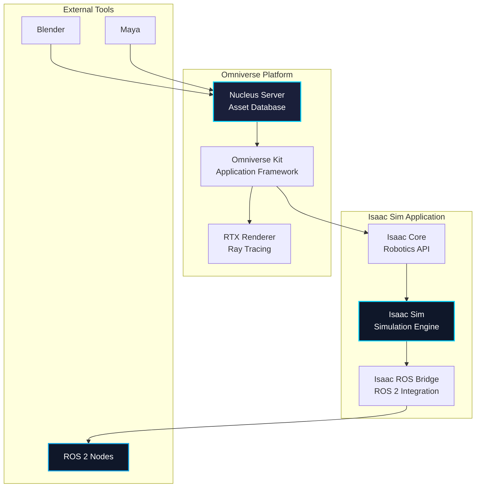
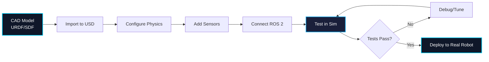

# Chapter 1: Isaac Sim Introduction

## Learning Objectives

By the end of this chapter, you will be able to:

1. Understand NVIDIA Omniverse and its role in robotics simulation
2. Explain the Universal Scene Description (USD) format and its advantages
3. Identify Isaac Sim's key capabilities and features
4. Determine system requirements for running Isaac Sim
5. Install and configure Isaac Sim for robotics development
6. Create your first Isaac Sim scene with ROS 2 integration
7. Compare Isaac Sim with traditional robotics simulators

---

## 1. Introduction to Isaac Sim

**NVIDIA Isaac Sim** is a scalable robotics simulation platform built on NVIDIA Omniverse, designed to provide photorealistic, physically accurate virtual environments for developing, testing, and training robots powered by AI.

### Why Isaac Sim?

Isaac Sim addresses critical challenges in modern robotics development:

- **Photorealistic Rendering**: Ray-traced graphics for realistic sensor simulation (cameras, LiDAR)
- **Physics Accuracy**: NVIDIA PhysX 5 provides high-fidelity rigid body and soft body dynamics
- **Scalability**: Cloud-based deployment for massive parallel simulations
- **ROS 2 Native Integration**: First-class support for ROS 2 communication
- **Synthetic Data Generation**: Create labeled training data for machine learning
- **Sim-to-Real Transfer**: High-fidelity simulation reduces the reality gap

### Isaac Sim vs Traditional Simulators

| Feature | Isaac Sim | Gazebo | Unity |
|---------|-----------|--------|-------|
| **Physics Engine** | PhysX 5 | ODE/Bullet/DART | PhysX 4 |
| **Rendering** | RTX Ray Tracing | OpenGL/OGRE | HDRP/URP |
| **ROS 2 Integration** | Native | gazebo_ros_pkgs | ROS-TCP Bridge |
| **USD Support** | Native | Limited | Via plugins |
| **Multi-GPU** | Yes | No | Limited |
| **Cloud Deployment** | Kubernetes | Manual | Manual |
| **Sensor Accuracy** | High (RTX) | Medium | Medium-High |
| **Learning Curve** | Steep | Moderate | Moderate |
| **License** | Free (with restrictions) | Apache 2.0 | Free/Plus/Pro |

---

## 2. NVIDIA Omniverse Foundation

### What is Omniverse?

**NVIDIA Omniverse** is a platform for building and operating 3D workflows and applications. It provides the foundation for Isaac Sim through:

1. **USD as Core Format**: Universal Scene Description for interoperability
2. **Nucleus Server**: Collaborative database for 3D assets
3. **RTX Rendering**: Real-time ray tracing with NVIDIA RTX GPUs
4. **Connectors**: Integration with DCC tools (Blender, Maya, Unreal Engine)
5. **Extensions**: Python-based plugin system for custom functionality

### Omniverse Architecture



---

## 3. Universal Scene Description (USD)

### USD Overview

**Universal Scene Description (USD)** is an open-source file format developed by Pixar for describing, composing, and simulating 3D scenes.

#### Key USD Concepts

1. **Layers**: Composable scene descriptions that can be stacked
2. **Prims**: Primitive scene elements (meshes, cameras, lights)
3. **Properties**: Attributes and relationships of prims
4. **Composition Arcs**: Mechanisms for combining layers (references, payloads, variants)

### USD in Robotics

USD provides several advantages for robotics simulation:

- **Non-destructive Editing**: Layer system preserves original assets
- **Collaboration**: Multiple users can work on different layers simultaneously
- **Scalability**: Lazy loading with payloads for large scenes
- **Interoperability**: Exchange assets between different DCC tools
- **Version Control**: Text-based format (USDA) works with Git

### USD Example: Simple Robot

```python
# robot.usda - USD ASCII format
#usda 1.0
(
    defaultPrim = "Robot"
    upAxis = "Z"
    metersPerUnit = 1
)

def Xform "Robot" (
    kind = "component"
)
{
    def Cube "Base"
    {
        double size = 0.5
        color3f[] primvars:displayColor = [(0, 0.5, 1)]

        float3 xformOp:translate = (0, 0, 0.25)
        uniform token[] xformOpOrder = ["xformOp:translate"]
    }

    def Cylinder "Wheel_Left"
    {
        double radius = 0.1
        double height = 0.05

        float3 xformOp:translate = (0.2, -0.3, 0.1)
        uniform token[] xformOpOrder = ["xformOp:translate"]
    }

    def Cylinder "Wheel_Right"
    {
        double radius = 0.1
        double height = 0.05

        float3 xformOp:translate = (0.2, 0.3, 0.1)
        uniform token[] xformOpOrder = ["xformOp:translate"]
    }
}
```

---

## 4. Isaac Sim Capabilities

### Core Features

#### 4.1 Photorealistic Rendering

Isaac Sim uses **NVIDIA RTX** ray tracing for physically accurate rendering:

- **Path Tracing**: Accurate light transport simulation
- **Materials**: PBR (Physically Based Rendering) materials
- **HDRI Lighting**: Image-based lighting for realistic environments
- **Camera Sensors**: RGB, depth, segmentation, instance segmentation

#### 4.2 High-Fidelity Physics

**NVIDIA PhysX 5** provides:

- **Rigid Body Dynamics**: Accurate collision and contact simulation
- **Articulated Bodies**: Joint constraints for robot mechanisms
- **Soft Bodies**: Deformable objects (cables, fabrics)
- **Fluids**: Particle-based fluid simulation (experimental)
- **Multi-GPU Physics**: Distribute physics computation across GPUs

#### 4.3 Sensor Simulation

Isaac Sim supports a wide range of robotic sensors:

| Sensor Type | Simulation Method | Accuracy |
|-------------|-------------------|----------|
| **RGB Camera** | RTX Ray Tracing | High |
| **Depth Camera** | Z-buffer / Ray Tracing | High |
| **LiDAR** | Ray Casting | Medium-High |
| **IMU** | Physics-based | High |
| **Contact Sensor** | PhysX Contacts | High |
| **Ultrasonic** | Ray Casting | Medium |
| **Force/Torque** | PhysX Joints | High |

#### 4.4 ROS 2 Integration

Isaac Sim provides native ROS 2 support through:

- **Isaac ROS Bridge**: Bidirectional communication with ROS 2 nodes
- **Clock Synchronization**: Simulation time published to `/clock` topic
- **Message Types**: Support for common ROS 2 message types
- **Action Servers**: Integration with ROS 2 actions
- **TF2**: Transform broadcasting for robot links

#### 4.5 Synthetic Data Generation

Generate labeled datasets for machine learning:

- **Semantic Segmentation**: Per-pixel class labels
- **Instance Segmentation**: Separate object instances
- **Bounding Boxes**: 2D and 3D bounding boxes
- **Depth Maps**: Accurate depth information
- **Normal Maps**: Surface normal vectors
- **Domain Randomization**: Automated scene variation

---

## 5. System Requirements

### Minimum Requirements

To run Isaac Sim effectively, you need:

#### Hardware

- **GPU**: NVIDIA RTX 2080 Ti (11GB VRAM) or better
  - Recommended: RTX 3090 (24GB), RTX 4090 (24GB), or A6000 (48GB)
- **CPU**: Intel i7 9th Gen or AMD Ryzen 7 3rd Gen
- **RAM**: 32GB DDR4 (64GB recommended for large scenes)
- **Storage**: 50GB SSD space for installation
  - Additional space for USD assets and caches

#### Software

- **OS**: Ubuntu 20.04 or 22.04 (primary support)
  - Windows 10/11 supported but with limitations
- **NVIDIA Driver**: 525.xx or newer
- **CUDA**: 11.8 or newer (installed with driver)
- **Python**: 3.7, 3.8, or 3.10

### Recommended Configurations

#### Development Workstation

- **GPU**: NVIDIA RTX 4090 (24GB VRAM)
- **CPU**: Intel i9 13900K or AMD Ryzen 9 7950X
- **RAM**: 64GB DDR5
- **Storage**: 1TB NVMe SSD
- **Display**: 4K monitor with G-SYNC

**Cost**: ~$3,500-$5,000

#### Professional Workstation

- **GPU**: NVIDIA RTX A6000 (48GB VRAM)
- **CPU**: AMD Threadripper PRO 5975WX
- **RAM**: 128GB DDR4 ECC
- **Storage**: 2TB NVMe RAID
- **Network**: 10GbE for Nucleus collaboration

**Cost**: ~$8,000-$12,000

#### Cloud Deployment

For scalable simulations, use cloud GPU instances:

- **AWS**: g5.xlarge (1x A10G, 24GB VRAM) - $1.006/hour
- **AWS**: g5.12xlarge (4x A10G, 96GB VRAM) - $5.672/hour
- **GCP**: a2-highgpu-1g (1x A100, 40GB VRAM) - $3.67/hour
- **Azure**: NCasT4_v3 (1x T4, 16GB VRAM) - $0.526/hour

---

## 6. Installation Guide

### Method 1: Omniverse Launcher (Recommended)

#### Step 1: Install Omniverse Launcher

```bash
# Download Omniverse Launcher
wget https://install.launcher.omniverse.nvidia.com/installers/omniverse-launcher-linux.AppImage

# Make executable
chmod +x omniverse-launcher-linux.AppImage

# Run launcher
./omniverse-launcher-linux.AppImage
```

#### Step 2: Install Isaac Sim from Launcher

1. Open Omniverse Launcher
2. Navigate to **Exchange** tab
3. Search for "Isaac Sim"
4. Click **Install** (downloads ~15GB)
5. Wait for installation to complete

#### Step 3: Verify Installation

Launch Isaac Sim from the Launcher and check the console for errors.

### Method 2: Docker Container (Recommended for Cloud)

#### Pull Isaac Sim Docker Image

```bash
# Pull the latest Isaac Sim image
docker pull nvcr.io/nvidia/isaac-sim:2023.1.1

# Run Isaac Sim container with GPU support
docker run --name isaac-sim --entrypoint bash -it --gpus all \
  -e "ACCEPT_EULA=Y" \
  --rm --network=host \
  -v ~/docker/isaac-sim/cache/kit:/isaac-sim/kit/cache:rw \
  -v ~/docker/isaac-sim/cache/ov:/root/.cache/ov:rw \
  -v ~/docker/isaac-sim/cache/pip:/root/.cache/pip:rw \
  -v ~/docker/isaac-sim/cache/glcache:/root/.cache/nvidia/GLCache:rw \
  -v ~/docker/isaac-sim/cache/computecache:/root/.nv/ComputeCache:rw \
  -v ~/docker/isaac-sim/logs:/root/.nvidia-omniverse/logs:rw \
  -v ~/docker/isaac-sim/data:/root/.local/share/ov/data:rw \
  -v ~/docker/isaac-sim/documents:/root/Documents:rw \
  nvcr.io/nvidia/isaac-sim:2023.1.1
```

#### Run Isaac Sim in Headless Mode

```bash
# Inside the container
./runheadless.native.sh
```

### Method 3: pip Installation (Python Package)

```bash
# Install Isaac Sim Python package
pip install isaacsim==2023.1.1 --extra-index-url https://pypi.nvidia.com

# Verify installation
python -c "from isaacsim import SimulationApp; print('Isaac Sim installed successfully')"
```

---

## 7. First Isaac Sim Scene

### Creating a Simple Robot Scene

#### Step 1: Launch Isaac Sim

Open Isaac Sim from the Omniverse Launcher or run the Python script.

#### Step 2: Create Python Script

Create `simple_robot_scene.py`:

```python
"""
Simple Isaac Sim scene with a robot and ROS 2 integration.
"""

from isaacsim import SimulationApp

# Initialize Isaac Sim
simulation_app = SimulationApp({"headless": False})

import omni
from omni.isaac.core import World
from omni.isaac.core.objects import DynamicCuboid
from omni.isaac.core.robots import Robot
from omni.isaac.core.utils.types import ArticulationAction
import numpy as np

# Create world
world = World(stage_units_in_meters=1.0)

# Add ground plane
world.scene.add_default_ground_plane()

# Add a simple robot (cube with wheels)
robot_prim_path = "/World/SimpleRobot"
robot = Robot(prim_path=robot_prim_path, name="simple_robot")

# Add robot base
base = DynamicCuboid(
    prim_path=f"{robot_prim_path}/base",
    name="robot_base",
    position=np.array([0, 0, 0.5]),
    scale=np.array([0.5, 0.5, 0.5]),
    color=np.array([0, 0.5, 1.0])
)
world.scene.add(base)

# Reset world
world.reset()

print("Isaac Sim scene created successfully!")
print("Press Ctrl+C to exit")

# Simulation loop
try:
    while simulation_app.is_running():
        world.step(render=True)
except KeyboardInterrupt:
    print("Simulation stopped")

# Cleanup
simulation_app.close()
```

#### Step 3: Run the Scene

```bash
# Run with Isaac Sim Python
~/.local/share/ov/pkg/isaac_sim-2023.1.1/python.sh simple_robot_scene.py

# Or if using pip installation
python simple_robot_scene.py
```

---

## 8. Isaac Sim with ROS 2

### Enabling ROS 2 Bridge

Isaac Sim includes a native ROS 2 bridge for seamless integration.

#### Step 1: Enable ROS 2 Extension

In Isaac Sim GUI:
1. Go to **Window → Extensions**
2. Search for "ROS2"
3. Enable **omni.isaac.ros2_bridge**

#### Step 2: Python Script with ROS 2

```python
"""
Isaac Sim scene with ROS 2 publishing.
"""

from isaacsim import SimulationApp

simulation_app = SimulationApp({"headless": False})

from omni.isaac.core import World
from omni.isaac.core.utils.extensions import enable_extension

# Enable ROS 2 extension
enable_extension("omni.isaac.ros2_bridge")

import rclpy
from geometry_msgs.msg import Twist
from omni.isaac.core.objects import DynamicCuboid
import numpy as np

# Initialize ROS 2
rclpy.init()

# Create world
world = World(stage_units_in_meters=1.0)
world.scene.add_default_ground_plane()

# Add robot
robot = DynamicCuboid(
    prim_path="/World/Robot",
    name="robot",
    position=np.array([0, 0, 0.5]),
    scale=np.array([0.5, 0.3, 0.2]),
    color=np.array([0, 0.5, 1.0])
)
world.scene.add(robot)

# Reset
world.reset()

# ROS 2 publisher
from omni.isaac.core.utils.stage import get_current_stage
from pxr import Usd, UsdGeom
import omni.isaac.core.utils.numpy.rotations as rot_utils

# Create ROS 2 clock publisher
from omni.isaac.ros2_bridge import ROS2Bridge
ros2_bridge = ROS2Bridge()

print("Isaac Sim with ROS 2 running!")
print("Publishing to /clock topic")

# Simulation loop
try:
    while simulation_app.is_running():
        world.step(render=True)

        # Publish simulation time to ROS 2
        # (handled automatically by ROS2Bridge)

except KeyboardInterrupt:
    print("Simulation stopped")

# Cleanup
rclpy.shutdown()
simulation_app.close()
```

---

## 9. Isaac Sim Workflow

### Typical Development Workflow



### Best Practices

1. **Start Simple**: Begin with basic scenes before adding complexity
2. **Use USD Layers**: Organize assets into reusable layers
3. **Version Control**: Store USD files in Git for collaboration
4. **Optimize Performance**: Use LODs and instancing for large scenes
5. **Profile Regularly**: Use NVIDIA Nsight for performance analysis
6. **Document Everything**: Add metadata to USD prims for clarity

---

## 10. Common Issues and Troubleshooting

### Issue 1: Black Screen on Launch

**Symptoms**: Isaac Sim window shows black screen

**Solutions**:
```bash
# Update NVIDIA driver
sudo apt update
sudo apt install nvidia-driver-525

# Clear cache
rm -rf ~/.cache/ov
rm -rf ~/.nvidia-omniverse/

# Relaunch Isaac Sim
```

### Issue 2: GPU Out of Memory

**Symptoms**: Crash with "CUDA out of memory" error

**Solutions**:
- Reduce viewport resolution: **Window → Viewport → Resolution → 720p**
- Disable ray tracing: **Renderer → Mode → Raster**
- Close other GPU applications
- Use smaller scenes or fewer instances

### Issue 3: ROS 2 Bridge Not Working

**Symptoms**: ROS 2 topics not appearing

**Solutions**:
```bash
# Source ROS 2 before launching Isaac Sim
source /opt/ros/humble/setup.bash

# Verify ROS 2 domain ID
export ROS_DOMAIN_ID=0

# Check firewall settings
sudo ufw allow from 224.0.0.0/4
sudo ufw allow from 239.0.0.0/8
```

### Issue 4: Slow Simulation Performance

**Symptoms**: Low FPS, stuttering

**Solutions**:
- Reduce physics substeps: Edit → Preferences → Physics → Substeps: 1
- Disable shadows: RTX Settings → Shadows → Off
- Use simplified collision meshes
- Enable GPU acceleration: Physics Settings → Use GPU: True

---

## 11. Learning Resources

### Official Documentation

- [Isaac Sim Documentation](https://docs.omniverse.nvidia.com/isaacsim/latest/index.html)
- [USD Documentation](https://graphics.pixar.com/usd/docs/index.html)
- [Omniverse Documentation](https://docs.omniverse.nvidia.com/)
- [PhysX 5 Documentation](https://nvidia-omniverse.github.io/PhysX/physx/5.1.0/)

### Video Tutorials

- [NVIDIA Isaac Sim YouTube Channel](https://www.youtube.com/@NVIDIAOmniverse)
- [Getting Started with Isaac Sim](https://www.youtube.com/watch?v=9kWuf7Qx1rI)
- [USD Fundamentals](https://www.youtube.com/watch?v=Yc8VEVgQPeo)

### Community Resources

- [NVIDIA Developer Forums](https://forums.developer.nvidia.com/c/omniverse/simulation/69)
- [Isaac Sim GitHub Examples](https://github.com/NVIDIA-Omniverse/IsaacSim-dockerfiles)
- [USD Working Group](https://github.com/usd-wg)

---

## Assessment Questions

### Traditional Questions

1. **What is the primary rendering technology used in Isaac Sim?**
   - Answer: NVIDIA RTX ray tracing for photorealistic, physically accurate rendering

2. **Explain the role of USD in Isaac Sim. Why is it important?**
   - Answer: USD (Universal Scene Description) provides a composable, non-destructive scene format that enables collaboration, version control, and interoperability between different tools. It's important because it allows multiple users to work on different aspects of a scene simultaneously and facilitates asset exchange.

3. **Compare the physics engines used in Isaac Sim, Gazebo, and Unity.**
   - Answer: Isaac Sim uses PhysX 5 (most advanced), Gazebo uses ODE/Bullet/DART (modular but older), Unity uses PhysX 4 (mature but less advanced than 5). PhysX 5 offers better performance, multi-GPU support, and more accurate articulated body simulation.

4. **What are the minimum GPU requirements for running Isaac Sim, and why?**
   - Answer: RTX 2080 Ti (11GB VRAM) minimum. Required because Isaac Sim uses RTX ray tracing for rendering and needs CUDA cores for physics simulation. More VRAM enables larger scenes and higher resolution rendering.

5. **Describe three advantages of using Isaac Sim over Gazebo for humanoid robot simulation.**
   - Answer: (1) Photorealistic rendering with RTX ray tracing for more accurate camera/LiDAR simulation, (2) Native ROS 2 integration without additional bridge packages, (3) Better synthetic data generation capabilities for training machine learning models with semantic segmentation and domain randomization.

### Knowledge Check Questions

6. **Multiple Choice: Which format does Isaac Sim use for scene description?**
   - A) URDF
   - B) SDF
   - C) USD ✓
   - D) XML
   - Answer: C. USD (Universal Scene Description) is the native format for Isaac Sim and Omniverse

7. **True/False: Isaac Sim can only run on NVIDIA GPUs.**
   - Answer: True. Isaac Sim requires NVIDIA RTX GPUs for ray tracing and CUDA for physics computation.

8. **Fill in the blank: Isaac Sim is built on the __________ platform.**
   - Answer: NVIDIA Omniverse

9. **Short Answer: What is the purpose of the Nucleus server in Omniverse?**
   - Answer: Nucleus is a collaborative database server that stores and manages 3D assets, enabling multiple users to work on the same scene simultaneously with live synchronization.

10. **Scenario: You want to generate synthetic training data for a vision-based pick-and-place task. Which Isaac Sim feature would you use, and why?**
    - Answer: Use the Synthetic Data Generation features including semantic segmentation for object labels, domain randomization for scene variation, and bounding box generation for object detection. This provides large labeled datasets without manual annotation, with realistic lighting and material variations that improve sim-to-real transfer.

---

## Summary

In this chapter, you learned about:

- **NVIDIA Isaac Sim**: A photorealistic robotics simulator built on Omniverse
- **USD Format**: Universal Scene Description for composable 3D scenes
- **Key Capabilities**: RTX rendering, PhysX 5 physics, ROS 2 integration, synthetic data generation
- **System Requirements**: Minimum RTX 2080 Ti, 32GB RAM, Ubuntu 20.04/22.04
- **Installation Methods**: Omniverse Launcher, Docker, pip package
- **First Scene**: Creating a simple robot scene with ROS 2 publishing
- **Workflow**: Import CAD → Configure physics → Add sensors → Test → Deploy

Isaac Sim represents the cutting edge of robotics simulation, providing tools for developing next-generation AI-powered robots with accurate sensor simulation and scalable cloud deployment.

---

**Next Chapter**: [Chapter 2: Isaac ROS VSLAM/Perception](./chapter2.md) - Learn how to implement visual SLAM and perception pipelines using Isaac ROS packages.
