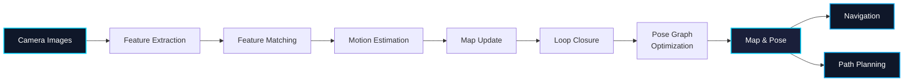
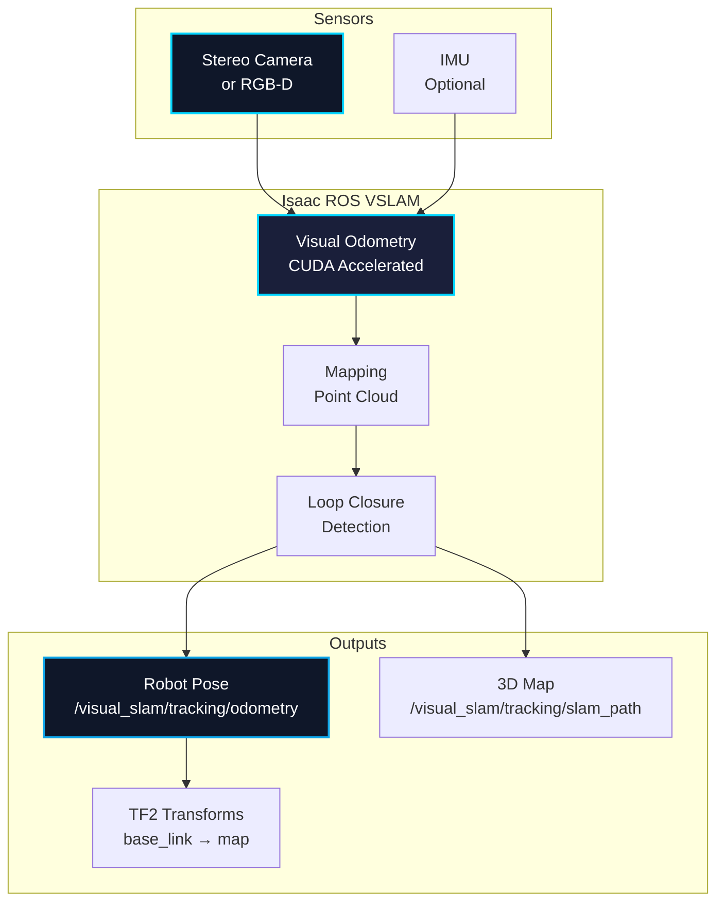
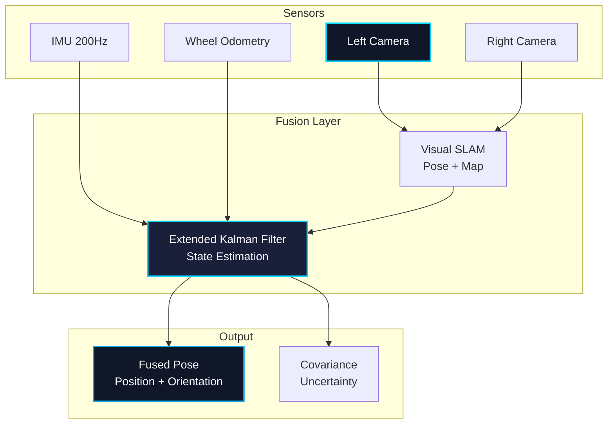

# Chapter 2: Isaac ROS VSLAM/Perception

## Learning Objectives

By the end of this chapter, you will be able to:

1. Understand Visual SLAM (VSLAM) algorithms and their role in robotics
2. Explain depth perception techniques for 3D environment understanding
3. Implement sensor fusion for robust perception
4. Use Isaac ROS packages for VSLAM and perception tasks
5. Configure and tune VSLAM parameters for different environments
6. Process point clouds and depth images for obstacle detection
7. Integrate perception pipelines with navigation systems

---

## 1. Introduction to Visual SLAM

**Visual Simultaneous Localization and Mapping (VSLAM)** is a technique that enables robots to build a map of an unknown environment while simultaneously tracking their position within that map using visual sensors (cameras).

### Why VSLAM?

Traditional localization methods require:
- Pre-built maps
- External infrastructure (GPS, beacons)
- Expensive sensors (LiDAR)

VSLAM offers:
- ✅ Camera-only localization (low cost)
- ✅ Dense 3D reconstruction
- ✅ Works indoors and outdoors
- ✅ Scales to large environments
- ✅ Enables autonomous exploration

### VSLAM Pipeline Overview



---

## 2. VSLAM Algorithms

### 2.1 Feature-Based VSLAM

Feature-based methods extract distinctive keypoints from images and track them across frames.

#### ORB-SLAM3

**ORB-SLAM3** is one of the most popular open-source VSLAM systems.

**Key Features:**
- Monocular, stereo, and RGB-D camera support
- Multi-map system for disconnected environments
- Real-time loop closure detection
- Place recognition

**Algorithm Steps:**

1. **Feature Extraction**: Extract ORB (Oriented FAST and Rotated BRIEF) features
2. **Tracking**: Match features between consecutive frames
3. **Local Mapping**: Create and optimize local map points
4. **Loop Closing**: Detect revisited places and optimize global map
5. **Pose Graph Optimization**: Bundle adjustment for accuracy

#### Example: ORB Feature Detection

```python
"""
Simple ORB feature detection example.
"""

import cv2
import numpy as np

def detect_orb_features(image_path):
    """
    Detect ORB features in an image.

    Args:
        image_path: Path to input image

    Returns:
        keypoints: List of detected keypoints
        descriptors: Feature descriptors
    """
    # Load image
    img = cv2.imread(image_path, cv2.IMREAD_GRAYSCALE)

    # Create ORB detector
    orb = cv2.ORB_create(
        nfeatures=1000,      # Maximum number of features
        scaleFactor=1.2,     # Pyramid decimation ratio
        nlevels=8,           # Number of pyramid levels
        edgeThreshold=31,    # Border size
        firstLevel=0,        # First pyramid level
        WTA_K=2,             # Number of points for descriptor
        scoreType=cv2.ORB_HARRIS_SCORE,
        patchSize=31         # Patch size for descriptor
    )

    # Detect keypoints and compute descriptors
    keypoints, descriptors = orb.detectAndCompute(img, None)

    # Draw keypoints
    img_keypoints = cv2.drawKeypoints(
        img,
        keypoints,
        None,
        color=(0, 255, 0),
        flags=cv2.DRAW_MATCHES_FLAGS_DRAW_RICH_KEYPOINTS
    )

    print(f"Detected {len(keypoints)} ORB features")

    return keypoints, descriptors, img_keypoints

# Usage
keypoints, descriptors, viz = detect_orb_features('camera_frame.png')
cv2.imshow('ORB Features', viz)
cv2.waitKey(0)
```

### 2.2 Direct Methods (Dense VSLAM)

Direct methods use pixel intensity values directly, without feature extraction.

#### LSD-SLAM

**LSD-SLAM (Large-Scale Direct SLAM)** operates on image intensities.

**Advantages:**
- Works in low-texture environments
- Dense or semi-dense reconstruction
- No feature extraction overhead

**Disadvantages:**
- Sensitive to lighting changes
- Higher computational cost
- Requires good initialization

### 2.3 Hybrid Methods

Modern VSLAM systems combine feature-based and direct methods for robustness.

---

## 3. Depth Perception

### 3.1 Stereo Vision

Stereo cameras mimic human binocular vision to estimate depth.

#### Stereo Depth Estimation

```python
"""
Stereo depth estimation using OpenCV.
"""

import cv2
import numpy as np

def compute_stereo_depth(left_image, right_image, baseline=0.12, focal_length=700):
    """
    Compute depth map from stereo image pair.

    Args:
        left_image: Left camera image (grayscale)
        right_image: Right camera image (grayscale)
        baseline: Distance between cameras in meters
        focal_length: Camera focal length in pixels

    Returns:
        depth_map: Depth map in meters
    """
    # Create StereoBM object
    stereo = cv2.StereoBM_create(
        numDisparities=16*5,  # Must be divisible by 16
        blockSize=15          # Matching block size (odd number)
    )

    # Compute disparity map
    disparity = stereo.compute(left_image, right_image)

    # Convert to float and normalize
    disparity = disparity.astype(np.float32) / 16.0

    # Avoid division by zero
    disparity[disparity == 0] = 0.1

    # Compute depth: depth = (baseline * focal_length) / disparity
    depth_map = (baseline * focal_length) / disparity

    # Clip to reasonable range (0.1m to 10m)
    depth_map = np.clip(depth_map, 0.1, 10.0)

    return depth_map

# Load stereo images
left = cv2.imread('left_camera.png', cv2.IMREAD_GRAYSCALE)
right = cv2.imread('right_camera.png', cv2.IMREAD_GRAYSCALE)

# Compute depth
depth = compute_stereo_depth(left, right)

# Visualize
depth_vis = cv2.applyColorMap(
    cv2.convertScaleAbs(depth, alpha=25),
    cv2.COLORMAP_JET
)
cv2.imshow('Depth Map', depth_vis)
cv2.waitKey(0)
```

### 3.2 RGB-D Cameras

RGB-D cameras (e.g., RealSense, Kinect) provide aligned color and depth images.

**Advantages:**
- Direct depth measurement
- No stereo correspondence needed
- Works in textureless environments

**Limitations:**
- Limited range (0.3m - 10m typically)
- Outdoor performance issues (IR-based)
- Higher power consumption

### 3.3 LiDAR

LiDAR provides accurate 3D point clouds but at higher cost.

**Comparison:**

| Sensor | Range | Accuracy | FPS | Cost | Power |
|--------|-------|----------|-----|------|-------|
| **Stereo Camera** | 0.5-20m | Medium | 30-60 | $100-$500 | Low |
| **RGB-D** | 0.3-10m | High | 30-90 | $200-$600 | Medium |
| **LiDAR** | 1-100m | Very High | 10-20 | $1k-$75k | High |

---

## 4. Isaac ROS Overview

**Isaac ROS** is a collection of hardware-accelerated ROS 2 packages optimized for NVIDIA GPUs.

### Isaac ROS Packages

| Package | Function | Acceleration |
|---------|----------|--------------|
| **isaac_ros_visual_slam** | Visual odometry and SLAM | CUDA + TensorRT |
| **isaac_ros_image_proc** | Image processing | CUDA |
| **isaac_ros_depth_segmentation** | Depth-based segmentation | CUDA |
| **isaac_ros_apriltag** | AprilTag detection | CUDA |
| **isaac_ros_dnn_inference** | Deep learning inference | TensorRT |

### Performance Benefits

Isaac ROS packages leverage GPU acceleration:

- **10-20x** faster than CPU implementations
- **Lower latency** for real-time control
- **Higher throughput** for multi-camera systems
- **Energy efficient** compared to CPU-only solutions

---

## 5. Isaac ROS Visual SLAM

### 5.1 Architecture



### 5.2 Installation

#### Prerequisites

```bash
# Install NVIDIA CUDA and cuDNN (if not already installed)
sudo apt install nvidia-cuda-toolkit

# Install ROS 2 Humble
sudo apt install ros-humble-desktop

# Install Isaac ROS common packages
sudo apt install ros-humble-isaac-ros-common
```

#### Install Isaac ROS Visual SLAM

```bash
# Create workspace
mkdir -p ~/isaac_ros_ws/src
cd ~/isaac_ros_ws/src

# Clone Isaac ROS Visual SLAM
git clone https://github.com/NVIDIA-ISAAC-ROS/isaac_ros_visual_slam.git

# Install dependencies
cd ~/isaac_ros_ws
rosdep install --from-paths src --ignore-src -r -y

# Build
colcon build --symlink-install

# Source
source ~/isaac_ros_ws/install/setup.bash
```

### 5.3 Configuration

Create a launch file `visual_slam_launch.py`:

```python
"""
Isaac ROS Visual SLAM launch file.
"""

from launch import LaunchDescription
from launch_ros.actions import Node
from launch.actions import DeclareLaunchArgument
from launch.substitutions import LaunchConfiguration

def generate_launch_description():
    """Generate launch description for Isaac ROS Visual SLAM."""

    # Declare arguments
    camera_type_arg = DeclareLaunchArgument(
        'camera_type',
        default_value='stereo',
        description='Camera type: stereo or rgbd'
    )

    enable_imu_arg = DeclareLaunchArgument(
        'enable_imu',
        default_value='false',
        description='Enable IMU fusion'
    )

    # Visual SLAM node
    visual_slam_node = Node(
        package='isaac_ros_visual_slam',
        executable='isaac_ros_visual_slam',
        name='visual_slam',
        output='screen',
        parameters=[{
            # Camera configuration
            'denoise_input_images': False,
            'rectified_images': True,
            'enable_debug_mode': False,
            'enable_slam_visualization': True,
            'enable_landmarks_view': True,
            'enable_observations_view': True,

            # SLAM parameters
            'num_cameras': 2,
            'min_num_images': 2,
            'max_frame_rate': 30.0,

            # Feature tracking
            'enable_localization_n_mapping': True,
            'enable_imu_fusion': LaunchConfiguration('enable_imu'),

            # Map parameters
            'map_frame': 'map',
            'odom_frame': 'odom',
            'base_frame': 'base_link',

            # Performance tuning
            'gpu_id': 0,
            'enable_verbosity': False,
        }],
        remappings=[
            ('stereo_camera/left/image', '/camera/left/image_raw'),
            ('stereo_camera/left/camera_info', '/camera/left/camera_info'),
            ('stereo_camera/right/image', '/camera/right/image_raw'),
            ('stereo_camera/right/camera_info', '/camera/right/camera_info'),
            ('visual_slam/tracking/odometry', '/odom'),
        ]
    )

    return LaunchDescription([
        camera_type_arg,
        enable_imu_arg,
        visual_slam_node,
    ])
```

### 5.4 Running Isaac ROS VSLAM

#### With Stereo Camera

```bash
# Source workspace
source ~/isaac_ros_ws/install/setup.bash

# Launch VSLAM
ros2 launch isaac_ros_visual_slam visual_slam_launch.py camera_type:=stereo

# In another terminal, check topics
ros2 topic list | grep visual_slam

# Expected topics:
# /visual_slam/status
# /visual_slam/tracking/odometry
# /visual_slam/tracking/slam_path
# /visual_slam/tracking/vo_pose
# /visual_slam/tracking/vo_pose_covariance
```

#### Visualize in RViz2

```bash
# Launch RViz2
rviz2 -d ~/isaac_ros_ws/src/isaac_ros_visual_slam/isaac_ros_visual_slam/rviz/default.rviz

# Add displays:
# - TF (to see camera frames)
# - Path (topic: /visual_slam/tracking/slam_path)
# - Odometry (topic: /visual_slam/tracking/odometry)
# - PointCloud2 (if available)
```

---

## 6. Sensor Fusion

### 6.1 IMU + Camera Fusion

Combining IMU with camera improves robustness:

**Benefits:**
- Better motion tracking during fast movements
- Reduced drift in featureless environments
- Improved scale estimation (monocular cameras)
- Faster recovery from tracking loss

#### IMU Configuration

```yaml
# imu_config.yaml
imu:
  topic: "/imu/data"
  rate: 200  # Hz

  # Noise parameters (from datasheet)
  gyroscope_noise_density: 0.0003
  gyroscope_random_walk: 0.00003
  accelerometer_noise_density: 0.001
  accelerometer_random_walk: 0.0001

  # Extrinsic calibration (IMU to camera)
  T_imu_cam:
    - [0.0148655429818, -0.999880929698, 0.00414029679422, -0.0216401454975]
    - [0.999557249008, 0.0149672133247, 0.025715529948, -0.064676986768]
    - [-0.0257744366974, 0.00375618835797, 0.999660727178, 0.00981073058949]
    - [0.0, 0.0, 0.0, 1.0]
```

### 6.2 Multi-Sensor Fusion Architecture



---

## 7. Point Cloud Processing

### 7.1 Point Cloud Basics

Point clouds represent 3D geometry as a set of points in space.

#### ROS 2 PointCloud2 Message

```python
"""
Publishing point clouds in ROS 2.
"""

import rclpy
from rclpy.node import Node
from sensor_msgs.msg import PointCloud2, PointField
import numpy as np
import struct

class PointCloudPublisher(Node):
    """Publish sample point cloud."""

    def __init__(self):
        super().__init__('pointcloud_publisher')

        self.publisher = self.create_publisher(
            PointCloud2,
            '/camera/depth/points',
            10
        )

        self.timer = self.create_timer(0.1, self.publish_pointcloud)

    def publish_pointcloud(self):
        """Publish a sample point cloud."""

        # Generate sample points (100x100 grid)
        points = []
        for i in range(-50, 50):
            for j in range(-50, 50):
                x = i * 0.01
                y = j * 0.01
                z = 0.1 * np.sin(np.sqrt(x**2 + y**2) * 10)

                # RGB color (optional)
                r = int((i + 50) / 100 * 255)
                g = int((j + 50) / 100 * 255)
                b = 128

                # Pack RGB into single float
                rgb = struct.unpack('f', struct.pack('I',
                    (r << 16) | (g << 8) | b))[0]

                points.append([x, y, z, rgb])

        # Create PointCloud2 message
        msg = PointCloud2()
        msg.header.stamp = self.get_clock().now().to_msg()
        msg.header.frame_id = 'camera_depth_optical_frame'

        msg.height = 1
        msg.width = len(points)
        msg.is_dense = False
        msg.is_bigendian = False

        # Define fields
        msg.fields = [
            PointField(name='x', offset=0, datatype=PointField.FLOAT32, count=1),
            PointField(name='y', offset=4, datatype=PointField.FLOAT32, count=1),
            PointField(name='z', offset=8, datatype=PointField.FLOAT32, count=1),
            PointField(name='rgb', offset=12, datatype=PointField.FLOAT32, count=1),
        ]

        msg.point_step = 16  # 4 fields * 4 bytes
        msg.row_step = msg.point_step * msg.width

        # Pack data
        msg.data = np.array(points, dtype=np.float32).tobytes()

        self.publisher.publish(msg)

def main():
    rclpy.init()
    node = PointCloudPublisher()
    rclpy.spin(node)
    node.destroy_node()
    rclpy.shutdown()

if __name__ == '__main__':
    main()
```

### 7.2 Point Cloud Filtering

```python
"""
Point cloud filtering for obstacle detection.
"""

import numpy as np
from sensor_msgs.msg import PointCloud2
import sensor_msgs_py.point_cloud2 as pc2

def filter_pointcloud(cloud_msg, min_z=0.1, max_z=2.0, min_distance=0.5):
    """
    Filter point cloud for navigation.

    Args:
        cloud_msg: PointCloud2 message
        min_z: Minimum height above ground (meters)
        max_z: Maximum height (meters)
        min_distance: Minimum distance from robot (meters)

    Returns:
        filtered_points: Numpy array of filtered points
    """
    # Convert PointCloud2 to numpy array
    points = np.array(list(pc2.read_points(
        cloud_msg,
        field_names=("x", "y", "z"),
        skip_nans=True
    )))

    if len(points) == 0:
        return np.array([])

    # Filter by height
    height_mask = (points[:, 2] >= min_z) & (points[:, 2] <= max_z)

    # Filter by distance
    distance = np.sqrt(points[:, 0]**2 + points[:, 1]**2)
    distance_mask = distance >= min_distance

    # Combined filter
    filtered_points = points[height_mask & distance_mask]

    return filtered_points

def detect_obstacles(filtered_points, grid_resolution=0.1):
    """
    Detect obstacles in point cloud using 2D occupancy grid.

    Args:
        filtered_points: Filtered point cloud (Nx3 numpy array)
        grid_resolution: Grid cell size in meters

    Returns:
        occupied_cells: List of (x, y) occupied grid cells
    """
    if len(filtered_points) == 0:
        return []

    # Project to 2D grid
    grid_x = (filtered_points[:, 0] / grid_resolution).astype(int)
    grid_y = (filtered_points[:, 1] / grid_resolution).astype(int)

    # Find unique occupied cells
    occupied_cells = list(set(zip(grid_x, grid_y)))

    return occupied_cells
```

---

## 8. Performance Tuning

### 8.1 VSLAM Parameter Tuning

Key parameters to adjust based on environment:

```yaml
# vslam_params.yaml

# Feature detection
num_features: 1000        # Increase for feature-rich environments
quality_threshold: 0.01   # Lower for low-texture scenes

# Tracking
max_keyframes: 50         # Increase for larger maps
min_parallax: 1.0         # Degrees, lower for slow motion

# Loop closure
loop_closure_enabled: true
vocabulary_tree_path: "/path/to/vocab.yml"
min_loop_closure_score: 0.5

# Performance
num_threads: 4            # Match CPU cores
gpu_enabled: true         # Use GPU acceleration
```

### 8.2 Benchmark Results

Isaac ROS Visual SLAM performance on NVIDIA Jetson AGX Orin:

| Resolution | FPS | Latency | Power |
|------------|-----|---------|-------|
| **640x480** | 90 | 11ms | 15W |
| **1280x720** | 60 | 16ms | 22W |
| **1920x1080** | 30 | 33ms | 28W |

CPU-only VSLAM (ORB-SLAM3):
| Resolution | FPS | Latency | Power |
|------------|-----|---------|-------|
| **640x480** | 25 | 40ms | 35W |
| **1280x720** | 12 | 83ms | 40W |

**Speedup: 3-5x with lower power consumption**

---

## 9. Practical Applications

### 9.1 Autonomous Navigation

VSLAM enables robots to navigate without GPS:

1. **Indoor Navigation**: Warehouses, hospitals, offices
2. **Search and Rescue**: Unknown environments
3. **Agriculture**: Field mapping and monitoring
4. **Construction**: Site surveying and progress tracking

### 9.2 Augmented Reality

VSLAM is the foundation of AR applications:

- **Mobile AR**: ARCore, ARKit use VSLAM
- **Industrial AR**: Maintenance and assembly guidance
- **Medical AR**: Surgical navigation

---

## 10. Common Issues and Solutions

### Issue 1: Tracking Loss

**Symptoms**: Odometry jumps, map inconsistencies

**Solutions**:
- Ensure sufficient lighting
- Reduce motion blur (increase shutter speed)
- Add more features to environment (posters, patterns)
- Enable IMU fusion for better motion estimation

### Issue 2: Loop Closure Failures

**Symptoms**: Duplicate map sections, drift accumulation

**Solutions**:
- Verify vocabulary tree is loaded correctly
- Increase `min_loop_closure_score` for more conservative matching
- Ensure revisited areas have distinctive features
- Check camera calibration accuracy

### Issue 3: High CPU/GPU Usage

**Symptoms**: Overheating, throttling, system lag

**Solutions**:
```bash
# Reduce image resolution
ros2 param set /camera/camera image_width 640
ros2 param set /camera/camera image_height 480

# Limit frame rate
ros2 param set /visual_slam max_frame_rate 20.0

# Reduce number of features
ros2 param set /visual_slam num_features 500
```

---

## Assessment Questions

### Traditional Questions

1. **What is Visual SLAM and why is it important for mobile robots?**
   - Answer: Visual SLAM (Simultaneous Localization and Mapping) is a technique that enables robots to build a map of an unknown environment while tracking their position using cameras. It's important because it provides low-cost, infrastructure-free localization without requiring pre-built maps or GPS.

2. **Compare feature-based and direct VSLAM methods. When would you use each?**
   - Answer: Feature-based methods (ORB-SLAM) extract keypoints and are robust to lighting changes but struggle in textureless environments. Direct methods (LSD-SLAM) use pixel intensities directly, working better in low-texture scenes but are sensitive to lighting. Use feature-based for most scenarios, direct methods for feature-poor environments like corridors.

3. **Explain how stereo depth estimation works. What is the relationship between disparity and depth?**
   - Answer: Stereo depth uses triangulation between two cameras. Disparity is the horizontal pixel difference between corresponding points in left and right images. Depth = (baseline × focal_length) / disparity. Closer objects have larger disparity; distant objects have smaller disparity.

4. **What are the advantages of Isaac ROS packages over standard ROS 2 implementations?**
   - Answer: Isaac ROS provides 10-20x performance improvement through CUDA/TensorRT GPU acceleration, lower latency for real-time control, higher throughput for multi-camera systems, and better energy efficiency. Critical for embedded systems and real-time applications.

5. **Describe the role of loop closure in VSLAM. Why is it necessary?**
   - Answer: Loop closure detects when the robot revisits a previously mapped location, enabling correction of accumulated drift through pose graph optimization. Without loop closure, odometry drift accumulates unboundedly, leading to inconsistent maps and inaccurate localization.

### Knowledge Check Questions

6. **Multiple Choice: Which sensor provides the most accurate depth measurements?**
   - A) Stereo camera
   - B) RGB-D camera
   - C) LiDAR ✓
   - D) Monocular camera
   - Answer: C. LiDAR provides centimeter-level accuracy across long ranges, though at higher cost and power consumption.

7. **True/False: Isaac ROS Visual SLAM requires an NVIDIA GPU to function.**
   - Answer: True. Isaac ROS packages are specifically optimized for NVIDIA GPUs using CUDA and TensorRT acceleration.

8. **Fill in the blank: ORB features combine __________ keypoint detector with __________ descriptor.**
   - Answer: FAST (Features from Accelerated Segment Test), BRIEF (Binary Robust Independent Elementary Features)

9. **Short Answer: What is the purpose of sensor fusion in robotic perception?**
   - Answer: Sensor fusion combines data from multiple sensors (cameras, IMU, odometry) to produce more accurate and robust estimates than any single sensor. It reduces individual sensor limitations, handles sensor failures gracefully, and improves overall system reliability.

10. **Scenario: Your robot loses VSLAM tracking in a long, textureless corridor. What modifications would you make?**
    - Answer: (1) Enable IMU fusion for motion estimation, (2) Switch to direct VSLAM method instead of feature-based, (3) Add artificial landmarks (AprilTags, posters) to the corridor, (4) Reduce required minimum features for tracking, (5) Use wheel odometry as backup during tracking loss.

---

## Summary

In this chapter, you learned about:

- **Visual SLAM**: Simultaneous localization and mapping using cameras
- **VSLAM Algorithms**: Feature-based (ORB-SLAM), direct (LSD-SLAM), and hybrid approaches
- **Depth Perception**: Stereo vision, RGB-D cameras, and LiDAR comparison
- **Isaac ROS**: GPU-accelerated perception packages for real-time performance
- **Sensor Fusion**: Combining IMU, cameras, and odometry for robust estimation
- **Point Cloud Processing**: Filtering, obstacle detection, and 3D representation
- **Performance Tuning**: Parameter optimization and benchmarking

Isaac ROS Visual SLAM provides the foundation for autonomous robot navigation, enabling real-time localization and mapping with hardware acceleration on NVIDIA platforms.

---

**Next Chapter**: [Chapter 3: Nav2 Path Planning](./chapter3.md) - Learn how to use the ROS 2 Navigation Stack (Nav2) for autonomous path planning and obstacle avoidance.
