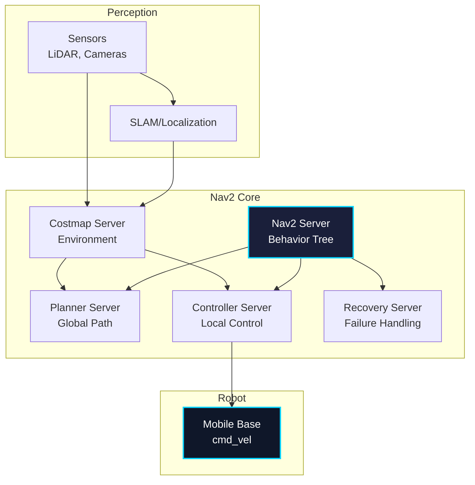
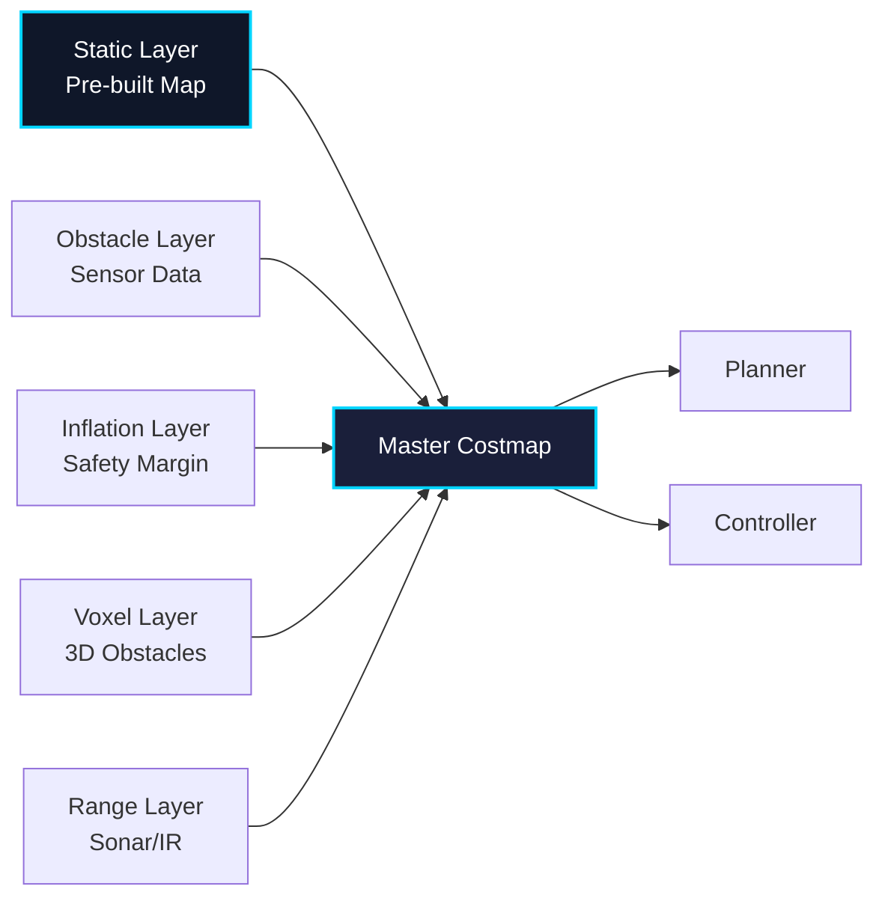
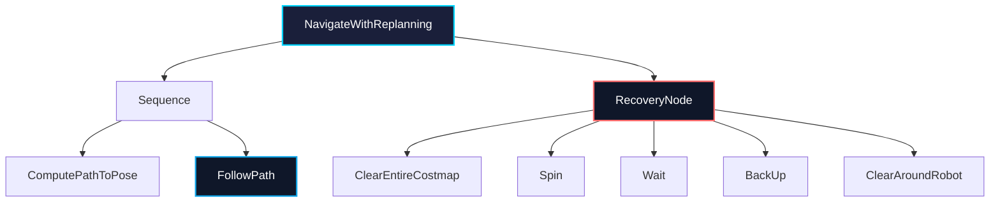

# Chapter 3: Nav2 Path Planning

## Learning Objectives

By the end of this chapter, you will be able to:

1. Understand the ROS 2 Navigation Stack (Nav2) architecture
2. Configure costmaps for environment representation
3. Implement global and local path planning algorithms
4. Tune controller parameters for smooth robot motion
5. Configure recovery behaviors for failure handling
6. Integrate Nav2 with VSLAM for autonomous navigation
7. Optimize navigation performance for different robot types

---

## 1. Introduction to Nav2

**Nav2 (Navigation2)** is the ROS 2 version of the navigation stack, providing a complete framework for autonomous robot navigation.

### What is Nav2?

Nav2 enables robots to:
- Navigate from point A to point B autonomously
- Avoid obstacles dynamically
- Replan paths when obstacles appear
- Recover from navigation failures
- Follow waypoints and paths

### Nav2 vs ROS 1 Navigation

| Feature | Nav2 (ROS 2) | ROS 1 Navigation |
|---------|--------------|-------------------|
| **Architecture** | Behavior Trees | Action servers |
| **Planners** | Pluggable (many options) | move_base limited |
| **Performance** | Better (DDS) | Standard |
| **Configuration** | YAML-based | Parameter server |
| **Recovery** | Behavior tree based | Fixed sequence |
| **Multi-robot** | Native DDS support | Custom solutions |

---

## 2. Nav2 Architecture

### System Overview



### Core Components

1. **BT Navigator**: Behavior tree-based navigation logic
2. **Planner Server**: Computes global paths
3. **Controller Server**: Generates velocity commands
4. **Smoother Server**: Path smoothing (optional)
5. **Recovery Server**: Handles navigation failures
6. **Costmap 2D**: Environment representation
7. **Waypoint Follower**: Multi-waypoint navigation

---

## 3. Costmaps

### 3.1 Costmap Concept

A **costmap** is a 2D grid representing the environment where each cell has a cost value:

- **0**: Free space (robot can navigate)
- **1-252**: Increasing cost (prefer to avoid)
- **253**: Inscribed obstacle (robot footprint)
- **254**: Lethal obstacle (collision)
- **255**: Unknown space

### 3.2 Costmap Layers

Nav2 uses multiple layers to build the final costmap:



### 3.3 Costmap Configuration

#### Global Costmap

```yaml
# global_costmap_params.yaml
global_costmap:
  global_costmap:
    ros__parameters:
      # Frame configuration
      global_frame: map
      robot_base_frame: base_link

      # Update rates
      update_frequency: 1.0  # Hz
      publish_frequency: 1.0

      # Costmap dimensions
      width: 50  # meters
      height: 50
      resolution: 0.05  # meters per cell

      # Robot footprint
      robot_radius: 0.3  # For circular robots
      # For non-circular robots:
      # footprint: "[[0.5, 0.3], [0.5, -0.3], [-0.5, -0.3], [-0.5, 0.3]]"

      # Plugins (layers)
      plugins: ["static_layer", "obstacle_layer", "inflation_layer"]

      # Static layer (pre-built map)
      static_layer:
        plugin: "nav2_costmap_2d::StaticLayer"
        map_subscribe_transient_local: True
        enabled: True

      # Obstacle layer (dynamic obstacles from sensors)
      obstacle_layer:
        plugin: "nav2_costmap_2d::ObstacleLayer"
        enabled: True
        observation_sources: scan
        scan:
          topic: /scan
          max_obstacle_height: 2.0
          clearing: True
          marking: True
          data_type: "LaserScan"
          raytrace_max_range: 3.0
          raytrace_min_range: 0.0
          obstacle_max_range: 2.5
          obstacle_min_range: 0.0

      # Inflation layer (safety margin)
      inflation_layer:
        plugin: "nav2_costmap_2d::InflationLayer"
        enabled: True
        inflation_radius: 0.55  # meters
        cost_scaling_factor: 3.0
        inflate_unknown: False
        inflate_around_unknown: False
```

#### Local Costmap

```yaml
# local_costmap_params.yaml
local_costmap:
  local_costmap:
    ros__parameters:
      global_frame: odom
      robot_base_frame: base_link

      # Update rates (higher for reactive control)
      update_frequency: 5.0  # Hz
      publish_frequency: 2.0

      # Smaller, rolling window
      width: 10  # meters
      height: 10
      resolution: 0.05
      rolling_window: True  # Moves with robot

      robot_radius: 0.3

      plugins: ["voxel_layer", "inflation_layer"]

      # Voxel layer (3D obstacle representation)
      voxel_layer:
        plugin: "nav2_costmap_2d::VoxelLayer"
        enabled: True
        publish_voxel_map: True
        origin_z: 0.0
        z_resolution: 0.05
        z_voxels: 16
        max_obstacle_height: 2.0
        mark_threshold: 0
        observation_sources: scan pointcloud
        scan:
          topic: /scan
          max_obstacle_height: 2.0
          clearing: True
          marking: True
          data_type: "LaserScan"
        pointcloud:
          topic: /camera/depth/points
          max_obstacle_height: 2.0
          clearing: True
          marking: True
          data_type: "PointCloud2"

      inflation_layer:
        plugin: "nav2_costmap_2d::InflationLayer"
        inflation_radius: 0.45
        cost_scaling_factor: 5.0
```

---

## 4. Path Planning

### 4.1 Global Planner

The **global planner** computes a path from start to goal using the static map.

#### Available Planners

| Planner | Algorithm | Best For |
|---------|-----------|----------|
| **NavFn** | Dijkstra's | Simple environments |
| **SmacPlanner2D** | Hybrid A* (2D) | Grid-based planning |
| **SmacPlannerHybrid** | Hybrid A* (SE2) | Car-like robots |
| **SmacPlannerLattice** | State lattice | Complex kinematics |
| **ThetaStar** | Theta* | Any-angle paths |

#### SmacPlanner Configuration

```yaml
# planner_server.yaml
planner_server:
  ros__parameters:
    expected_planner_frequency: 20.0
    planner_plugins: ["GridBased"]

    GridBased:
      plugin: "nav2_smac_planner/SmacPlanner2D"
      tolerance: 0.125  # meters
      downsample_costmap: false
      downsampling_factor: 1
      allow_unknown: true
      max_iterations: 1000000
      max_on_approach_iterations: 1000
      max_planning_time: 2.0  # seconds

      # Motion model
      motion_model_for_search: "MOORE"  # 8-connected grid
      # Options: "VON_NEUMANN" (4), "MOORE" (8), "DUBIN", "REEDS_SHEPP"

      # Cost parameters
      cost_travel_multiplier: 2.0

      # Smoothing
      smoother:
        max_iterations: 1000
        w_smooth: 0.3
        w_data: 0.2
        tolerance: 1.0e-10
```

### 4.2 Local Controller

The **controller** generates velocity commands to follow the global path while avoiding obstacles.

#### Available Controllers

| Controller | Type | Best For |
|------------|------|----------|
| **DWB** | Dynamic Window | Differential drive |
| **TEB** | Timed Elastic Band | Smooth, optimal paths |
| **RPP** | Regulated Pure Pursuit | Simple, fast |
| **MPPI** | Model Predictive Path Integral | Complex dynamics |

#### DWB Controller Configuration

```yaml
# controller.yaml
controller_server:
  ros__parameters:
    controller_frequency: 20.0  # Hz
    min_x_velocity_threshold: 0.001
    min_y_velocity_threshold: 0.5
    min_theta_velocity_threshold: 0.001
    failure_tolerance: 0.3
    progress_checker_plugin: "progress_checker"
    goal_checker_plugins: ["general_goal_checker"]
    controller_plugins: ["FollowPath"]

    # Progress checker (am I making progress?)
    progress_checker:
      plugin: "nav2_controller::SimpleProgressChecker"
      required_movement_radius: 0.5
      movement_time_allowance: 10.0

    # Goal checker (have I reached goal?)
    general_goal_checker:
      plugin: "nav2_controller::SimpleGoalChecker"
      xy_goal_tolerance: 0.25
      yaw_goal_tolerance: 0.25
      stateful: True

    # DWB controller
    FollowPath:
      plugin: "dwb_core::DWBLocalPlanner"
      debug_trajectory_details: True
      min_vel_x: 0.0
      min_vel_y: 0.0
      max_vel_x: 0.5  # m/s
      max_vel_y: 0.0  # Differential drive
      max_vel_theta: 1.0  # rad/s
      min_speed_xy: 0.0
      max_speed_xy: 0.5
      min_speed_theta: 0.0

      # Acceleration limits
      acc_lim_x: 2.5
      acc_lim_y: 0.0
      acc_lim_theta: 3.2
      decel_lim_x: -2.5
      decel_lim_y: 0.0
      decel_lim_theta: -3.2

      # DWB parameters
      vx_samples: 20
      vy_samples: 0
      vtheta_samples: 40
      sim_time: 1.7  # seconds to simulate
      linear_granularity: 0.05
      angular_granularity: 0.025
      transform_tolerance: 0.2
      xy_goal_tolerance: 0.25
      trans_stopped_velocity: 0.25
      short_circuit_trajectory_evaluation: True
      stateful: True

      # Trajectory scoring critics
      critics: ["RotateToGoal", "Oscillation", "BaseObstacle", "GoalAlign", "PathAlign", "PathDist", "GoalDist"]

      BaseObstacle.scale: 0.02
      PathAlign.scale: 32.0
      PathAlign.forward_point_distance: 0.1
      GoalAlign.scale: 24.0
      GoalAlign.forward_point_distance: 0.1
      PathDist.scale: 32.0
      GoalDist.scale: 24.0
      RotateToGoal.scale: 32.0
      RotateToGoal.slowing_factor: 5.0
      RotateToGoal.lookahead_time: -1.0
```

---

## 5. Recovery Behaviors

### 5.1 Behavior Tree

Nav2 uses **behavior trees** to organize navigation logic and recovery behaviors.



### 5.2 Recovery Behavior Configuration

```yaml
# recoveries_server.yaml
recoveries_server:
  ros__parameters:
    costmap_topic: local_costmap/costmap_raw
    footprint_topic: local_costmap/published_footprint
    cycle_frequency: 10.0
    recovery_plugins: ["spin", "backup", "wait"]

    # Spin recovery
    spin:
      plugin: "nav2_recoveries::Spin"
      simulate_ahead_time: 2.0
      max_rotational_vel: 1.0
      min_rotational_vel: 0.4
      rotational_acc_lim: 3.2

    # Backup recovery
    backup:
      plugin: "nav2_recoveries::BackUp"
      simulate_ahead_time: 2.0
      backup_dist: 0.15
      backup_speed: 0.025

    # Wait recovery
    wait:
      plugin: "nav2_recoveries::Wait"
      wait_duration: 5.0
```

### 5.3 Custom Behavior Tree

You can create custom navigation behavior trees:

```xml
<!-- navigate_with_replanning_and_recovery.xml -->
<root main_tree_to_execute="MainTree">
  <BehaviorTree ID="MainTree">
    <RecoveryNode number_of_retries="6" name="NavigateRecovery">
      <!-- Main navigation sequence -->
      <PipelineSequence name="NavigateWithReplanning">
        <RateController hz="1.0">
          <RecoveryNode number_of_retries="1" name="ComputePathToPose">
            <ComputePathToPose goal="{goal}" path="{path}" planner_id="GridBased"/>
            <ClearEntireCostmap name="ClearGlobalCostmap-Context" service_name="global_costmap/clear_entirely_global_costmap"/>
          </RecoveryNode>
        </RateController>
        <RecoveryNode number_of_retries="1" name="FollowPath">
          <FollowPath path="{path}" controller_id="FollowPath"/>
          <ClearEntireCostmap name="ClearLocalCostmap-Context" service_name="local_costmap/clear_entirely_local_costmap"/>
        </RecoveryNode>
      </PipelineSequence>

      <!-- Recovery behaviors -->
      <ReactiveFallback name="RecoveryFallback">
        <GoalUpdated/>
        <SequenceStar name="RecoveryActions">
          <ClearEntireCostmap name="ClearLocalCostmap-Subtree" service_name="local_costmap/clear_entirely_local_costmap"/>
          <ClearEntireCostmap name="ClearGlobalCostmap-Subtree" service_name="global_costmap/clear_entirely_global_costmap"/>
          <Spin spin_dist="1.57"/>
          <Wait wait_duration="5"/>
          <BackUp backup_dist="0.30" backup_speed="0.05"/>
        </SequenceStar>
      </ReactiveFallback>
    </RecoveryNode>
  </BehaviorTree>
</root>
```

---

## 6. Integration with VSLAM

### 6.1 SLAM + Nav2 Architecture

```python
"""
Launch file for VSLAM + Nav2 integration.
"""

from launch import LaunchDescription
from launch_ros.actions import Node
from launch.actions import IncludeLaunchDescription
from launch.launch_description_sources import PythonLaunchDescriptionSource
from ament_index_python.packages import get_package_share_directory
import os

def generate_launch_description():
    """Generate launch description for VSLAM + Nav2."""

    # Package directories
    nav2_bringup_dir = get_package_share_directory('nav2_bringup')
    isaac_vslam_dir = get_package_share_directory('isaac_ros_visual_slam')

    # Launch Isaac ROS Visual SLAM
    vslam_launch = IncludeLaunchDescription(
        PythonLaunchDescriptionSource(
            os.path.join(isaac_vslam_dir, 'launch', 'isaac_ros_visual_slam.launch.py')
        )
    )

    # Launch Nav2
    nav2_launch = IncludeLaunchDescription(
        PythonLaunchDescriptionSource(
            os.path.join(nav2_bringup_dir, 'launch', 'navigation_launch.py')
        ),
        launch_arguments={
            'use_sim_time': 'False',
            'params_file': os.path.join(get_package_share_directory('my_robot_nav'), 'config', 'nav2_params.yaml')
        }.items()
    )

    return LaunchDescription([
        vslam_launch,
        nav2_launch,
    ])
```

---

## 7. Navigation Python API

### 7.1 BasicNavigator

```python
"""
Simple navigation example using BasicNavigator API.
"""

import rclpy
from nav2_simple_commander.robot_navigator import BasicNavigator
from geometry_msgs.msg import PoseStamped
import tf_transformations

def create_pose_stamped(navigator, position_x, position_y, orientation_z):
    """Create a PoseStamped message."""
    q_x, q_y, q_z, q_w = tf_transformations.quaternion_from_euler(0.0, 0.0, orientation_z)

    pose = PoseStamped()
    pose.header.frame_id = 'map'
    pose.header.stamp = navigator.get_clock().now().to_msg()
    pose.pose.position.x = position_x
    pose.pose.position.y = position_y
    pose.pose.position.z = 0.0
    pose.pose.orientation.x = q_x
    pose.pose.orientation.y = q_y
    pose.pose.orientation.z = q_z
    pose.pose.orientation.w = q_w

    return pose

def main():
    """Main navigation function."""
    rclpy.init()

    navigator = BasicNavigator()

    # Wait for Nav2 to be ready
    navigator.waitUntilNav2Active()

    # Define waypoints
    waypoints = [
        create_pose_stamped(navigator, 3.5, 1.0, 0.0),
        create_pose_stamped(navigator, 5.5, 1.5, 1.57),
        create_pose_stamped(navigator, 5.5, 4.5, 3.14),
        create_pose_stamped(navigator, 2.0, 4.0, -1.57),
    ]

    # Navigate through waypoints
    navigator.followWaypoints(waypoints)

    # Monitor progress
    while not navigator.isTaskComplete():
        feedback = navigator.getFeedback()
        if feedback:
            print(f'Waypoint {feedback.current_waypoint + 1}/{len(waypoints)}')

    # Get result
    result = navigator.getResult()
    if result == BasicNavigator.TaskResult.SUCCEEDED:
        print('Navigation succeeded!')
    elif result == BasicNavigator.TaskResult.CANCELED:
        print('Navigation was canceled.')
    elif result == BasicNavigator.TaskResult.FAILED:
        print('Navigation failed!')

    navigator.lifecycleShutdown()
    rclpy.shutdown()

if __name__ == '__main__':
    main()
```

---

## 8. Performance Optimization

### 8.1 Parameter Tuning Guidelines

| Parameter | Effect | Tuning |
|-----------|--------|--------|
| **costmap resolution** | Finer = more accurate | 0.05m typical |
| **update_frequency** | Higher = more responsive | Global: 1Hz, Local: 5Hz |
| **inflation_radius** | Larger = more safety margin | 1.5× robot radius |
| **max_vel_x** | Higher = faster but less safe | Match robot capability |
| **sim_time** | Longer = better prediction | 1.5-2.0s typical |
| **vx_samples** | More = better but slower | 20-40 typical |

### 8.2 Computational Requirements

Nav2 performance on different platforms:

| Platform | CPU | RAM | Update Rate |
|----------|-----|-----|-------------|
| **Desktop (i7)** | 8-core | 16GB | 20Hz |
| **Jetson Orin** | 12-core | 32GB | 15Hz |
| **Jetson Xavier NX** | 6-core | 8GB | 10Hz |
| **Raspberry Pi 4** | 4-core | 8GB | 5Hz |

---

## Assessment Questions

### Traditional Questions

1. **Explain the difference between global and local costmaps in Nav2.**
   - Answer: Global costmap uses the entire known map with static obstacles for long-range planning, updated at 1Hz. Local costmap is a smaller rolling window (e.g., 10×10m) around the robot with dynamic obstacles from sensors, updated at 5Hz for reactive control.

2. **What is the purpose of the inflation layer in costmaps?**
   - Answer: The inflation layer adds a safety margin around obstacles by gradually increasing cost values radiating outward from obstacles. This ensures the robot maintains a safe distance from walls and obstacles, accounting for robot size and positioning uncertainty.

3. **Compare Hybrid A* (SmacPlanner) with Dijkstra's algorithm (NavFn) for path planning.**
   - Answer: Dijkstra's explores all directions uniformly, guaranteeing shortest path but slow. Hybrid A* uses heuristics (estimated cost-to-goal) to guide search toward goal, much faster. Hybrid A* also considers robot kinematics (turning radius), producing feasible paths for car-like robots.

4. **What is a behavior tree and why does Nav2 use it instead of action servers?**
   - Answer: Behavior trees are modular, hierarchical control structures that tick nodes sequentially, allowing complex logic composition. Nav2 uses them for better modularity, easier recovery handling, and clearer navigation logic compared to ROS 1's monolithic move_base action server.

5. **Describe three recovery behaviors and when they would be triggered.**
   - Answer: (1) **Spin**: Rotate in place when path is blocked—clears sensor blind spots and relocates robot. (2) **Backup**: Move backward when stuck against obstacle. (3) **ClearCostmap**: Reset costmap when phantom obstacles appear from sensor noise. Triggered after path planning/following failures.

### Knowledge Check Questions

6. **Multiple Choice: Which planner is best for car-like robots with limited turning radius?**
   - A) NavFn
   - B) SmacPlanner2D
   - C) SmacPlannerHybrid ✓
   - D) ThetaStar
   - Answer: C. SmacPlannerHybrid uses SE(2) state space (x, y, theta) and considers kinematic constraints like turning radius.

7. **True/False: The local costmap should have the same resolution as the global costmap.**
   - Answer: False. Local costmap often uses finer resolution (e.g., 0.05m) for precise obstacle avoidance, while global costmap can use coarser resolution (0.1m) since it's for long-range planning.

8. **Fill in the blank: The DWB controller generates velocity commands by sampling velocities in a __________ around the current velocity.**
   - Answer: dynamic window (velocities reachable within one control cycle given acceleration limits)

9. **Short Answer: Why does Nav2 use two separate costmaps (global and local)?**
   - Answer: Global costmap handles long-range planning with static map, updated slowly (1Hz). Local costmap handles reactive obstacle avoidance with recent sensor data, updated quickly (5Hz). Separating them optimizes computational efficiency and enables different update strategies.

10. **Scenario: Your robot successfully plans a path but oscillates when trying to follow it. Which parameters would you adjust?**
    - Answer: (1) Reduce **max_vel_theta** to limit rotation speed, (2) Increase **xy_goal_tolerance** to be less strict, (3) Adjust critic weights: lower **Oscillation.scale** penalty and increase **PathAlign.scale**, (4) Reduce **vtheta_samples** to limit angular velocity options, (5) Increase **sim_time** for better trajectory prediction.

---

## Summary

In this chapter, you learned about:

- **Nav2 Architecture**: Behavior tree-based navigation with pluggable planners and controllers
- **Costmaps**: Multi-layer environment representation with static, obstacle, and inflation layers
- **Path Planning**: Global planners (SmacPlanner, NavFn) and local controllers (DWB, TEB)
- **Recovery Behaviors**: Spin, backup, wait, and costmap clearing for failure handling
- **VSLAM Integration**: Combining visual SLAM with Nav2 for autonomous navigation
- **Python API**: BasicNavigator for programmatic waypoint navigation
- **Performance Tuning**: Parameter optimization for different robot types and environments

Nav2 provides a complete, production-ready navigation stack for autonomous mobile robots with extensive configurability and modern architectural improvements over ROS 1.

---

**Next Chapter**: [Chapter 4: Synthetic Data & Sim-to-Real](./chapter4.md) - Learn how to generate synthetic training data and transfer policies from simulation to real robots.
