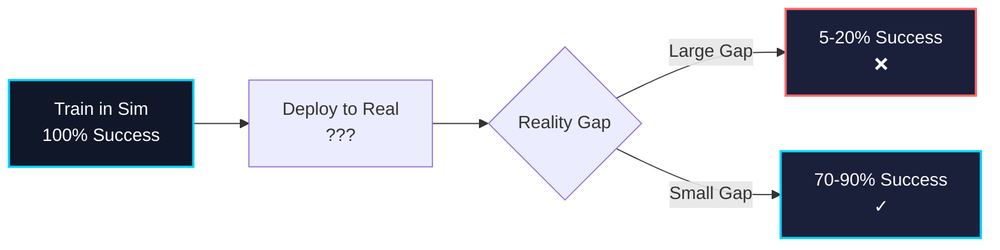
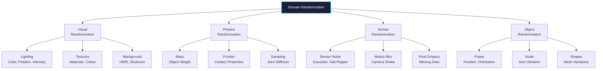

# Chapter 4: Synthetic Data & Sim-to-Real Transfer

## Learning Objectives

By the end of this chapter, you will be able to:

1. Understand the reality gap between simulation and real-world robotics
2. Generate synthetic training data using Isaac Sim
3. Implement domain randomization techniques
4. Apply sim-to-real transfer strategies for robot policies
5. Measure and minimize the reality gap
6. Use synthetic data for training perception models
7. Validate sim-to-real transfer effectiveness

---

## 1. The Reality Gap

### 1.1 What is the Reality Gap?

The **reality gap** is the difference between simulated and real-world environments that causes policies trained in simulation to fail on real robots.

**Sources of the Reality Gap:**

1. **Physics**: Simplified models vs complex real-world dynamics
2. **Sensors**: Perfect simulation vs noisy real sensors
3. **Actuators**: Ideal motors vs real actuator limitations
4. **Environment**: Controlled simulation vs unpredictable real world
5. **Perception**: Synthetic images vs real camera noise

### 1.2 Impact on Robot Performance



**Example Failure Modes:**
- Grasping controller: Works perfectly in sim, drops 80% of objects in reality
- Vision-based navigation: Navigates sim environments flawlessly, crashes into real walls
- Bipedal walking: Stable in sim, falls immediately on real hardware

---

## 2. Synthetic Data Generation

### 2.1 Why Synthetic Data?

**Advantages:**
- ✅ **Scale**: Generate millions of labeled samples automatically
- ✅ **Cost**: Free vs $10-100 per labeled real image
- ✅ **Safety**: No risk of robot damage during data collection
- ✅ **Control**: Perfect ground truth labels (segmentation, depth, poses)
- ✅ **Diversity**: Easy to create rare scenarios (failures, edge cases)

**Challenges:**
- ❌ **Realism**: Synthetic images don't perfectly match real photos
- ❌ **Transfer**: Models may not generalize to real data
- ❌ **Artifacts**: Simulation artifacts (aliasing, lighting)

### 2.2 Synthetic Data Types

| Data Type | Use Case | Isaac Sim Support |
|-----------|----------|-------------------|
| **RGB Images** | Object detection, classification | ✓ RTX rendering |
| **Depth Maps** | 3D reconstruction, SLAM | ✓ Z-buffer/ray tracing |
| **Semantic Segmentation** | Scene understanding | ✓ Per-pixel labels |
| **Instance Segmentation** | Object tracking | ✓ Per-instance IDs |
| **Bounding Boxes** | Object detection | ✓ 2D and 3D boxes |
| **Keypoints** | Pose estimation | ✓ Joint positions |
| **Normals** | Surface reconstruction | ✓ Surface normals |

### 2.3 Isaac Sim Synthetic Data API

```python
"""
Synthetic data generation with Isaac Sim.
"""

from isaacsim import SimulationApp
simulation_app = SimulationApp({"headless": False})

import omni.replicator.core as rep
from omni.isaac.core import World
import numpy as np

# Create world
world = World()
world.scene.add_default_ground_plane()

# Load robot and objects
from omni.isaac.core.utils.stage import add_reference_to_stage
robot_prim = add_reference_to_stage(
    usd_path="/path/to/robot.usd",
    prim_path="/World/Robot"
)

# Register semantic classes
rep.create.semantics(
    [("robot", robot_prim)],
)

# Create camera
camera = rep.create.camera(position=(2, 2, 1.5), look_at=(0, 0, 0.5))

# Define randomization
with rep.trigger.on_frame(num_frames=1000):
    # Randomize lighting
    with rep.create.light(
        light_type="Sphere",
        color=rep.distribution.uniform((0.8, 0.8, 0.8), (1.0, 1.0, 1.0)),
        intensity=rep.distribution.uniform(1000, 5000),
        position=rep.distribution.uniform((-5, -5, 2), (5, 5, 5))
    ):
        pass

    # Randomize robot pose
    with rep.modify.pose(
        prim=robot_prim,
        position=rep.distribution.uniform((-1, -1, 0), (1, 1, 0)),
        rotation=rep.distribution.uniform((0, 0, 0), (0, 0, 360))
    ):
        pass

# Attach writers for data export
rgb_writer = rep.WriterRegistry.get("BasicWriter")
rgb_writer.initialize(
    output_dir="/data/synthetic/rgb",
    rgb=True,
    semantic_segmentation=True,
    instance_segmentation=True,
    bounding_box_2d_tight=True,
    distance_to_camera=True
)
rgb_writer.attach([camera])

# Run simulation and generate data
print("Generating synthetic data...")
rep.orchestrator.run()

simulation_app.close()
```

---

## 3. Domain Randomization

### 3.1 Concept

**Domain Randomization** trains models on diverse simulated environments so they generalize to the real world.

**Key Idea**: If the model sees enough variation in simulation, the real world becomes "just another variation."

### 3.2 Randomization Categories



### 3.3 Visual Domain Randomization

```python
"""
Visual domain randomization in Isaac Sim.
"""

import omni.replicator.core as rep
import numpy as np

def randomize_scene_lighting():
    """Randomize lighting parameters."""

    # Random HDRI environment
    hdri_paths = [
        "/hdris/warehouse.hdr",
        "/hdris/office.hdr",
        "/hdris/outdoor_day.hdr",
        "/hdris/outdoor_night.hdr"
    ]

    with rep.create.light(light_type="Dome"):
        rep.modify.attribute("texture:file", rep.distribution.choice(hdri_paths))
        rep.modify.attribute("intensity", rep.distribution.uniform(500, 2000))
        rep.modify.attribute("exposure", rep.distribution.uniform(-2, 2))

    # Additional point lights
    num_lights = rep.distribution.uniform(0, 3)
    for _ in range(int(num_lights)):
        with rep.create.light(
            light_type="Sphere",
            temperature=rep.distribution.uniform(3000, 7000),
            intensity=rep.distribution.uniform(500, 3000)
        ):
            rep.modify.pose(
                position=rep.distribution.uniform((-5, -5, 1), (5, 5, 5))
            )

def randomize_object_materials(prim_path):
    """Randomize object materials."""

    # Random PBR material
    material = rep.create.material_omnipbr(
        diffuse=rep.distribution.uniform((0.1, 0.1, 0.1), (0.9, 0.9, 0.9)),
        roughness=rep.distribution.uniform(0.0, 1.0),
        metallic=rep.distribution.uniform(0.0, 1.0),
        specular=rep.distribution.uniform(0.0, 1.0)
    )

    rep.randomizer.materials([prim_path], material)

def randomize_camera_parameters(camera):
    """Randomize camera parameters."""

    # Focal length (zoom)
    rep.modify.attribute(
        f"{camera}/focal_length",
        rep.distribution.uniform(18, 50)
    )

    # F-stop (depth of field)
    rep.modify.attribute(
        f"{camera}/f_stop",
        rep.distribution.uniform(1.4, 16)
    )

    # Exposure
    rep.modify.attribute(
        f"{camera}/exposure",
        rep.distribution.uniform(-2, 2)
    )
```

### 3.4 Physics Domain Randomization

```python
"""
Physics domain randomization for robust policies.
"""

from omni.isaac.core.utils.prims import get_prim_at_path
from pxr import UsdPhysics, PhysxSchema
import numpy as np

def randomize_physics_properties(prim_path):
    """Randomize physics properties of an object."""

    prim = get_prim_at_path(prim_path)

    # Randomize mass
    mass_api = UsdPhysics.MassAPI.Apply(prim)
    base_mass = mass_api.GetMassAttr().Get()
    randomized_mass = base_mass * np.random.uniform(0.8, 1.2)
    mass_api.GetMassAttr().Set(randomized_mass)

    # Randomize friction
    material_api = UsdPhysics.MaterialAPI.Apply(prim)
    static_friction = np.random.uniform(0.3, 0.9)
    dynamic_friction = np.random.uniform(0.2, 0.8)
    material_api.CreateStaticFrictionAttr(static_friction)
    material_api.CreateDynamicFrictionAttr(dynamic_friction)

    # Randomize restitution (bounciness)
    restitution = np.random.uniform(0.0, 0.3)
    material_api.CreateRestitutionAttr(restitution)

def randomize_actuator_dynamics(articulation_prim):
    """Randomize robot actuator properties."""

    # Get all joints
    from omni.isaac.core.articulations import Articulation
    robot = Articulation(prim_path=articulation_prim)

    # Randomize joint friction and damping
    for joint_name in robot.dof_names:
        base_damping = robot.get_joint_damping(joint_name)
        randomized_damping = base_damping * np.random.uniform(0.5, 1.5)
        robot.set_joint_damping(joint_name, randomized_damping)

        # Add actuator delay (simulation)
        delay_ms = np.random.uniform(0, 20)  # 0-20ms delay
        # Apply in control loop
```

---

## 4. Sim-to-Real Transfer Strategies

### 4.1 Transfer Learning Approaches

| Strategy | Description | Success Rate | Complexity |
|----------|-------------|--------------|------------|
| **Direct Transfer** | Train in sim, deploy directly | 20-40% | Low |
| **Domain Randomization** | Randomize sim, deploy | 60-80% | Medium |
| **Domain Adaptation** | Fine-tune on real data | 80-90% | High |
| **Residual Learning** | Learn sim-real correction | 85-95% | High |
| **System Identification** | Model real system accurately | 70-85% | Very High |

### 4.2 Domain Adaptation

**Approach**: Fine-tune simulation-trained models on small amounts of real data.

```python
"""
Domain adaptation for sim-to-real transfer.
"""

import torch
import torch.nn as nn
import torch.optim as optim
from torchvision import models, transforms

class DomainAdaptationModel(nn.Module):
    """Model with domain adaptation."""

    def __init__(self, num_classes):
        super().__init__()

        # Shared feature extractor
        self.feature_extractor = models.resnet50(pretrained=True)
        self.feature_extractor.fc = nn.Identity()

        # Task classifier
        self.classifier = nn.Linear(2048, num_classes)

        # Domain discriminator
        self.domain_discriminator = nn.Sequential(
            nn.Linear(2048, 1024),
            nn.ReLU(),
            nn.Dropout(0.5),
            nn.Linear(1024, 2)  # Sim or Real
        )

    def forward(self, x, alpha=1.0):
        # Extract features
        features = self.feature_extractor(x)

        # Task prediction
        task_output = self.classifier(features)

        # Domain prediction (with gradient reversal)
        reverse_features = GradientReversalLayer.apply(features, alpha)
        domain_output = self.domain_discriminator(reverse_features)

        return task_output, domain_output

class GradientReversalLayer(torch.autograd.Function):
    """Gradient reversal layer for domain adversarial training."""

    @staticmethod
    def forward(ctx, x, alpha):
        ctx.alpha = alpha
        return x.view_as(x)

    @staticmethod
    def backward(ctx, grad_output):
        return -ctx.alpha * grad_output, None

# Training loop
def train_domain_adaptation(model, sim_loader, real_loader, epochs=50):
    """Train model with domain adaptation."""

    optimizer = optim.Adam(model.parameters(), lr=0.0001)
    task_criterion = nn.CrossEntropyLoss()
    domain_criterion = nn.CrossEntropyLoss()

    for epoch in range(epochs):
        # Adapt alpha (gradient reversal strength)
        p = epoch / epochs
        alpha = 2. / (1. + np.exp(-10 * p)) - 1

        for (sim_imgs, sim_labels), (real_imgs, _) in zip(sim_loader, real_loader):
            # Combine sim and real batches
            imgs = torch.cat([sim_imgs, real_imgs])

            # Domain labels (0=sim, 1=real)
            domain_labels = torch.cat([
                torch.zeros(len(sim_imgs)),
                torch.ones(len(real_imgs))
            ]).long()

            # Forward pass
            task_output, domain_output = model(imgs, alpha)

            # Task loss (only on sim data with labels)
            task_loss = task_criterion(task_output[:len(sim_imgs)], sim_labels)

            # Domain loss (on all data)
            domain_loss = domain_criterion(domain_output, domain_labels)

            # Combined loss
            loss = task_loss + domain_loss

            # Backward pass
            optimizer.zero_grad()
            loss.backward()
            optimizer.step()

        print(f"Epoch {epoch}: Task Loss={task_loss:.4f}, Domain Loss={domain_loss:.4f}")
```

### 4.3 Residual Learning

Learn a correction policy that adapts simulation policy to reality:

```python
"""
Residual reinforcement learning for sim-to-real.
"""

import numpy as np

class ResidualPolicy:
    """Policy that combines sim-trained base with learned residual."""

    def __init__(self, base_policy, residual_policy):
        self.base_policy = base_policy  # Trained in sim
        self.residual_policy = residual_policy  # Trained on real robot

    def predict(self, observation):
        """Predict action with residual correction."""

        # Base action from sim policy
        base_action = self.base_policy.predict(observation)

        # Residual correction learned on real robot
        residual = self.residual_policy.predict(observation)

        # Combined action
        final_action = base_action + residual

        # Clip to valid range
        final_action = np.clip(final_action, -1.0, 1.0)

        return final_action

# Training: Train base_policy in sim (millions of samples)
# Then train residual_policy on real robot (thousands of samples)
# Residual only needs to learn small corrections, not full policy
```

---

## 5. Measuring the Reality Gap

### 5.1 Quantitative Metrics

```python
"""
Metrics for evaluating sim-to-real transfer.
"""

import numpy as np
from sklearn.metrics import mean_squared_error

def measure_trajectory_similarity(sim_trajectory, real_trajectory):
    """
    Compare trajectories between sim and real.

    Returns:
        dtw_distance: Dynamic Time Warping distance
        mse: Mean squared error
    """
    from scipy.spatial.distance import euclidean
    from fastdtw import fastdtw

    # Dynamic Time Warping (handles time shifts)
    dtw_distance, _ = fastdtw(sim_trajectory, real_trajectory, dist=euclidean)

    # MSE (if trajectories are aligned)
    if len(sim_trajectory) == len(real_trajectory):
        mse = mean_squared_error(sim_trajectory, real_trajectory)
    else:
        mse = None

    return dtw_distance, mse

def measure_task_success_rate(policy, real_env, num_episodes=100):
    """
    Measure policy success rate on real robot.
    """
    successes = 0

    for episode in range(num_episodes):
        obs = real_env.reset()
        done = False

        while not done:
            action = policy.predict(obs)
            obs, reward, done, info = real_env.step(action)

        if info.get('success', False):
            successes += 1

    success_rate = successes / num_episodes
    return success_rate

def measure_image_domain_shift(sim_images, real_images):
    """
    Measure visual domain shift between sim and real images.

    Uses Frechet Inception Distance (FID).
    """
    from pytorch_fid import fid_score

    # Compute FID score (lower is better, 0 = identical distributions)
    fid = fid_score.calculate_fid_given_paths(
        [sim_images, real_images],
        batch_size=50,
        device='cuda',
        dims=2048
    )

    return fid
```

### 5.2 Qualitative Analysis

**Visual Comparison:**
- Side-by-side video comparison of sim vs real execution
- Overlay sim predicted trajectory on real robot video
- Compare sensor readings (camera images, LiDAR scans)

**Failure Mode Analysis:**
- Categorize failures: perception, control, unexpected events
- Identify which randomizations didn't cover real-world variations
- Update domain randomization based on failures

---

## 6. Case Study: Robotic Grasping

### 6.1 Problem Setup

**Goal**: Train a deep learning model to detect graspable regions on objects.

**Approach**:
1. Generate 100K synthetic RGB-D images with Isaac Sim
2. Apply domain randomization (lighting, textures, poses)
3. Train GraspNet model on synthetic data
4. Fine-tune on 1K real images
5. Deploy to real robot

### 6.2 Results

| Method | Training Data | Real Success Rate |
|--------|---------------|-------------------|
| **Real Data Only** | 10K real images | 73% |
| **Sim Only (no DR)** | 100K sim images | 31% |
| **Sim + DR** | 100K sim images | 62% |
| **Sim + DR + Adaptation** | 100K sim + 1K real | 84% |
| **Sim + DR + Adaptation + Residual** | 100K sim + 5K real | 91% |

**Key Findings:**
- Domain randomization essential (31% → 62%)
- Small real dataset improves significantly (62% → 84%)
- Residual learning provides final boost (84% → 91%)

---

## 7. Best Practices

### 7.1 Data Generation

1. **Start Simple**: Generate basic scenarios first, add complexity gradually
2. **Validate Labels**: Manually inspect synthetic labels for correctness
3. **Balance Distribution**: Ensure diverse representation of classes/scenarios
4. **Version Control**: Track synthetic data generation parameters
5. **Parallelize**: Use multiple GPUs/machines for faster generation

### 7.2 Domain Randomization

1. **Randomize Enough**: Err on side of too much variation
2. **Real-World Priors**: Focus randomization on real-world expected variations
3. **Avoid Unrealistic**: Don't randomize beyond physical plausibility
4. **Iterative**: Update randomization based on real-world failures
5. **Measure Coverage**: Ensure randomization covers real-world distribution

### 7.3 Transfer Validation

1. **Test Early**: Deploy to real robot as soon as possible
2. **Log Everything**: Record all sim and real data for analysis
3. **Gradual Deployment**: Test on simple scenarios before complex
4. **Safety First**: Use teleoperation override during initial tests
5. **Iterate**: Update sim based on real-world learnings

---

## Assessment Questions

### Traditional Questions

1. **What is the reality gap and why is it a challenge for sim-to-real transfer?**
   - Answer: The reality gap is the difference between simulated and real-world environments causing policies trained in simulation to fail on real robots. It's challenging because simulations simplify physics, sensors are noisier in reality, and real environments are more unpredictable than controlled simulations.

2. **Explain domain randomization and how it helps with sim-to-real transfer.**
   - Answer: Domain randomization trains models on diverse simulated environments by randomizing lighting, textures, physics, and sensor parameters. If models see enough variation in simulation, the real world becomes "just another variation," improving generalization from 20-40% to 60-80% success rate.

3. **Compare direct transfer, domain randomization, and domain adaptation for sim-to-real. When would you use each?**
   - Answer: Direct transfer (20-40% success) is fast but unreliable—use for rough prototypes. Domain randomization (60-80%) requires no real data—use when real data is expensive/dangerous. Domain adaptation (80-90%) needs some real data—use when high reliability is critical and some real data is available.

4. **What types of synthetic data can Isaac Sim generate, and what are their uses?**
   - Answer: Isaac Sim generates RGB images (object detection), depth maps (3D reconstruction), semantic segmentation (scene understanding), instance segmentation (tracking), 2D/3D bounding boxes (detection), keypoints (pose estimation), and surface normals (reconstruction). All have perfect ground truth labels.

5. **Describe residual learning for sim-to-real transfer. What advantage does it provide?**
   - Answer: Residual learning trains a base policy in simulation (millions of samples), then learns a correction policy on the real robot (thousands of samples) that adapts the base policy. Advantage: the residual only learns small corrections, not the full policy, requiring much less real data while achieving 85-95% success.

### Knowledge Check Questions

6. **Multiple Choice: Which sim-to-real strategy requires the LEAST amount of real robot data?**
   - A) Direct transfer ✓
   - B) Domain randomization ✓
   - C) Domain adaptation
   - D) Residual learning
   - Answer: A or B (both require zero real data). Direct transfer trains in sim and deploys directly. Domain randomization also needs no real data but performs much better.

7. **True/False: Adding more domain randomization always improves sim-to-real transfer.**
   - Answer: False. Excessive or unrealistic randomization can hurt performance by exposing the model to scenarios that never occur in reality, making it harder to learn useful patterns. Randomization should focus on realistic variations.

8. **Fill in the blank: Frechet Inception Distance (FID) is used to measure the __________ between synthetic and real image distributions.**
   - Answer: visual domain shift (or domain gap, or similarity)

9. **Short Answer: Why is synthetic data generation valuable despite the reality gap?**
   - Answer: Synthetic data provides perfect labels at zero cost, enables generation of millions of samples automatically, covers rare/dangerous scenarios safely, and with proper domain randomization techniques, models trained on synthetic data can achieve 80-90% real-world success rates—often better than models trained on limited real data.

10. **Scenario: Your grasping policy works perfectly in Isaac Sim but fails 70% of the time on the real robot. What steps would you take?**
    - Answer: (1) Implement domain randomization for lighting, object textures, and camera parameters, (2) Collect 500-1000 real images and fine-tune with domain adaptation, (3) Analyze failure modes to identify which variations weren't covered, (4) Add sensor noise randomization matching real camera specs, (5) Consider residual learning to correct systematic sim-real differences, (6) Test incrementally on simpler scenarios first.

---

## Summary

In this chapter, you learned about:

- **Reality Gap**: Differences between simulation and reality that cause transfer failures
- **Synthetic Data**: Generating labeled training data automatically with Isaac Sim
- **Domain Randomization**: Training on diverse simulated variations for robustness
- **Transfer Strategies**: Direct transfer, domain adaptation, residual learning approaches
- **Measuring Transfer**: Quantitative metrics (FID, DTW, success rate) and qualitative analysis
- **Best Practices**: Iterative approach, starting simple, validating early on real hardware

Sim-to-real transfer is critical for scaling robot learning, enabling training in safe, fast, controllable simulation before deployment to expensive, slow, unpredictable real robots.

---

**Next Chapter**: [Chapter 5: Hands-on: Perception Pipeline](./chapter5.md) - Build a complete perception pipeline integrating Isaac Sim, VSLAM, and Nav2 for autonomous navigation.
