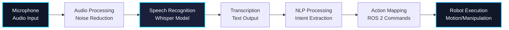
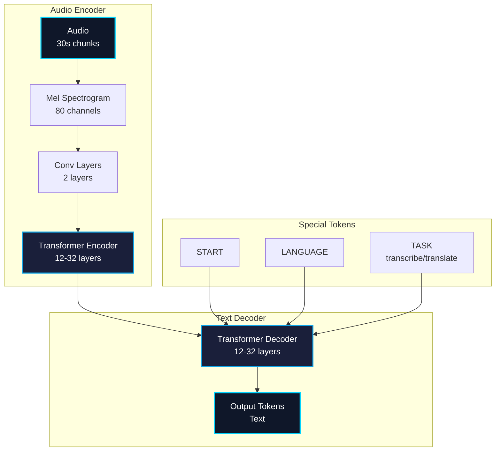

# Chapter 1: Voice-to-Action with OpenAI Whisper

## Learning Objectives

By the end of this chapter, you will be able to:

1. Understand speech recognition fundamentals and the Whisper architecture
2. Install and configure OpenAI Whisper for robotics applications
3. Integrate Whisper with ROS 2 for real-time speech recognition
4. Map voice commands to robot actions
5. Handle audio input from microphones in ROS 2
6. Optimize Whisper for low-latency edge deployment
7. Implement voice-controlled robot navigation

---

## 1. Introduction to Voice Control for Robots

### 1.1 Why Voice Control?

Voice interfaces enable natural human-robot interaction:

**Advantages:**
- ✅ **Hands-free Operation**: Control robots while performing other tasks
- ✅ **Natural Interface**: No need to learn complex commands or UIs
- ✅ **Accessibility**: Enables control for users with limited mobility
- ✅ **Multi-tasking**: Command robots remotely without line of sight
- ✅ **Rapid Prototyping**: Quickly add new commands without hardware changes

**Use Cases:**
- Warehouse robots: "Go to loading dock 3"
- Household assistants: "Bring me a water bottle"
- Medical robots: "Hand me the scalpel"
- Search and rescue: "Check behind the door"

### 1.2 Speech Recognition Overview



---

## 2. OpenAI Whisper Architecture

### 2.1 What is Whisper?

**OpenAI Whisper** is a state-of-the-art automatic speech recognition (ASR) system trained on 680,000 hours of multilingual data.

**Key Features:**
- **Multilingual**: Supports 99 languages
- **Robust**: Works in noisy environments
- **Multi-task**: Transcription, translation, language detection
- **Open Source**: Available under MIT license
- **Multiple Sizes**: From tiny (39M params) to large (1550M params)

### 2.2 Model Variants

| Model | Parameters | Size | VRAM | Speed | Accuracy |
|-------|------------|------|------|-------|----------|
| **tiny** | 39M | 75MB | 1GB | ~32x realtime | Good |
| **base** | 74M | 142MB | 1GB | ~16x realtime | Better |
| **small** | 244M | 466MB | 2GB | ~6x realtime | Very Good |
| **medium** | 769M | 1.5GB | 5GB | ~2x realtime | Excellent |
| **large-v2** | 1550M | 3GB | 10GB | ~1x realtime | Best |

**Recommendation for Robotics:**
- **Edge Devices (Jetson)**: `tiny` or `base`
- **Workstation**: `small` or `medium`
- **Cloud**: `large-v2`

### 2.3 Whisper Architecture

Whisper uses an **encoder-decoder transformer** architecture:



---

## 3. Installation and Setup

### 3.1 Install Whisper

```bash
# Install PyTorch (with CUDA support)
pip3 install torch torchvision torchaudio --index-url https://download.pytorch.org/whl/cu118

# Install Whisper
pip3 install openai-whisper

# Verify installation
python3 -c "import whisper; print(whisper.available_models())"
# Output: ['tiny', 'base', 'small', 'medium', 'large-v1', 'large-v2', 'large']
```

### 3.2 Install Audio Dependencies

```bash
# PortAudio for microphone input
sudo apt install portaudio19-dev python3-pyaudio

# FFmpeg for audio processing
sudo apt install ffmpeg

# Install Python audio libraries
pip3 install pyaudio sounddevice numpy

# Test microphone
python3 -c "import sounddevice as sd; print(sd.query_devices())"
```

### 3.3 Download Models

```python
"""
Download Whisper models for offline use.
"""

import whisper

# Download and cache models
models_to_download = ['tiny', 'base', 'small']

for model_name in models_to_download:
    print(f"Downloading {model_name} model...")
    model = whisper.load_model(model_name)
    print(f"✓ {model_name} model ready")

print("\nAll models downloaded successfully!")
```

---

## 4. Basic Whisper Usage

### 4.1 Transcribe Audio File

```python
"""
Simple Whisper transcription example.
"""

import whisper

# Load model
model = whisper.load_model("base")

# Transcribe audio file
result = model.transcribe("audio.mp3")

# Print results
print("Transcription:", result["text"])
print("Language:", result["language"])
print("Segments:", len(result["segments"]))

# Detailed segment information
for segment in result["segments"]:
    print(f"[{segment['start']:.2f}s - {segment['end']:.2f}s]: {segment['text']}")
```

### 4.2 Real-time Microphone Transcription

```python
"""
Real-time speech recognition from microphone.
"""

import whisper
import sounddevice as sd
import numpy as np
import queue

# Audio configuration
SAMPLE_RATE = 16000  # Whisper expects 16kHz
CHANNELS = 1
CHUNK_DURATION = 3  # seconds
CHUNK_SIZE = int(SAMPLE_RATE * CHUNK_DURATION)

# Load Whisper model
print("Loading Whisper model...")
model = whisper.load_model("base")
print("✓ Model loaded")

# Audio queue for thread-safe recording
audio_queue = queue.Queue()

def audio_callback(indata, frames, time, status):
    """Callback for audio stream."""
    if status:
        print(f"Audio error: {status}")
    audio_queue.put(indata.copy())

def transcribe_audio(audio_data):
    """Transcribe audio using Whisper."""
    # Convert to float32 and flatten
    audio = audio_data.flatten().astype(np.float32)

    # Normalize audio
    audio = audio / np.max(np.abs(audio))

    # Transcribe
    result = model.transcribe(audio, language='en', fp16=False)

    return result['text']

# Start audio stream
print("Starting microphone...")
with sd.InputStream(
    samplerate=SAMPLE_RATE,
    channels=CHANNELS,
    callback=audio_callback,
    blocksize=CHUNK_SIZE
):
    print("🎤 Listening... (Press Ctrl+C to stop)")

    try:
        while True:
            # Get audio chunk from queue
            audio_data = audio_queue.get()

            # Transcribe
            text = transcribe_audio(audio_data)

            if text.strip():
                print(f"\n>> {text}")

    except KeyboardInterrupt:
        print("\n✓ Stopped")
```

---

## 5. ROS 2 Integration

### 5.1 Whisper ROS 2 Node

```python
"""
Whisper ROS 2 Node for Speech Recognition

Publishes transcribed speech to /voice_commands topic.
"""

import rclpy
from rclpy.node import Node
from std_msgs.msg import String
import whisper
import sounddevice as sd
import numpy as np
import threading
import queue

class WhisperNode(Node):
    """ROS 2 node for speech recognition using Whisper."""

    def __init__(self):
        super().__init__('whisper_node')

        # Parameters
        self.declare_parameter('model_size', 'base')
        self.declare_parameter('sample_rate', 16000)
        self.declare_parameter('chunk_duration', 3.0)
        self.declare_parameter('language', 'en')
        self.declare_parameter('device', 'cuda')  # 'cuda' or 'cpu'

        # Get parameters
        model_size = self.get_parameter('model_size').value
        self.sample_rate = self.get_parameter('sample_rate').value
        chunk_duration = self.get_parameter('chunk_duration').value
        self.language = self.get_parameter('language').value
        device = self.get_parameter('device').value

        # Load Whisper model
        self.get_logger().info(f'Loading Whisper {model_size} model...')
        self.model = whisper.load_model(model_size, device=device)
        self.get_logger().info('✓ Model loaded')

        # Audio configuration
        self.chunk_size = int(self.sample_rate * chunk_duration)
        self.audio_queue = queue.Queue()

        # Publisher for transcriptions
        self.publisher = self.create_publisher(String, 'voice_commands', 10)

        # Start audio stream
        self.stream = sd.InputStream(
            samplerate=self.sample_rate,
            channels=1,
            callback=self.audio_callback,
            blocksize=self.chunk_size
        )
        self.stream.start()

        # Start transcription thread
        self.running = True
        self.transcribe_thread = threading.Thread(target=self.transcribe_loop)
        self.transcribe_thread.start()

        self.get_logger().info('🎤 Whisper node ready. Listening for speech...')

    def audio_callback(self, indata, frames, time, status):
        """Callback for audio stream."""
        if status:
            self.get_logger().warning(f'Audio status: {status}')
        self.audio_queue.put(indata.copy())

    def transcribe_loop(self):
        """Main transcription loop running in separate thread."""
        while self.running:
            try:
                # Get audio chunk (blocking)
                audio_data = self.audio_queue.get(timeout=1.0)

                # Transcribe
                text = self.transcribe_audio(audio_data)

                # Publish if non-empty
                if text.strip():
                    msg = String()
                    msg.data = text.strip()
                    self.publisher.publish(msg)
                    self.get_logger().info(f'Transcribed: "{text}"')

            except queue.Empty:
                continue
            except Exception as e:
                self.get_logger().error(f'Transcription error: {str(e)}')

    def transcribe_audio(self, audio_data):
        """Transcribe audio using Whisper."""
        # Convert to float32 and flatten
        audio = audio_data.flatten().astype(np.float32)

        # Normalize
        if np.max(np.abs(audio)) > 0:
            audio = audio / np.max(np.abs(audio))

        # Transcribe
        result = self.model.transcribe(
            audio,
            language=self.language,
            fp16=False,
            task='transcribe'
        )

        return result['text']

    def destroy_node(self):
        """Cleanup when node is destroyed."""
        self.running = False
        self.stream.stop()
        self.stream.close()
        if self.transcribe_thread.is_alive():
            self.transcribe_thread.join(timeout=2.0)
        super().destroy_node()

def main(args=None):
    rclpy.init(args=args)

    node = WhisperNode()

    try:
        rclpy.spin(node)
    except KeyboardInterrupt:
        pass
    finally:
        node.destroy_node()
        rclpy.shutdown()

if __name__ == '__main__':
    main()
```

### 5.2 Launch Whisper Node

```bash
# Launch Whisper node
ros2 run voice_control whisper_node --ros-args \
    -p model_size:=base \
    -p language:=en \
    -p device:=cuda

# In another terminal, listen to voice commands
ros2 topic echo /voice_commands
```

---

## 6. Voice Command Mapping

### 6.1 Simple Command Mapper

```python
"""
Map voice commands to robot actions.
"""

import rclpy
from rclpy.node import Node
from std_msgs.msg import String
from geometry_msgs.msg import Twist
import re

class VoiceCommandMapper(Node):
    """Map voice commands to ROS 2 actions."""

    def __init__(self):
        super().__init__('voice_command_mapper')

        # Subscribe to voice commands
        self.subscription = self.create_subscription(
            String,
            'voice_commands',
            self.command_callback,
            10
        )

        # Publisher for velocity commands
        self.cmd_vel_pub = self.create_publisher(Twist, 'cmd_vel', 10)

        # Command patterns
        self.patterns = {
            'forward': r'(move|go)\s+(forward|ahead|straight)',
            'backward': r'(move|go)\s+(backward|back)',
            'left': r'(turn|rotate)\s+(left)',
            'right': r'(turn|rotate)\s+(right)',
            'stop': r'(stop|halt|freeze)',
        }

        self.get_logger().info('Voice command mapper ready')

    def command_callback(self, msg):
        """Process voice command and execute action."""
        command = msg.data.lower()
        self.get_logger().info(f'Processing command: "{command}"')

        # Match command patterns
        for action, pattern in self.patterns.items():
            if re.search(pattern, command):
                self.execute_action(action)
                return

        self.get_logger().warning(f'Unknown command: "{command}"')

    def execute_action(self, action):
        """Execute robot action."""
        twist = Twist()

        if action == 'forward':
            twist.linear.x = 0.5
            duration = 2.0
        elif action == 'backward':
            twist.linear.x = -0.3
            duration = 2.0
        elif action == 'left':
            twist.angular.z = 0.5
            duration = 1.5
        elif action == 'right':
            twist.angular.z = -0.5
            duration = 1.5
        elif action == 'stop':
            twist.linear.x = 0.0
            twist.angular.z = 0.0
            duration = 0.1

        self.get_logger().info(f'Executing action: {action}')
        self.cmd_vel_pub.publish(twist)

        # Stop after duration (simplified)
        # In production, use timer for precise control

def main(args=None):
    rclpy.init(args=args)
    node = VoiceCommandMapper()

    try:
        rclpy.spin(node)
    except KeyboardInterrupt:
        pass
    finally:
        node.destroy_node()
        rclpy.shutdown()

if __name__ == '__main__':
    main()
```

---

## 7. Performance Optimization

### 7.1 Model Quantization

Reduce model size and increase speed with quantization:

```python
"""
Quantize Whisper model for faster inference.
"""

import torch
import whisper

# Load model
model = whisper.load_model("base")

# Quantize to int8
quantized_model = torch.quantization.quantize_dynamic(
    model,
    {torch.nn.Linear},
    dtype=torch.qint8
)

# Save quantized model
torch.save(quantized_model.state_dict(), "whisper_base_quantized.pt")

print("Model quantized and saved")
print(f"Size reduction: ~4x smaller")
print(f"Speed improvement: ~2-3x faster on CPU")
```

### 7.2 Faster Inference with faster-whisper

```bash
# Install faster-whisper (uses CTranslate2)
pip install faster-whisper

# 4-5x faster than openai-whisper
# Lower memory usage
# Same accuracy
```

```python
"""
Using faster-whisper for low-latency inference.
"""

from faster_whisper import WhisperModel

# Load model with CTranslate2 backend
model = WhisperModel(
    "base",
    device="cuda",
    compute_type="int8"  # int8 quantization
)

# Transcribe (much faster)
segments, info = model.transcribe("audio.mp3", language="en")

for segment in segments:
    print(f"[{segment.start:.2f}s - {segment.end:.2f}s]: {segment.text}")
```

### 7.3 Performance Benchmarks

Transcription speed on different hardware:

| Hardware | Model | Backend | Realtime Factor | Latency |
|----------|-------|---------|-----------------|---------|
| **CPU (i7-10700K)** | tiny | openai-whisper | 32x | 93ms |
| **CPU (i7-10700K)** | base | openai-whisper | 16x | 187ms |
| **CPU (i7-10700K)** | base | faster-whisper | 40x | 75ms |
| **GPU (RTX 3090)** | base | openai-whisper | 80x | 37ms |
| **GPU (RTX 3090)** | small | openai-whisper | 30x | 100ms |
| **Jetson Orin** | tiny | faster-whisper | 25x | 120ms |
| **Jetson Orin** | base | faster-whisper | 12x | 250ms |

**Realtime Factor**: 32x means 32 seconds of audio transcribed in 1 second

---

## 8. Voice-Controlled Navigation

### 8.1 Complete Navigation System

```python
"""
Voice-controlled robot navigation using Whisper + Nav2.
"""

import rclpy
from rclpy.node import Node
from std_msgs.msg import String
from geometry_msgs.msg import PoseStamped
from nav2_simple_commander.robot_navigator import BasicNavigator
import re

class VoiceNavigationNode(Node):
    """Voice-controlled navigation node."""

    def __init__(self):
        super().__init__('voice_navigation')

        # Initialize Nav2 navigator
        self.navigator = BasicNavigator()

        # Subscribe to voice commands
        self.subscription = self.create_subscription(
            String,
            'voice_commands',
            self.command_callback,
            10
        )

        # Predefined locations (name -> (x, y, yaw))
        self.locations = {
            'kitchen': (5.0, 2.0, 0.0),
            'living room': (8.0, 5.0, 1.57),
            'bedroom': (2.0, 8.0, 3.14),
            'entrance': (0.0, 0.0, 0.0),
            'dock': (10.0, 0.0, -1.57),
        }

        self.get_logger().info('Voice navigation ready')
        self.get_logger().info(f'Known locations: {list(self.locations.keys())}')

    def command_callback(self, msg):
        """Process voice navigation command."""
        command = msg.data.lower()
        self.get_logger().info(f'Voice command: "{command}"')

        # Extract location from command
        # Examples: "go to kitchen", "navigate to bedroom", "take me to the dock"
        match = re.search(r'(go|navigate|take me) to (?:the )?(\w+[\s\w]*)', command)

        if match:
            location_name = match.group(2).strip()

            if location_name in self.locations:
                self.navigate_to(location_name)
            else:
                self.get_logger().warning(f'Unknown location: "{location_name}"')
                self.get_logger().info(f'Available locations: {list(self.locations.keys())}')
        else:
            self.get_logger().warning(f'Could not parse command: "{command}"')

    def navigate_to(self, location_name):
        """Navigate to named location."""
        x, y, yaw = self.locations[location_name]

        self.get_logger().info(f'Navigating to {location_name} at ({x}, {y})')

        # Create goal pose
        goal = PoseStamped()
        goal.header.frame_id = 'map'
        goal.header.stamp = self.get_clock().now().to_msg()
        goal.pose.position.x = x
        goal.pose.position.y = y
        goal.pose.position.z = 0.0

        # Convert yaw to quaternion (simplified)
        import math
        goal.pose.orientation.z = math.sin(yaw / 2.0)
        goal.pose.orientation.w = math.cos(yaw / 2.0)

        # Send goal
        self.navigator.goToPose(goal)

        self.get_logger().info(f'Goal sent to Nav2: {location_name}')

def main(args=None):
    rclpy.init(args=args)

    node = VoiceNavigationNode()

    try:
        rclpy.spin(node)
    except KeyboardInterrupt:
        pass
    finally:
        node.destroy_node()
        rclpy.shutdown()

if __name__ == '__main__':
    main()
```

---

## 9. Common Issues and Solutions

### Issue 1: High Latency

**Symptoms**: Slow transcription, delayed response

**Solutions**:
- Use smaller model (tiny or base)
- Use faster-whisper backend
- Enable GPU acceleration
- Reduce chunk_duration to 2-3 seconds
- Quantize model to int8

### Issue 2: Poor Accuracy

**Symptoms**: Incorrect transcriptions

**Solutions**:
- Improve microphone quality
- Reduce background noise
- Use larger model (small or medium)
- Specify language explicitly
- Add noise reduction preprocessing

### Issue 3: CUDA Out of Memory

**Symptoms**: GPU memory errors

**Solutions**:
```bash
# Use smaller model
model = whisper.load_model("tiny")  # Instead of "large"

# Use CPU instead
model = whisper.load_model("base", device="cpu")

# Enable mixed precision (FP16)
result = model.transcribe(audio, fp16=True)
```

---

## Assessment Questions

### Traditional Questions

1. **What is OpenAI Whisper and what makes it suitable for robotics applications?**
   - Answer: Whisper is a robust multilingual speech recognition system trained on 680k hours of data. It's suitable for robotics because it works in noisy environments, supports 99 languages, has multiple model sizes for different hardware (edge to cloud), and is open-source (MIT license).

2. **Explain the trade-offs between Whisper model sizes for robot deployment.**
   - Answer: Tiny (39M) is fastest (32x realtime) but least accurate, suitable for edge devices. Base (74M) balances speed/accuracy for most robots. Small (244M) offers very good accuracy at 6x realtime. Large (1550M) is most accurate but requires 10GB VRAM and only 1x realtime, suitable for cloud deployment. Choose based on available hardware and latency requirements.

3. **Describe the encoder-decoder architecture used in Whisper.**
   - Answer: Whisper uses a transformer-based encoder-decoder. The encoder processes mel spectrogram audio (80 channels, 30s chunks) through convolutions and 12-32 transformer layers. The decoder generates text tokens auto-regressively, conditioned on the encoder output and special tokens (START, LANGUAGE, TASK).

4. **How would you optimize Whisper for low-latency edge deployment on a Jetson Orin?**
   - Answer: (1) Use tiny or base model, (2) Switch to faster-whisper backend (CTranslate2) for 4-5x speedup, (3) Apply int8 quantization, (4) Reduce chunk_duration to 2-3s, (5) Use GPU acceleration, (6) Consider model distillation for custom smaller models. Expect ~120-250ms latency with base model.

5. **What are the key steps to integrate Whisper with ROS 2 for voice-controlled navigation?**
   - Answer: (1) Create Whisper ROS 2 node to transcribe microphone audio, (2) Publish transcriptions to /voice_commands topic, (3) Create command mapper node to parse commands with regex, (4) Extract location names and parameters, (5) Interface with Nav2 BasicNavigator to send goal poses, (6) Handle navigation feedback and errors.

### Knowledge Check Questions

6. **Multiple Choice: Which Whisper model is best for real-time robot control on embedded hardware?**
   - A) large-v2
   - B) medium
   - C) small
   - D) tiny or base ✓
   - Answer: D. Tiny/base models provide the fastest inference (16-32x realtime) with acceptable accuracy, suitable for edge devices with limited compute.

7. **True/False: Whisper requires an internet connection to transcribe audio.**
   - Answer: False. Whisper models run entirely locally once downloaded. No internet required for inference, making it ideal for offline robot operation.

8. **Fill in the blank: Whisper expects audio sampled at __________ Hz.**
   - Answer: 16000 (16 kHz)

9. **Short Answer: Why use faster-whisper instead of the standard openai-whisper library?**
   - Answer: faster-whisper uses CTranslate2 backend for 4-5x faster inference with same accuracy, lower memory usage, and supports int8 quantization. Critical for real-time robotics where sub-300ms latency is needed.

10. **Scenario: Your robot correctly transcribes speech but navigation fails. The transcription is "go to kitchen" but Nav2 doesn't respond. What could be wrong?**
    - Answer: (1) Command mapper regex doesn't match the exact phrase - verify pattern includes "go to", (2) "kitchen" not in predefined locations dictionary - add it, (3) Nav2 not initialized - check navigator.waitUntilNav2Active(), (4) Map frame not matching - verify "map" frame exists, (5) Goal pose formatting incorrect - check quaternion conversion from yaw angle.

---

## Summary

In this chapter, you learned about:

- **OpenAI Whisper**: State-of-the-art speech recognition with 99-language support
- **Model Variants**: Tiny to large models with accuracy/speed trade-offs
- **ROS 2 Integration**: Creating Whisper nodes for real-time transcription
- **Command Mapping**: Converting voice commands to robot actions
- **Optimization**: Quantization and faster-whisper for edge deployment
- **Voice Navigation**: Complete system integrating Whisper with Nav2

Whisper provides robust, multilingual speech recognition that enables natural voice control for robots, from simple commands to complex navigation tasks.

---

**Next Chapter**: [Chapter 2: LLM Cognitive Planning](./chapter2.md) - Learn how to integrate large language models for high-level task planning and reasoning.
