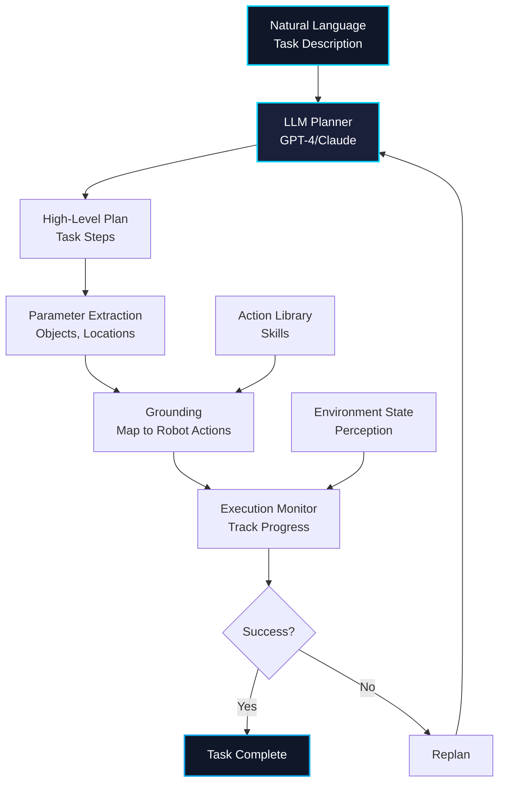
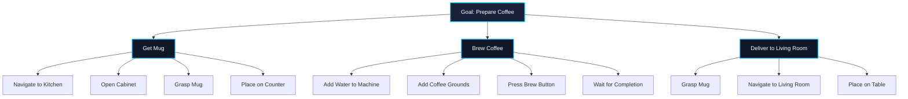

# Chapter 2: LLM Cognitive Planning for Robots

## Learning Objectives

By the end of this chapter, you will be able to:

1. Understand how large language models enable high-level robot planning
2. Integrate LLMs (GPT-4, Claude, LLaMA) with ROS 2
3. Design cognitive architectures for autonomous task planning
4. Implement hierarchical task decomposition
5. Handle uncertainty and replanning with LLMs
6. Create multi-step robot behaviors using LLM reasoning
7. Evaluate and optimize LLM planning performance

---

## 1. Introduction to LLM-Based Planning

### 1.1 Why LLMs for Robotics?

Large Language Models bring powerful reasoning capabilities to robots:

**Advantages:**
- ✅ **Common-sense Reasoning**: Understanding context and implicit constraints
- ✅ **Task Decomposition**: Breaking complex goals into executable steps
- ✅ **Natural Language Interface**: Plan from human descriptions
- ✅ **Generalization**: Apply knowledge to new situations
- ✅ **Explainability**: Generate human-readable plans

**Example Use Cases:**
- **Household Tasks**: "Prepare breakfast" → sequence of grasp, place, cook actions
- **Warehouse**: "Reorganize inventory" → optimize pick/place operations
- **Medical**: "Assist with surgery" → anticipate next instrument needed
- **Rescue**: "Search building for survivors" → prioritize rooms, avoid hazards

### 1.2 LLM Planning Pipeline



---

## 2. LLM Options for Robotics

### 2.1 Model Comparison

| Model | Provider | Context | Reasoning | Speed | Cost | Deployment |
|-------|----------|---------|-----------|-------|------|------------|
| **GPT-4 Turbo** | OpenAI | 128k | Excellent | Fast | $10/1M tokens | API only |
| **Claude 3 Opus** | Anthropic | 200k | Excellent | Fast | $15/1M tokens | API only |
| **GPT-3.5 Turbo** | OpenAI | 16k | Good | Very Fast | $0.5/1M tokens | API only |
| **LLaMA 2 70B** | Meta | 4k | Good | Medium | Free | Local |
| **Mistral 7B** | Mistral AI | 8k | Good | Fast | Free | Local |
| **Code LLaMA** | Meta | 16k | Code-focused | Medium | Free | Local |

**Recommendations:**
- **Production**: GPT-4 Turbo or Claude 3 (best reasoning)
- **Cost-sensitive**: GPT-3.5 Turbo (good performance, 20x cheaper)
- **Edge/Offline**: LLaMA 2 13B or Mistral 7B (local deployment)

### 2.2 API Setup

```python
"""
Setup LLM APIs for robot planning.
"""

import os
from openai import OpenAI
from anthropic import Anthropic

# OpenAI GPT-4
openai_client = OpenAI(api_key=os.getenv("OPENAI_API_KEY"))

def query_gpt4(prompt, system_message="You are a helpful robot planner."):
    """Query GPT-4 for planning."""
    response = openai_client.chat.completions.create(
        model="gpt-4-turbo-preview",
        messages=[
            {"role": "system", "content": system_message},
            {"role": "user", "content": prompt}
        ],
        temperature=0.7,
        max_tokens=1000
    )
    return response.choices[0].message.content

# Anthropic Claude
anthropic_client = Anthropic(api_key=os.getenv("ANTHROPIC_API_KEY"))

def query_claude(prompt, system_message="You are a helpful robot planner."):
    """Query Claude for planning."""
    response = anthropic_client.messages.create(
        model="claude-3-opus-20240229",
        max_tokens=1000,
        system=system_message,
        messages=[
            {"role": "user", "content": prompt}
        ]
    )
    return response.content[0].text

# Example usage
task = "Prepare coffee and bring it to the living room"
plan = query_gpt4(task)
print(plan)
```

---

## 3. Cognitive Architecture

### 3.1 Hierarchical Task Network (HTN)

LLMs excel at hierarchical decomposition:



### 3.2 LLM Planner Implementation

```python
"""
LLM-based hierarchical task planner for ROS 2 robots.
"""

import rclpy
from rclpy.node import Node
from std_msgs.msg import String
from openai import OpenAI
import json
import re

class LLMPlannerNode(Node):
    """ROS 2 node for LLM-based task planning."""

    def __init__(self):
        super().__init__('llm_planner')

        # Initialize OpenAI client
        self.client = OpenAI(api_key=os.getenv("OPENAI_API_KEY"))

        # Subscribe to task requests
        self.subscription = self.create_subscription(
            String,
            'task_request',
            self.task_callback,
            10
        )

        # Publisher for generated plans
        self.plan_publisher = self.create_publisher(String, 'task_plan', 10)

        # Define available robot actions
        self.action_library = {
            'navigate': 'Navigate to location',
            'grasp': 'Grasp object',
            'place': 'Place object at location',
            'open': 'Open container/door',
            'close': 'Close container/door',
            'wait': 'Wait for duration',
            'detect': 'Detect objects in scene',
        }

        self.get_logger().info('LLM Planner ready')

    def task_callback(self, msg):
        """Process incoming task request."""
        task_description = msg.data
        self.get_logger().info(f'Planning task: "{task_description}"')

        # Generate plan using LLM
        plan = self.generate_plan(task_description)

        # Publish plan
        plan_msg = String()
        plan_msg.data = json.dumps(plan, indent=2)
        self.plan_publisher.publish(plan_msg)

        self.get_logger().info(f'Published plan with {len(plan["steps"])} steps')

    def generate_plan(self, task_description):
        """Generate task plan using LLM."""

        # Create system prompt with action library
        system_prompt = f"""You are a robot task planner. Generate step-by-step plans.

Available actions:
{json.dumps(self.action_library, indent=2)}

Output format (JSON):
{{
  "task": "task description",
  "steps": [
    {{"action": "navigate", "parameters": {{"location": "kitchen"}}}},
    {{"action": "grasp", "parameters": {{"object": "mug"}}}}
  ],
  "preconditions": ["list of required conditions"],
  "postconditions": ["list of expected outcomes"]
}}

Be specific about parameters. Break complex tasks into atomic actions."""

        # Query LLM
        response = self.client.chat.completions.create(
            model="gpt-4-turbo-preview",
            messages=[
                {"role": "system", "content": system_prompt},
                {"role": "user", "content": f"Plan task: {task_description}"}
            ],
            temperature=0.3,  # Lower temperature for more deterministic plans
            response_format={"type": "json_object"}
        )

        # Parse JSON response
        plan_text = response.choices[0].message.content
        plan = json.loads(plan_text)

        return plan

def main(args=None):
    rclpy.init(args=args)
    node = LLMPlannerNode()

    try:
        rclpy.spin(node)
    except KeyboardInterrupt:
        pass
    finally:
        node.destroy_node()
        rclpy.shutdown()

if __name__ == '__main__':
    main()
```

---

## 4. Advanced Planning Techniques

### 4.1 Chain-of-Thought Prompting

Improve plan quality by encouraging step-by-step reasoning:

```python
def generate_plan_with_cot(task_description):
    """Generate plan using chain-of-thought prompting."""

    prompt = f"""Plan the following robot task step-by-step:

Task: {task_description}

Think through this carefully:
1. What is the goal?
2. What are the preconditions?
3. What steps are needed?
4. What could go wrong?
5. How to verify success?

Then provide the final plan in JSON format."""

    response = client.chat.completions.create(
        model="gpt-4-turbo-preview",
        messages=[
            {"role": "system", "content": "You are a thoughtful robot planner."},
            {"role": "user", "content": prompt}
        ],
        temperature=0.3
    )

    # LLM will reason through the problem before outputting plan
    return parse_plan_from_response(response.choices[0].message.content)
```

### 4.2 Few-Shot Learning

Provide examples to guide plan generation:

```python
def generate_plan_few_shot(task_description):
    """Generate plan using few-shot examples."""

    few_shot_examples = """
Example 1:
Task: "Bring me a water bottle"
Plan:
1. navigate(location="kitchen")
2. detect(object="water_bottle")
3. grasp(object="water_bottle")
4. navigate(location="living_room")
5. place(location="table")

Example 2:
Task: "Clean the table"
Plan:
1. navigate(location="storage")
2. grasp(object="cloth")
3. navigate(location="dining_room")
4. clean_surface(surface="table")
5. navigate(location="storage")
6. place(object="cloth", location="shelf")

Now plan this task:
Task: "{task_description}"
Plan:"""

    # LLM learns from examples
    # More likely to generate similar structured plans
    # ...
```

### 4.3 Replanning with Execution Feedback

```python
"""
Adaptive replanning based on execution results.
"""

class AdaptivePlanner:
    """Planner that adapts based on execution feedback."""

    def __init__(self, llm_client):
        self.client = llm_client
        self.execution_history = []

    def replan(self, original_task, failed_step, error_message):
        """Generate new plan after failure."""

        replan_prompt = f"""The robot was executing this task:
Task: {original_task}

The following step failed:
{failed_step}

Error: {error_message}

Previous execution history:
{json.dumps(self.execution_history, indent=2)}

Generate a new plan that:
1. Avoids the failure condition
2. Considers alternative approaches
3. Includes error recovery if needed

New plan (JSON):"""

        response = self.client.chat.completions.create(
            model="gpt-4-turbo-preview",
            messages=[
                {"role": "system", "content": "You are an adaptive robot planner."},
                {"role": "user", "content": replan_prompt}
            ],
            temperature=0.5,  # Higher temp for creative solutions
            response_format={"type": "json_object"}
        )

        new_plan = json.loads(response.choices[0].message.content)
        return new_plan

    def record_execution(self, step, success, details):
        """Record execution result for future replanning."""
        self.execution_history.append({
            'step': step,
            'success': success,
            'details': details,
            'timestamp': time.time()
        })
```

---

## 5. Grounding Plans to Robot Actions

### 5.1 Action Grounding

Map high-level LLM plans to low-level robot commands:

```python
"""
Ground LLM plans to executable robot actions.
"""

from geometry_msgs.msg import PoseStamped
from nav2_simple_commander.robot_navigator import BasicNavigator

class ActionGrounder:
    """Ground abstract actions to robot-specific implementations."""

    def __init__(self, navigator, manipulation_client):
        self.navigator = navigator
        self.manipulation = manipulation_client

        # Map action names to implementation functions
        self.action_map = {
            'navigate': self.execute_navigate,
            'grasp': self.execute_grasp,
            'place': self.execute_place,
            'open': self.execute_open,
            'wait': self.execute_wait,
        }

    def ground_and_execute(self, plan):
        """Execute grounded plan."""
        for i, step in enumerate(plan['steps']):
            action_name = step['action']
            parameters = step.get('parameters', {})

            if action_name not in self.action_map:
                raise ValueError(f"Unknown action: {action_name}")

            # Execute grounded action
            success = self.action_map[action_name](parameters)

            if not success:
                return False, i  # Return failure and step index

        return True, len(plan['steps'])

    def execute_navigate(self, params):
        """Execute navigation action."""
        location = params['location']

        # Look up location coordinates (from database or hardcoded)
        coords = self.get_location_coords(location)

        # Create goal pose
        goal = PoseStamped()
        goal.header.frame_id = 'map'
        goal.pose.position.x = coords['x']
        goal.pose.position.y = coords['y']
        goal.pose.orientation.w = 1.0

        # Navigate
        self.navigator.goToPose(goal)

        # Wait for result
        while not self.navigator.isTaskComplete():
            time.sleep(0.1)

        result = self.navigator.getResult()
        return result == BasicNavigator.TaskResult.SUCCEEDED

    def execute_grasp(self, params):
        """Execute grasp action."""
        object_name = params['object']

        # Detect object pose
        object_pose = self.detect_object(object_name)

        if object_pose is None:
            return False

        # Plan and execute grasp
        success = self.manipulation.grasp(object_pose)
        return success

    # ... implement other actions
```

---

## 6. Performance Optimization

### 6.1 Prompt Caching

Reduce API costs by caching common prompts:

```python
"""
Cache LLM responses for repeated queries.
"""

import hashlib
import json

class LLMCache:
    """Simple cache for LLM responses."""

    def __init__(self, cache_file='llm_cache.json'):
        self.cache_file = cache_file
        self.cache = self.load_cache()

    def load_cache(self):
        """Load cache from disk."""
        try:
            with open(self.cache_file, 'r') as f:
                return json.load(f)
        except FileNotFoundError:
            return {}

    def save_cache(self):
        """Save cache to disk."""
        with open(self.cache_file, 'w') as f:
            json.dump(self.cache, f, indent=2)

    def get_cache_key(self, prompt):
        """Generate cache key from prompt."""
        return hashlib.sha256(prompt.encode()).hexdigest()

    def get(self, prompt):
        """Get cached response."""
        key = self.get_cache_key(prompt)
        return self.cache.get(key)

    def set(self, prompt, response):
        """Cache response."""
        key = self.get_cache_key(prompt)
        self.cache[key] = response
        self.save_cache()

# Usage
cache = LLMCache()

response = cache.get(prompt)
if response is None:
    response = query_llm(prompt)  # API call
    cache.set(prompt, response)

# Subsequent calls are instant and free
```

### 6.2 Local LLM Deployment

Run LLMs locally for offline operation and privacy:

```bash
# Install llama.cpp for efficient local inference
git clone https://github.com/ggerganov/llama.cpp
cd llama.cpp
make

# Download quantized model (4-bit for efficiency)
wget https://huggingface.co/TheBloke/Mistral-7B-Instruct-v0.2-GGUF/resolve/main/mistral-7b-instruct-v0.2.Q4_K_M.gguf

# Run local server
./server -m mistral-7b-instruct-v0.2.Q4_K_M.gguf --port 8080
```

```python
"""
Query local LLM server.
"""

import requests

def query_local_llm(prompt, server_url="http://localhost:8080"):
    """Query local LLM."""
    response = requests.post(
        f"{server_url}/completion",
        json={
            "prompt": prompt,
            "temperature": 0.7,
            "max_tokens": 500
        }
    )
    return response.json()['content']

# Works offline, no API costs, data stays local
plan = query_local_llm("Plan task: clean the kitchen")
```

---

## 7. Evaluation Metrics

### 7.1 Plan Quality Metrics

```python
"""
Evaluate LLM-generated plans.
"""

def evaluate_plan(plan, ground_truth):
    """Evaluate plan quality."""

    metrics = {}

    # 1. Correctness: Are all required steps present?
    required_steps = set(ground_truth['required_actions'])
    plan_steps = set([s['action'] for s in plan['steps']])
    metrics['correctness'] = len(required_steps & plan_steps) / len(required_steps)

    # 2. Efficiency: Minimal number of steps?
    metrics['efficiency'] = len(ground_truth['optimal_steps']) / len(plan['steps'])

    # 3. Safety: No forbidden actions?
    forbidden = set(ground_truth.get('forbidden_actions', []))
    uses_forbidden = len(plan_steps & forbidden) > 0
    metrics['safety'] = 0.0 if uses_forbidden else 1.0

    # 4. Executability: All actions are valid?
    valid_actions = set(action_library.keys())
    invalid_count = len(plan_steps - valid_actions)
    metrics['executability'] = 1.0 - (invalid_count / len(plan_steps))

    # Overall score
    metrics['overall'] = sum(metrics.values()) / len(metrics)

    return metrics
```

---

## Assessment Questions

### Traditional Questions

1. **Why are large language models effective for robot task planning?**
   - Answer: LLMs provide common-sense reasoning, can decompose complex tasks into steps, understand natural language descriptions, generalize to new situations, and explain their reasoning. They've been trained on vast amounts of human knowledge including task procedures, making them well-suited for high-level planning.

2. **Compare GPT-4 and local LLaMA models for robot deployment. When would you use each?**
   - Answer: GPT-4 offers superior reasoning and context (128k tokens) but requires internet, costs $10/1M tokens, and has API latency. Use for complex tasks needing best performance. LLaMA 2 runs locally (free, offline, private) but has shorter context (4k) and lower reasoning capability. Use for edge deployment, offline operation, or cost-sensitive applications.

3. **Explain chain-of-thought prompting and its benefits for robot planning.**
   - Answer: Chain-of-thought prompting encourages LLMs to show intermediate reasoning steps before outputting the final plan. Benefits: (1) higher quality plans through explicit reasoning, (2) easier debugging by seeing thought process, (3) better handling of complex multi-step tasks, (4) ability to identify and avoid potential failure modes.

4. **What is action grounding and why is it necessary?**
   - Answer: Action grounding maps abstract LLM-generated actions (e.g., "grasp cup") to concrete robot implementations (motor commands, trajectories, API calls). Necessary because LLMs output high-level descriptions while robots need precise low-level commands. Grounding bridges the semantic gap between language and robotics.

5. **Describe how to implement adaptive replanning with execution feedback.**
   - Answer: (1) Execute plan step-by-step, (2) Monitor each step for success/failure, (3) If failure occurs, capture error message and execution history, (4) Provide failure context to LLM with replan request, (5) LLM generates alternative plan avoiding the failure condition, (6) Execute new plan. Maintains execution history for learning from past failures.

### Knowledge Check Questions

6. **Multiple Choice: Which LLM is best for offline robot operation?**
   - A) GPT-4 Turbo
   - B) Claude 3 Opus
   - C) LLaMA 2 70B ✓
   - D) GPT-3.5 Turbo
   - Answer: C. LLaMA 2 can run entirely locally without internet, crucial for offline robot deployment. GPT/Claude require API access.

7. **True/False: LLMs can directly control robot motors and joints.**
   - Answer: False. LLMs generate high-level plans as text. These must be grounded to specific robot actions through an action grounding layer that converts descriptions to motor commands.

8. **Fill in the blank: Hierarchical Task Networks decompose goals into __________, which further decompose into atomic __________.**
   - Answer: subtasks (or tasks), actions (or primitives)

9. **Short Answer: What is the purpose of prompt caching in LLM-based planning?**
   - Answer: Prompt caching stores LLM responses for repeated or similar queries to avoid redundant API calls, reducing costs (can save hundreds of dollars) and latency (instant retrieval vs 1-3s API call). Essential for interactive robots making similar queries.

10. **Scenario: Your LLM generates a plan to "navigate to kitchen, grasp mug, pour coffee, deliver to user" but the robot fails at "pour coffee" because it's a manipulation-only robot with no pouring capability. How would you prevent this?**
    - Answer: (1) Include robot capabilities in system prompt ("This robot can navigate, grasp, and place but NOT pour liquids"), (2) Validate generated plans against action library before execution, (3) Provide few-shot examples showing valid actions, (4) If failure occurs, replan with explicit constraint: "avoid pouring, ask human for help with pouring step", (5) Maintain capability profile and filter plans before execution.

---

## Summary

In this chapter, you learned about:

- **LLM Planning**: Using GPT-4, Claude, and local models for task decomposition
- **Cognitive Architecture**: Hierarchical task networks and planning pipelines
- **Advanced Techniques**: Chain-of-thought, few-shot learning, adaptive replanning
- **Action Grounding**: Mapping abstract plans to executable robot commands
- **Optimization**: Prompt caching, local deployment for cost and latency
- **Evaluation**: Metrics for correctness, efficiency, safety, and executability

LLMs enable robots to plan complex multi-step tasks from natural language, reason about goals, and adapt to failures—bridging high-level human intent with low-level robot execution.

---

**Next Chapter**: [Chapter 3: NLP to ROS 2 Actions](./chapter3.md) - Learn how to build robust natural language understanding for extracting intents and parameters from user commands.
