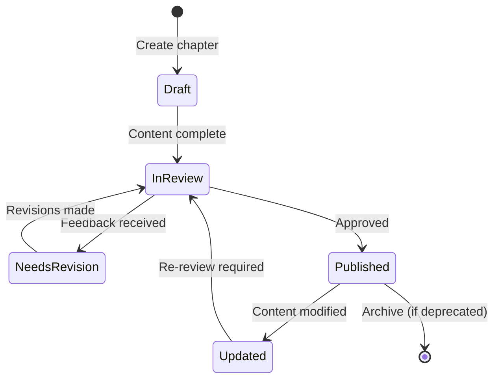
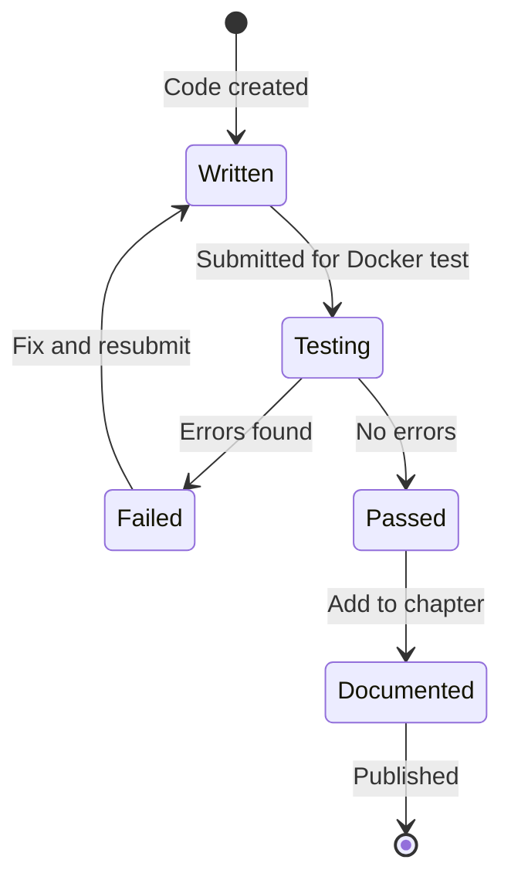

# Data Model: RoboBook Documentation Content Structure

**Feature**: 001-robobook-docusaurus
**Date**: 2025-12-13
**Status**: Final

## Overview

This document defines the content entities, their attributes, relationships, and validation rules for the RoboBook Docusaurus documentation website. These entities are implemented as Markdown files and configuration objects in the Docusaurus framework.

## Entity Diagram

```mermaid
erDiagram
    MODULE ||--o{ CHAPTER : contains
    CHAPTER ||--o{ CODE_EXAMPLE : includes
    CHAPTER ||--o{ HANDS_ON_EXERCISE : includes
    CHAPTER ||--o{ ASSESSMENT_QUESTION : includes
    CHAPTER ||--o{ DIAGRAM : includes
    MODULE {
        string id PK
        string title
        int number
        string description
        int weekStart
        int weekEnd
        string difficultyLevel
        int estimatedHours
    }
    CHAPTER {
        string id PK
        string moduleId FK
        string title
        int number
        int depthLevel
        int estimatedMinutes
        string[] learningObjectives
        string[] prerequisites
    }
    CODE_EXAMPLE {
        string id PK
        string chapterId FK
        string language
        string filePath
        boolean dockerTested
        string[] dependencies
    }
    HANDS_ON_EXERCISE {
        string id PK
        string chapterId FK
        string title
        int estimatedMinutes
        string[] prerequisites
        string expectedOutput
    }
    ASSESSMENT_QUESTION {
        string id PK
        string chapterId FK
        string questionType
        string difficulty
    }
    DIAGRAM {
        string id PK
        string chapterId FK
        string diagramType
        string filePath
    }
```



## Core Entities

### 1. Module

**Description**: Top-level curriculum division representing a major topic area.

**Attributes**:

| Field | Type | Required | Constraints | Description |
|-------|------|----------|-------------|-------------|
| `id` | string | Yes | Unique, format: `module-{number}` | Primary identifier |
| `title` | string | Yes | Max 100 chars | Display name (e.g., "The Robotic Nervous System") |
| `number` | integer | Yes | 1-4 | Module sequence number |
| `description` | string | Yes | Max 500 chars | Brief overview of module content |
| `weekStart` | integer | Yes | 1-13 | Starting week in 13-week curriculum |
| `weekEnd` | integer | Yes | 1-13 | Ending week in 13-week curriculum |
| `difficultyLevel` | enum | Yes | `foundation | intermediate | advanced` | Learning complexity |
| `contentDepth` | integer | Yes | 2 or 3 | Level 2 (5-8 pages) or Level 3 (10+ pages) |
| `estimatedHours` | integer | Yes | >0 | Total study time for module |
| `chapters` | string[] | Yes | 5 items | Array of chapter IDs |
| `icon` | string | No | Valid emoji or SVG path | Visual identifier for module card |
| `color` | string | No | Valid hex color | Accent color for module (defaults to cyan) |

**Validation Rules**:
- `weekEnd` must be greater than `weekStart`
- `chapters` array must contain exactly 5 chapter IDs
- Modules 1-2 must have `contentDepth: 2`, Modules 3-4 must have `contentDepth: 3`
- `number` must be unique across all modules

**Example**:
```typescript
{
  id: "module-1",
  title: "The Robotic Nervous System (ROS 2)",
  number: 1,
  description: "Master ROS 2 architecture, nodes, topics, and services...",
  weekStart: 3,
  weekEnd: 5,
  difficultyLevel: "foundation",
  contentDepth: 2,
  estimatedHours: 15,
  chapters: [
    "module-1-chapter-1",
    "module-1-chapter-2",
    "module-1-chapter-3",
    "module-1-chapter-4",
    "module-1-chapter-5"
  ],
  icon: "🤖",
  color: "#00d4ff"
}
```

### 2. Chapter

**Description**: Individual learning unit within a module.

**Attributes**:

| Field | Type | Required | Constraints | Description |
|-------|------|----------|-------------|-------------|
| `id` | string | Yes | Unique, format: `module-{m}-chapter-{c}` | Primary identifier |
| `moduleId` | string | Yes | Valid module ID | Foreign key to parent module |
| `title` | string | Yes | Max 150 chars | Display name |
| `number` | integer | Yes | 1-5 | Chapter sequence within module |
| `depthLevel` | integer | Yes | 2 or 3 | Inherited from module contentDepth |
| `estimatedMinutes` | integer | Yes | 15-40 | Reading time (15-25 for Level 2, 25-40 for Level 3) |
| `learningObjectives` | string[] | Yes | 3-5 items | What learner will be able to do |
| `prerequisites` | string[] | No | - | Required knowledge or prior chapters |
| `slug` | string | Yes | Valid URL slug | Used in route: `/docs/module1/{slug}` |
| `sidebar_position` | integer | Yes | Matches `number` | Controls sidebar ordering |
| `tags` | string[] | No | - | Topical keywords for search/filtering |
| `lastUpdated` | date | Yes | ISO 8601 format | Last content modification date |

**Validation Rules**:
- `number` must be unique within parent module
- `depthLevel` must match parent module's `contentDepth`
- Level 2: `estimatedMinutes` between 15-25
- Level 3: `estimatedMinutes` between 25-40
- `learningObjectives` must use action verbs (understand, create, implement, etc.)

**Example**:
```typescript
{
  id: "module-1-chapter-1",
  moduleId: "module-1",
  title: "Introduction to ROS 2 Architecture",
  number: 1,
  depthLevel: 2,
  estimatedMinutes: 20,
  learningObjectives: [
    "Understand the publish-subscribe model in ROS 2",
    "Identify core ROS 2 concepts: nodes, topics, services",
    "Explain the role of DDS in ROS 2 communication"
  ],
  prerequisites: [],
  slug: "ros2-architecture-intro",
  sidebar_position: 1,
  tags: ["ros2", "architecture", "fundamentals"],
  lastUpdated: "2025-12-13"
}
```

### 3. Code Example

**Description**: Syntactically correct, tested code snippet demonstrating a concept.

**Attributes**:

| Field | Type | Required | Constraints | Description |
|-------|------|----------|-------------|-------------|
| `id` | string | Yes | Unique | Primary identifier |
| `chapterId` | string | Yes | Valid chapter ID | Foreign key to parent chapter |
| `language` | enum | Yes | `python | cpp | yaml | xml` | Programming language |
| `filePath` | string | Yes | Relative path | Location in `/examples` directory |
| `dockerTested` | boolean | Yes | Must be `true` | Verified in ROS 2 Humble + Ubuntu 22.04 container |
| `dependencies` | string[] | No | - | Required packages (from requirements.txt or package.xml) |
| `description` | string | Yes | Max 300 chars | What the code demonstrates |
| `lineCount` | integer | No | >0 | Number of lines (for size estimation) |
| `hasInlineComments` | boolean | Yes | - | Whether complex logic is explained |

**Validation Rules**:
- `dockerTested` must be `true` (per FR-007 requirement)
- `filePath` must exist in `/examples` directory
- Python files must have corresponding `requirements.txt` or be dependency-free
- ROS 2 C++ files must have corresponding `package.xml`

**Example**:
```typescript
{
  id: "example-ros2-publisher-python",
  chapterId: "module-1-chapter-5",
  language: "python",
  filePath: "examples/module1/chapter5/simple_publisher.py",
  dockerTested: true,
  dependencies: ["rclpy"],
  description: "Basic ROS 2 publisher node that publishes string messages to /chatter topic",
  lineCount: 35,
  hasInlineComments: true
}
```

### 4. Hands-on Exercise

**Description**: Practical lab activity where learners apply concepts.

**Attributes**:

| Field | Type | Required | Constraints | Description |
|-------|------|----------|-------------|-------------|
| `id` | string | Yes | Unique | Primary identifier |
| `chapterId` | string | Yes | Valid chapter ID | Foreign key to parent chapter |
| `title` | string | Yes | Max 100 chars | Exercise name |
| `estimatedMinutes` | integer | Yes | >0 | Time estimate with ⏱️ badge |
| `prerequisites` | string[] | Yes | - | Software, packages, or prior knowledge needed |
| `steps` | Step[] | Yes | Min 3 items | Numbered instructions |
| `expectedOutput` | string | Yes | Max 1000 chars | What learner should see when successful |
| `troubleshooting` | Troubleshooting[] | Yes | Min 2 items | Common errors and solutions |
| `simulationBased` | boolean | Yes | Must be `true` | No physical hardware required |

**Nested Types**:

```typescript
type Step = {
  number: integer;
  instruction: string; // Max 500 chars
  codeSnippet?: string; // Optional code to execute
  expectedResult?: string; // What should happen
};

type Troubleshooting = {
  symptom: string; // What user sees (error message, unexpected behavior)
  rootCause: string; // Why it happens
  solution: string; // How to fix it
  prevention?: string; // How to avoid in future
};
```

**Validation Rules**:
- `simulationBased` must be `true` (per clarifications)
- `steps` must be numbered sequentially starting from 1
- `troubleshooting` should cover at least 2 common errors

**Example**:
```typescript
{
  id: "exercise-ros2-first-package",
  chapterId: "module-1-chapter-5",
  title: "Build Your First ROS 2 Package",
  estimatedMinutes: 45,
  prerequisites: [
    "Docker installed",
    "RoboBook ROS 2 Humble container running",
    "Completed Chapters 1-4"
  ],
  steps: [
    {
      number: 1,
      instruction: "Create a new ROS 2 workspace and source the environment",
      codeSnippet: "mkdir -p ~/ros2_ws/src && cd ~/ros2_ws && source /opt/ros/humble/setup.bash",
      expectedResult: "No output indicates success"
    },
    {
      number: 2,
      instruction: "Create a Python package using ros2 pkg create",
      codeSnippet: "cd src && ros2 pkg create my_first_package --build-type ament_python --dependencies rclpy",
      expectedResult: "See package created successfully message"
    }
    // ... more steps
  ],
  expectedOutput: "When you run 'ros2 run my_first_package publisher_node', you should see: [INFO] [publisher_node]: Publishing: 'Hello ROS 2: 0'",
  troubleshooting: [
    {
      symptom: "Error: Package 'my_first_package' not found",
      rootCause: "Workspace not sourced after build",
      solution: "Run: source install/setup.bash",
      prevention: "Always source after colcon build"
    },
    {
      symptom: "ModuleNotFoundError: No module named 'rclpy'",
      rootCause: "ROS 2 environment not activated in current terminal",
      solution: "Run: source /opt/ros/humble/setup.bash",
      prevention: "Add to ~/.bashrc for persistence"
    }
  ],
  simulationBased: true
}
```

### 5. Assessment Question

**Description**: End-of-chapter questions to verify comprehension.

**Attributes**:

| Field | Type | Required | Constraints | Description |
|-------|------|----------|-------------|-------------|
| `id` | string | Yes | Unique | Primary identifier |
| `chapterId` | string | Yes | Valid chapter ID | Foreign key to parent chapter |
| `questionType` | enum | Yes | `multiple-choice | short-answer | code-review` | Format |
| `difficulty` | enum | Yes | `beginner | intermediate | advanced` | Complexity level |
| `questionText` | string | Yes | Max 500 chars | The question being asked |
| `answers` | Answer[] | Conditional | Required for multiple-choice | Possible answers |
| `correctAnswer` | string | Yes | - | Correct response or answer key |
| `explanation` | string | Yes | Max 300 chars | Why this answer is correct |

**Nested Types**:

```typescript
type Answer = {
  id: string; // e.g., "A", "B", "C", "D"
  text: string; // Answer option
  isCorrect: boolean;
};
```

**Validation Rules**:
- Multiple-choice must have 2-5 `answers`
- Exactly one answer must have `isCorrect: true`
- `correctAnswer` must match one answer's `id` for multiple-choice

**Example**:
```typescript
{
  id: "assessment-ros2-arch-q1",
  chapterId: "module-1-chapter-1",
  questionType: "multiple-choice",
  difficulty: "beginner",
  questionText: "What communication pattern does ROS 2 primarily use?",
  answers: [
    { id: "A", text: "Client-Server", isCorrect: false },
    { id: "B", text: "Publish-Subscribe", isCorrect: true },
    { id: "C", text: "Peer-to-Peer", isCorrect: false },
    { id: "D", text: "Request-Response only", isCorrect: false }
  ],
  correctAnswer: "B",
  explanation: "ROS 2 uses the publish-subscribe pattern where nodes publish messages to topics and other nodes subscribe to receive them."
}
```

### 6. Diagram

**Description**: Visual illustration of concepts, architectures, or workflows.

**Attributes**:

| Field | Type | Required | Constraints | Description |
|-------|------|----------|-------------|-------------|
| `id` | string | Yes | Unique | Primary identifier |
| `chapterId` | string | Yes | Valid chapter ID | Foreign key to parent chapter |
| `diagramType` | enum | Yes | `mermaid | image` | Rendering method |
| `filePath` | string | Conditional | Required for images | Location in `/static/diagrams` |
| `mermaidCode` | string | Conditional | Required for mermaid | Diagram definition |
| `altText` | string | Yes | Max 200 chars | Accessibility description |
| `caption` | string | No | Max 150 chars | Optional figure caption |
| `fileSize` | integer | Conditional | <500KB for images | Bytes (for validation) |

**Validation Rules**:
- If `diagramType: "image"`, `filePath` and `fileSize` required
- If `diagramType: "mermaid"`, `mermaidCode` required
- Image files must be <500KB (per FR-030)
- `altText` must describe diagram content (accessibility requirement)

**Example (Mermaid)**:
```typescript
{
  id: "diagram-ros2-pub-sub",
  chapterId: "module-1-chapter-1",
  diagramType: "mermaid",
  mermaidCode: `
    graph LR
      A[Publisher Node] -->|Publishes| B[Topic: /chatter]
      B -->|Subscribes| C[Subscriber Node]
      style A fill:#00d4ff
      style C fill:#0ea5e9
  `,
  altText: "ROS 2 publish-subscribe pattern showing publisher node sending messages to a topic, which subscriber node receives",
  caption: "Figure 1.1: ROS 2 Publish-Subscribe Communication"
}
```

**Example (Image)**:
```typescript
{
  id: "diagram-gazebo-architecture",
  chapterId: "module-2-chapter-2",
  diagramType: "image",
  filePath: "/static/diagrams/module2/gazebo-architecture.png",
  altText: "Gazebo architecture diagram showing client-server model with physics engine, rendering engine, and sensor plugins",
  caption: "Figure 2.1: Gazebo Simulation Architecture",
  fileSize: 342000 // 342KB, within 500KB limit
}
```

## Supporting Entities

### 7. Hardware Specification

**Description**: Component listing for Physical AI workstation or robot.

**Attributes**:

| Field | Type | Required | Description |
|-------|------|----------|-------------|
| `id` | string | Yes | Unique identifier |
| `name` | string | Yes | Component name |
| `category` | enum | Yes | `workstation | edge-computing | robot-hardware | cloud` |
| `tier` | enum | Yes | `budget | recommended | premium` |
| `components` | Component[] | Yes | List of parts |

**Nested Type**:
```typescript
type Component = {
  part: string; // e.g., "GPU"
  model: string; // e.g., "NVIDIA RTX 4070 Ti"
  specs: string; // e.g., "12GB VRAM"
  quantity: integer;
  price: number; // USD as of Nov 2025
  vendor: string; // e.g., "Amazon", "Newegg"
  vendorLink?: string; // URL (no affiliate links)
};
```

**Example**:
```typescript
{
  id: "workstation-recommended",
  name: "Recommended Physical AI Workstation",
  category: "workstation",
  tier: "recommended",
  components: [
    {
      part: "GPU",
      model: "NVIDIA RTX 4090",
      specs: "24GB VRAM, 16384 CUDA cores",
      quantity: 1,
      price: 1599,
      vendor: "Amazon",
      vendorLink: "https://amazon.com/..."
    },
    {
      part: "CPU",
      model: "Intel Core i7-13700K",
      specs: "16 cores, 24 threads, 5.4GHz boost",
      quantity: 1,
      price: 419,
      vendor: "Newegg"
    }
    // ... more components
  ]
}
```

### 8. Glossary Entry

**Description**: Definition of robotics/AI term.

**Attributes**:

| Field | Type | Required | Description |
|-------|------|----------|-------------|
| `term` | string | Yes | Canonical term (e.g., "URDF") |
| `plainLanguage` | string | Yes | Simple explanation |
| `technicalDefinition` | string | Yes | Precise technical meaning |
| `usageExample` | string | No | How term is used in context |
| `relatedTerms` | string[] | No | Links to related glossary entries |
| `acronymExpansion` | string | Conditional | Full form if acronym |

**Example**:
```typescript
{
  term: "URDF",
  acronymExpansion: "Unified Robot Description Format",
  plainLanguage: "An XML file that describes what a robot looks like and how its parts move",
  technicalDefinition: "XML-based format for representing robot model geometry, kinematics, dynamics, sensors, and visual elements in ROS/ROS 2",
  usageExample: "The Unitree G1 humanoid robot's URDF file defines 23 joints connecting its torso, arms, and legs.",
  relatedTerms: ["SDF", "XACRO", "Gazebo"]
}
```

## Relationships

### Module ↔ Chapter
- **Type**: One-to-Many
- **Cardinality**: 1 Module contains exactly 5 Chapters
- **Cascade**: Deleting a Module cascades to Chapters (orphaned chapters invalid)

### Chapter ↔ Code Example
- **Type**: One-to-Many
- **Cardinality**: 1 Chapter contains 0-N Code Examples
- **Constraint**: Minimum 2 code examples per hands-on chapter

### Chapter ↔ Hands-on Exercise
- **Type**: One-to-Many
- **Cardinality**: 1 Chapter contains 0-1 Hands-on Exercise
- **Constraint**: Chapter 5 in each module must have 1 hands-on exercise

### Chapter ↔ Assessment Question
- **Type**: One-to-Many
- **Cardinality**: 1 Chapter contains 3-5 Assessment Questions
- **Constraint**: At least 1 question per difficulty level

### Chapter ↔ Diagram
- **Type**: One-to-Many
- **Cardinality**: 1 Chapter contains 1-N Diagrams
- **Constraint**: At least 1 diagram per chapter

## Validation Summary

### Global Constraints (from FR requirements)

- **FR-001**: Exactly 4 modules must exist
- **FR-002-005**: Each module must have exactly 5 chapters
- **FR-003**: Total chapters >= 20 (4 modules × 5 chapters)
- **FR-008**: Total code examples >= 30 across all modules
- **FR-009**: Every chapter must have learning objectives, examples, assessments
- **FR-010**: Hardware specs must include pricing as of Nov 2025

### Content Depth Constraints (from clarifications)

- **Modules 1-2**: `depthLevel: 2`, chapters 5-8 pages each, reading time 15-25 min
- **Modules 3-4**: `depthLevel: 3`, chapters 10+ pages each, reading time 25-40 min

### Testing Constraints (from clarifications)

- **All code examples**: `dockerTested: true` (ROS 2 Humble + Ubuntu 22.04)
- **All hands-on exercises**: `simulationBased: true` (no physical hardware)

## State Transitions

### Chapter Lifecycle



### Code Example Lifecycle



## Implementation Notes

### File System Mapping

This data model is implemented using Docusaurus conventions:

- **Modules**: Defined in `docusaurus.config.ts` and sidebar configuration
- **Chapters**: Markdown files in `/docs/module{N}/chapter{M}.md`
- **Code Examples**: Files in `/examples/module{N}/chapter{M}/`
- **Diagrams**: Mermaid code blocks in Markdown, or files in `/static/diagrams/`
- **Assessments**: Markdown sections at end of chapter files
- **Metadata**: Frontmatter in Markdown files

Example chapter frontmatter:
```yaml
---
id: ros2-architecture-intro
title: Introduction to ROS 2 Architecture
sidebar_position: 1
tags: [ros2, architecture, fundamentals]
---
```

### Validation Automation

Validation can be automated using:
- **Build-time**: Docusaurus validates frontmatter schema
- **Pre-commit**: Git hooks to check file sizes, Docker test status
- **CI/CD**: GitHub Actions to verify link integrity, code syntax, image sizes

## Summary

This data model ensures:
- ✅ Aligns with constitution principles (Educational Excellence, Technical Rigor)
- ✅ Implements clarified requirements (Docker testing, progressive depth, structured hands-on)
- ✅ Supports all functional requirements (FR-001 through FR-039)
- ✅ Provides validation rules for quality assurance
- ✅ Maps to Docusaurus file system conventions
- ✅ Enables automated testing and validation
