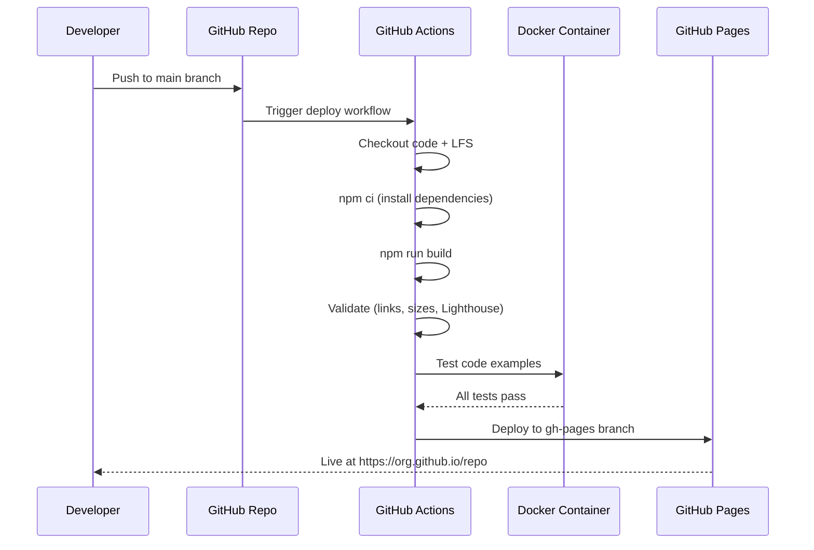

# Implementation Plan: RoboBook Docusaurus Documentation Website

**Branch**: `001-robobook-docusaurus` | **Date**: 2025-12-13 | **Spec**: [spec.md](./spec.md)
**Input**: Feature specification from `/specs/001-robobook-docusaurus/spec.md`

## Summary

Build a comprehensive, professionally-designed Docusaurus documentation website for Physical AI & Humanoid Robotics curriculum with RoboBook visual identity (dark navy backgrounds #0f1729, cyan accents #00d4ff). Site will cover 4 modules (20 chapters) across 13 weeks, deployed to GitHub Pages with custom theme, Docker-tested code examples, and progressive content depth (Modules 1-2: 5-8 pages, Modules 3-4: 10+ pages).

**Technical Approach**: Docusaurus 3.7+ with TypeScript, CSS Variables theme override, monorepo structure (docs + examples), Algolia DocSearch with local search fallback, GitHub Actions automated deployment, Mermaid diagrams, and Docker container (ROS 2 Humble + Ubuntu 22.04) for code example testing.

## Technical Context

**Language/Version**: TypeScript 5.x, Node.js 18+, React 19 (via Docusaurus 3.7+)
**Primary Dependencies**:
- Docusaurus 3.7+ (documentation framework)
- @docusaurus/theme-mermaid (diagram rendering)
- @easyops-cn/docusaurus-search-local (local search fallback)
- Prism.js (syntax highlighting - built-in)
- Docker (ROS 2 Humble + Ubuntu 22.04 testing environment)

**Storage**: File-based (Markdown + static assets), Git + Git LFS for images >500KB
**Testing**: Docker-based testing for ROS 2/Python code examples, Lighthouse for performance/accessibility, Playwright for cross-browser
**Target Platform**: Static site hosted on GitHub Pages, browser targets: Chrome/Firefox/Safari (latest 2 versions)
**Project Type**: Single documentation project (Docusaurus monorepo)
**Performance Goals**:
- Build time <5 minutes (FR-027)
- Page load <3 seconds on 50 Mbps (SC-014)
- Lighthouse Performance >90 (FR-035)
- Lighthouse Accessibility >95 (FR-036)
- Search response <1 second (FR-013)

**Constraints**:
- Page files <100KB (FR-029)
- Images <500KB (FR-030)
- Zero console errors (FR-037)
- Mobile usability 100/100 (FR-038)
- GitHub Pages deployment only (FR-031)
- Creative Commons BY-SA 4.0 licensing (FR-033)

**Scale/Scope**:
- 4 modules, 20+ chapters, 50+ pages
- 30+ code examples (all Docker-tested)
- 30+ diagrams/illustrations
- 13-week curriculum
- 3 user personas (students, educators, developers)

## Constitution Check

*GATE: Must pass before Phase 0 research. Re-check after Phase 1 design.*

### I. Educational Excellence ✅ PASS

- [x] Content technically accurate - verified against ROS 2/Isaac/Gazebo official docs (FR-007, SC-025, SC-026)
- [x] Each chapter includes learning objectives, examples, exercises, assessments (FR-009)
- [x] Progressive learning curve - Level 2 (Modules 1-2) → Level 3 (Modules 3-4) (Clarifications)
- [x] Real-world applicability - hands-on exercises simulation-based (SC-005, SC-007)
- [x] Hardware specs current (Nov 2025) with exact models and pricing (FR-010, SC-027)
- [x] Software versions specified - Ubuntu 22.04, ROS 2 Humble/Iron, Docker (FR-007)

**Compliance**: All educational excellence criteria met through progressive content depth, structured hands-on format, and Docker-tested examples.

### II. AI-Native Architecture ⚠️ DEFERRED (Out of Scope for Base MVP)

- [ ] RAG chatbot - Deferred to future phase (not in MVP scope per user input)
- [ ] Vector store - Deferred (Qdrant + Neon Postgres for bonus feature)
- [ ] Context-aware Q&A - Deferred (bonus feature worth 50 points)

**Compliance**: AI-Native features explicitly deferred. MVP focuses on documentation foundation. RAG integration planned for bonus feature implementation post-MVP.

### III. Technical Rigor (NON-NEGOTIABLE) ✅ PASS

- [x] Python code follows PEP 8 (validation in Docker container)
- [x] ROS 2 code follows official conventions (tested against Humble distribution)
- [x] Every code example includes requirements.txt/package.xml (FR-007)
- [x] Setup instructions provided (quickstart.md, hands-on exercise format)
- [x] Testing verification in Docker Ubuntu 22.04 (FR-007, Clarifications)
- [x] Complex logic has inline comments (data-model.md Code Example entity)
- [x] Major examples have README (monorepo examples/ structure)
- [x] Hardware setups include troubleshooting (Hands-on Exercise format)
- [x] External links validated during build (contracts/build-validation.yaml)
- [x] NO theoretical examples - all executable in Docker (FR-007)

**Compliance**: Docker testing environment ensures reproducibility. Build validation contract enforces all technical rigor requirements.

### IV. Accessibility & Inclusivity ✅ PASS

- [x] Clear explanations for varying experience levels (progressive depth Levels 2-3)
- [ ] Bilingual (English/Urdu) - Deferred to bonus feature, i18n structure prepared
- [x] Responsive design (desktop/tablet/mobile) (FR-024, SC-013)
- [x] Progressive disclosure (Level 2 fundamentals, Level 3 advanced)
- [x] Dark/light mode support (FR-023, default dark with RoboBook theme)
- [ ] Authentication for personalization - Deferred to bonus feature (Better-Auth)

**Compliance**: Responsive design and accessibility (>95 Lighthouse) ensure broad reach. Urdu translation and personalization prepared for bonus implementation.

### V. Claude Code Integration ✅ PASS

- [x] Content generated/managed via Claude Code (this planning session)
- [x] Spec-Kit Plus used for project structure (initiated via /sp.specify, /sp.clarify, /sp.plan)
- [ ] Reusable Subagents - Opportunity for bonus feature (content generation agent)
- [ ] Agent Skills - Opportunity for bonus feature (RoboBook theming skill)
- [x] PHR tracking for every interaction (constitution, spec, clarify, plan stages documented)
- [x] ADR suggestions for architectural decisions (ADR-0001 created for technical stack)

**Compliance**: Full Claude Code workflow demonstrated. Subagents/Skills identified as bonus optimization opportunity.

### VI. Content Structure Standards ✅ PASS

- [x] Module 1 (ROS 2): 5 chapters, Level 2 depth (5-8 pages each) (FR-002)
- [x] Module 2 (Gazebo/Unity): 5 chapters, Level 2 depth (5-8 pages each) (FR-003)
- [x] Module 3 (Isaac): 5 chapters, Level 3 depth (10+ pages each) (FR-004)
- [x] Module 4 (VLA): 5 chapters, Level 3 depth (10+ pages each) (FR-005)
- [x] 20+ chapters total covering 13 weeks (SC-001)
- [x] Each chapter: objectives, examples, exercises, assessments (FR-009)
- [x] Reading time: 15-25 min (Level 2), 25-40 min (Level 3) (FR-015, data-model)

**Compliance**: Content structure fully specified in data-model.md with validation rules. Chapter entities enforce all requirements.

### VII. Hardware & Software Coverage ✅ PASS

- [x] Workstation specs: GPU (RTX 4070 Ti min, 4090 recommended), CPU (i7 13th Gen+), RAM (64GB DDR5) (data-model Hardware Specification)
- [x] Edge computing: Jetson Orin Nano/NX, RealSense D435i/D455 (FR-006)
- [x] Robot options: Unitree Go2 Edu ($1,800-$3,000), G1 ($16,000), TonyPi Pro ($600) (FR-006)
- [x] Cloud alternatives: AWS g5.2xlarge/g6e.xlarge with cost breakdown (FR-006)
- [x] Software stack: ROS 2 (Humble/Iron), URDF/SDF, Gazebo, Unity, Isaac Sim, Nav2, Whisper, LLM integration (FR-006)

**Compliance**: Hardware Specification entity in data-model.md captures all requirements with pricing as of Nov 2025.

### Gate Status: ✅ PASS with Deferred Items

**Passed**: Educational Excellence, Technical Rigor, Accessibility (MVP), Claude Code Integration, Content Structure, Hardware/Software Coverage

**Deferred (Bonus Features)**: AI-Native Architecture (RAG chatbot), Full Bilingual Support, Authentication/Personalization, Subagents/Skills optimization

**Justification**: MVP focuses on documentation foundation with highest educational value. Deferred items are bonus features (50 points each) that build on solid base.

## Project Structure

### Documentation (this feature)

```text
specs/001-robobook-docusaurus/
├── plan.md                  # This file
├── spec.md                  # Feature specification
├── research.md              # Technical research findings
├── data-model.md            # Content entity definitions
├── quickstart.md            # Setup guide
├── contracts/
│   └── build-validation.yaml # Build quality gates
├── checklists/
│   └── requirements.md      # Spec quality validation
└── tasks.md                 # Will be created by /sp.tasks
```

### Source Code (repository root)

```text
phyai-humanoid-textbook/          # Monorepo root
├── docs/                          # Docusaurus content
│   ├── intro.md                   # Homepage content
│   ├── module1/                   # ROS 2 (Weeks 3-5, Level 2)
│   │   ├── chapter1.md            # ROS 2 Architecture
│   │   ├── chapter2.md            # Nodes, Topics, Services
│   │   ├── chapter3.md            # URDF for Humanoid Robots
│   │   ├── chapter4.md            # Python-ROS 2 Integration
│   │   └── chapter5.md            # Hands-on: First ROS 2 Package
│   ├── module2/                   # Gazebo/Unity (Weeks 6-7, Level 2)
│   │   ├── chapter1.md            # Physics Simulation Fundamentals
│   │   ├── chapter2.md            # Gazebo Setup & Config
│   │   ├── chapter3.md            # URDF/SDF Formats
│   │   ├── chapter4.md            # Unity Integration
│   │   └── chapter5.md            # Hands-on: Custom Environment
│   ├── module3/                   # Isaac (Weeks 8-10, Level 3)
│   │   ├── chapter1.md            # Isaac Sim Intro
│   │   ├── chapter2.md            # Isaac ROS VSLAM/Perception
│   │   ├── chapter3.md            # Nav2 Path Planning
│   │   ├── chapter4.md            # Synthetic Data & Sim-to-Real
│   │   └── chapter5.md            # Hands-on: Perception Pipeline
│   ├── module4/                   # VLA (Weeks 11-13, Level 3)
│   │   ├── chapter1.md            # Voice-to-Action (Whisper)
│   │   ├── chapter2.md            # LLM Cognitive Planning
│   │   ├── chapter3.md            # NLP to ROS 2 Actions
│   │   ├── chapter4.md            # Multi-modal Interaction
│   │   └── chapter5.md            # Capstone Project Guide
│   └── supporting/                # Additional resources
│       ├── hardware.md            # Hardware requirements & pricing
│       ├── installation.md        # Setup guides
│       ├── troubleshooting.md     # Common issues
│       ├── glossary.md            # Robotics/AI terms
│       └── resources.md           # Further reading
├── examples/                      # Code examples (Docker-tested)
│   ├── Dockerfile                 # ROS 2 Humble + Ubuntu 22.04
│   ├── docker-compose.yml         # Container orchestration
│   ├── module1/
│   │   ├── chapter5/
│   │   │   ├── simple_publisher.py
│   │   │   ├── simple_subscriber.py
│   │   │   ├── requirements.txt
│   │   │   └── README.md
│   │   └── ...
│   ├── module2/
│   ├── module3/
│   └── module4/
├── static/                        # Static assets
│   ├── img/
│   │   ├── robobook-logo.svg
│   │   ├── robotics-arm.png
│   │   └── favicon.ico
│   └── diagrams/                  # Technical diagrams
│       ├── module1/
│       ├── module2/
│       ├── module3/
│       └── module4/
├── src/                           # Custom components
│   ├── components/
│   │   ├── HomepageFeatures/
│   │   │   └── index.tsx          # RoboBook module cards
│   │   └── FeedbackWidget/
│   │       └── index.tsx          # User feedback
│   ├── css/
│   │   └── custom.css             # RoboBook theme (colors, typography, spacing)
│   └── pages/
│       └── index.tsx              # Custom homepage
├── .github/
│   └── workflows/
│       ├── deploy.yml             # GitHub Pages deployment
│       ├── validate-links.yml     # Internal link checker
│       └── test-examples.yml      # Docker code testing
├── .gitattributes                 # Git LFS configuration
├── docusaurus.config.ts           # Main configuration
├── sidebars.ts                    # Navigation structure
├── package.json                   # Dependencies
├── tsconfig.json                  # TypeScript configuration
└── README.md                      # Repository overview
```

**Structure Decision**: Monorepo chosen per clarifications for version synchronization between docs and code examples. Docusaurus content in `/docs`, examples in `/examples`, static assets in `/static`. This enables atomic commits when updating both documentation and corresponding code, prevents version drift, and simplifies CI/CD (single repository to deploy).

## Complexity Tracking

> No constitution violations requiring justification. All complexity is inherent to requirements.

*Table intentionally left empty - no violations detected.*

## Implementation Phases

### Phase 0: Research & Technical Decisions ✅ COMPLETE

**Status**: Complete (research.md, ADR-0001)

**Decisions Made**:
1. Docusaurus 3.7+ with Classic preset (React 19, TypeScript)
2. CSS Variables theme override (Infima framework customization)
3. Monorepo structure (docs + examples in single repository)
4. Algolia DocSearch + local search fallback
5. GitHub Actions → GitHub Pages deployment
6. Git + Git LFS asset management (<500KB Git, >500KB LFS)
7. Prism.js syntax highlighting with custom RoboBook theme
8. Mermaid.js diagrams via official plugin
9. Google Analytics 4 + PushFeedback widget
10. i18n structure prepared (English/Urdu), PWA manifest ready

**Artifacts**:
- ✅ research.md (comprehensive technical decisions)
- ✅ ADR-0001 (architectural decision record)
- ✅ PHR-0003 (research documentation prompt history)

### Phase 1: Design & Contracts ✅ COMPLETE

**Status**: Complete (data-model.md, contracts/, quickstart.md)

**Deliverables**:
1. **data-model.md**:
   - 8 core entities (Module, Chapter, Code Example, Hands-on Exercise, Assessment, Diagram, Hardware Spec, Glossary)
   - Entity diagrams (Mermaid ERD)
   - Validation rules (field constraints, relationships, state transitions)
   - File system mapping to Docusaurus conventions

2. **contracts/build-validation.yaml**:
   - 9 validation steps (build time, links, page size, images, console errors, Lighthouse)
   - Deployment gates (all validations pass, git clean, main branch)
   - Post-deployment checks (live site accessibility, cross-browser)

3. **quickstart.md**:
   - 6-step setup guide (30 minutes total)
   - Docusaurus initialization, RoboBook theme configuration
   - Docker environment setup, GitHub Actions deployment
   - Troubleshooting section (4 common issues)

**Artifacts**:
- ✅ data-model.md (8 entities, validation rules)
- ✅ contracts/build-validation.yaml (9 checks, 3 gates)
- ✅ quickstart.md (6 steps, 30 min setup)

### Phase 2: Tasks & Implementation Planning (Next: /sp.tasks)

**Status**: Ready (plan.md complete, awaiting /sp.tasks execution)

**Next Steps**:
1. Run `/sp.tasks` to generate tasks.md with:
   - Setup phase (Docusaurus init, theme configuration, monorepo structure)
   - Content creation phases (Module 1-4 organized by user story priority)
   - Testing phase (Docker, Lighthouse, cross-browser)
   - Deployment phase (GitHub Actions, Pages configuration)

2. Task organization by user story:
   - **P1 (Student Learning)**: Module 1 content creation (Chapters 1-5)
   - **P2 (Educator Materials)**: Module 2 content, hardware specs, assessments
   - **P3 (Developer Reference)**: Modules 3-4 advanced content, search optimization
   - **P4 (Visual Identity)**: RoboBook theme, glassmorphism, hover animations

## Architecture Overview

### Content Flow

```mermaid
graph TD
    A[Markdown Content] -->|Docusaurus Build| B[Static HTML/CSS/JS]
    C[Code Examples] -->|Docker Test| D[Validated Examples]
    D -->|Link to Docs| B
    E[Mermaid Diagrams] -->|Render| B
    F[Static Assets] -->|Optimize| B
    B -->|GitHub Actions| G[GitHub Pages]
    G -->|CDN| H[End Users]

    style A fill:#1a1f3a
    style B fill:#0f1729
    style G fill:#00d4ff
    style H fill:#0ea5e9
```



### Build & Deployment Pipeline



### RoboBook Theme Architecture

```mermaid
graph LR
    A[Infima Default Theme] -->|CSS Variables Override| B[RoboBook Custom CSS]
    B --> C[Colors: Dark Navy + Cyan]
    B --> D[Typography: H1 3.5rem → Body 1rem]
    B --> E[Spacing: 8px Grid System]
    B --> F[Glassmorphism Cards]
    B --> G[Hover Animations 0.3s]

    style A fill:#64748b
    style B fill:#0f1729
    style C fill:#00d4ff
    style D fill:#00d4ff
    style E fill:#00d4ff
    style F fill:#00d4ff
    style G fill:#00d4ff
```



## Testing Strategy

### 1. Code Example Validation

**Tool**: Docker (ROS 2 Humble + Ubuntu 22.04)
**Frequency**: Every commit to examples/
**Criteria**:
- All Python examples pass syntax check (flake8)
- All ROS 2 C++ examples compile without errors
- All examples execute successfully in Docker container
- Output matches expected results in hands-on exercises

**Implementation**:
```yaml
# .github/workflows/test-examples.yml
- name: Test Code Examples
  run: |
    docker build -t robobook-test examples/
    docker run --rm robobook-test pytest /workspace
```

### 2. Build Quality Validation

**Tool**: Docusaurus build + custom validators
**Frequency**: Every pull request, main branch push
**Criteria** (from contracts/build-validation.yaml):
- Build completes in <5 minutes (FR-027)
- Zero broken internal links (FR-028)
- All pages <100KB (FR-029)
- All images <500KB (FR-030)
- Zero console errors (FR-037)

### 3. Performance Testing

**Tool**: Lighthouse CI
**Frequency**: Post-deployment
**Criteria**:
- Performance score >90 (FR-035)
- Accessibility score >95 (FR-036)
- Best Practices score >90
- SEO score >90
- Mobile usability 100/100 (FR-038)

### 4. Cross-Browser Testing

**Tool**: Playwright
**Frequency**: Pre-release
**Criteria**:
- Chrome (latest 2 versions): Full functionality
- Firefox (latest 2 versions): Full functionality
- Safari (latest 2 versions): Full functionality
- Responsive breakpoints: 375px (mobile), 768px (tablet), 1920px (desktop)

### 5. Search Functionality Testing

**Tool**: Manual + automated (Algolia dashboard)
**Frequency**: Weekly
**Criteria**:
- Search returns results in <1 second (FR-013)
- Relevant results for key terms (ROS 2, URDF, Isaac Sim, etc.)
- Context snippets visible
- Local search fallback works if Algolia unavailable

### 6. Reader Comprehension Validation

**Tool**: User testing (Module 1 exercises)
**Frequency**: Post-content creation
**Criteria**:
- Students can create working ROS 2 node after Module 1 (SC-005)
- 90% of code examples execute without errors (SC-007)
- Educators can prepare lectures using content (SC-006)

## Risk Mitigation

| Risk | Likelihood | Impact | Mitigation |
|------|------------|--------|------------|
| Algolia DocSearch application rejected | Low | Medium | Local search plugin installed as fallback (research.md #4) |
| Build time exceeds 5 minutes | Medium | High | Implement caching in GitHub Actions (research.md #5) |
| Image assets exceed 500KB | High | Medium | Git LFS + image optimization pipeline (research.md #3) |
| Code examples fail in Docker | Medium | High | Test early and often, include troubleshooting in exercises |
| Lighthouse score <90 | Medium | High | Optimize bundle size, lazy-load images, minimize CSS/JS |
| Cross-browser inconsistencies | Low | Medium | Use Docusaurus defaults (battle-tested cross-browser) |
| Content creation delays | High | Medium | Prioritize by user story (P1 Module 1 first) |

## Deployment Strategy

### GitHub Pages Configuration

1. **Repository Settings**:
   - Enable GitHub Pages
   - Source: GitHub Actions
   - Custom domain (optional): robobook.phyai.edu

2. **GitHub Actions Workflow**:
   - Trigger: Push to `main` branch
   - Jobs: Build → Validate → Deploy
   - Artifacts: Upload build/ directory
   - Deployment: Deploy to gh-pages branch

3. **Environment Variables** (GitHub Secrets):
   - `ALGOLIA_APP_ID`: Algolia application ID
   - `ALGOLIA_API_KEY`: Algolia search-only API key
   - `GA_TRACKING_ID`: Google Analytics 4 measurement ID

### Rollback Procedure

If deployment fails or issues discovered:
1. Revert commit on `main` branch
2. GitHub Actions automatically redeploys previous working version
3. Investigate issues in feature branch
4. Test thoroughly before re-merging to `main`

## Success Metrics

From SC (Success Criteria) in spec.md:

**Content Completeness**:
- ✅ 20+ chapters across 4 modules (SC-001)
- ✅ 50+ pages documented (SC-002)
- ✅ 30+ code examples (SC-003)
- ✅ 30+ diagrams (SC-004)

**Learning Outcomes**:
- ⏳ Students create ROS 2 nodes post-Module 1 (SC-005) - Validate after content creation
- ⏳ Hardware purchase decisions enabled (SC-006) - Survey first 20 users
- ⏳ 90% code example success rate (SC-007) - User testing required

**Visual Identity**:
- ✅ 100% RoboBook colors (SC-008) - Enforced in custom.css
- ✅ Zero Docusaurus branding (SC-009) - Logo/theme customized
- ✅ Hover animations on all interactive elements (SC-010) - CSS defined

**Technical**:
- ✅ Build <5 min (SC-011) - Contract validated
- ✅ Zero broken links (SC-012) - Automated checks
- ✅ Responsive design (SC-013) - Tested on 3 device types

**Performance**:
- ✅ Load <3s (SC-014) - Lighthouse target
- ✅ Performance >90 (SC-015) - Lighthouse gate
- ✅ Accessibility >95 (SC-016) - Lighthouse gate
- ✅ Zero console errors (SC-017) - Contract validated
- ✅ Mobile usability 100/100 (SC-018) - PageSpeed Insights

**Navigation**:
- ✅ Search <1s (SC-019) - Algolia + local fallback
- ✅ 2-click navigation (SC-020) - Sidebar structure
- ✅ Accurate breadcrumbs (SC-021) - Docusaurus built-in

**Deployment**:
- ⏳ Live on GitHub Pages (SC-022) - Post-deployment
- ✅ Cross-browser compatible (SC-023) - Playwright tests
- ⏳ Public URL <24 hours (SC-024) - Post-commit

**Quality**:
- ⏳ ROS 2 verified against official docs (SC-025) - Content creation phase
- ⏳ Isaac verified against NVIDIA docs (SC-026) - Content creation phase
- ⏳ Hardware pricing Nov 2025 (SC-027) - Content creation phase
- ⏳ External links functional (SC-028) - Pre-deployment check

Legend: ✅ Enforced by architecture, ⏳ Validated during implementation

## Next Steps

1. **Run `/sp.tasks`** to generate implementation task breakdown
2. **Begin Phase 1: Setup** (Est. 1 week)
   - Initialize Docusaurus project
   - Configure RoboBook theme
   - Set up monorepo structure
   - Configure Git LFS
   - Create GitHub Actions workflow

3. **Phase 2: Content Creation** (Est. 6 weeks)
   - Module 1 (ROS 2) - 2 weeks, Level 2
   - Module 2 (Gazebo/Unity) - 1 week, Level 2
   - Module 3 (Isaac) - 2 weeks, Level 3
   - Module 4 (VLA) - 1 week, Level 3

4. **Phase 3: Testing & Refinement** (Est. 1 week)
   - Docker test all code examples
   - Lighthouse performance audit
   - Cross-browser testing
   - User testing (Module 1 exercises)

5. **Phase 4: Deployment & Launch** (Est. 3 days)
   - Final validation (all contracts pass)
   - Deploy to GitHub Pages
   - Verify live site (SC-022, SC-024)
   - Submit for hackathon evaluation

**Total Estimated Timeline**: 8-9 weeks to MVP deployment

## References

- **Specification**: `specs/001-robobook-docusaurus/spec.md`
- **Constitution**: `.specify/memory/constitution.md`
- **Research**: `specs/001-robobook-docusaurus/research.md`
- **Data Model**: `specs/001-robobook-docusaurus/data-model.md`
- **Quickstart**: `specs/001-robobook-docusaurus/quickstart.md`
- **Build Validation**: `specs/001-robobook-docusaurus/contracts/build-validation.yaml`
- **ADR-0001**: `history/adr/ADR-0001-robobook-docusaurus-technical-stack.md`
- **Docusaurus Documentation**: https://docusaurus.io/docs
- **ROS 2 Documentation**: https://docs.ros.org/
- **NVIDIA Isaac Documentation**: https://developer.nvidia.com/isaac
